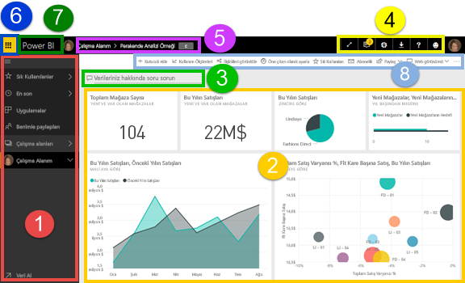
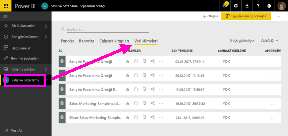
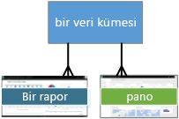
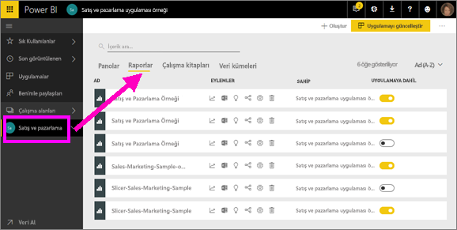
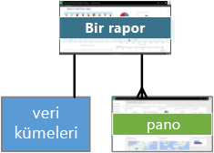
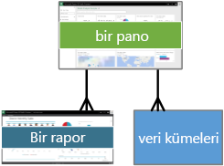
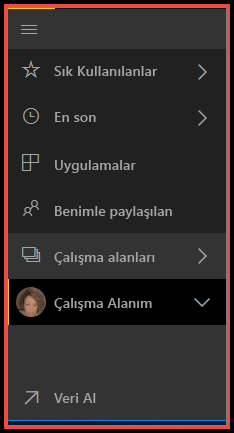
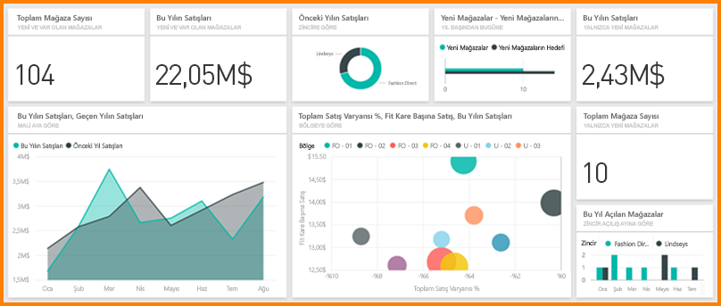

# Power BI - Power BI hizmeti için temel kavramlar

Bu makalede, [Power BI hizmetine kayıtlı ](service-self-service-signup-for-power-bi.md) ve [veri eklemiş](service-get-data.md) olduğunuz varsayılır.

Power BI hizmetini açtığınızda, bir ***pano*** görüntülenir. Power BI hizmeti panolarla Power BI Desktop'tan ayrılır.

Power BI hizmetindeki kullanıcı arabiriminizde bulunan temel özellikler şunlardır:

1. gezinti bölmesi (sol gezinti bölmesi)
2. tuval (burada kutucuk içeren pano)
3. Soru-Cevap soru kutusu
4. simge düğmeleri, yardım ve geri bildirim dahil
5. pano başlığı (gezinti yolu, içerik haritaları)
6. Office 365 uygulama başlatıcısı
7. Power BI giriş düğmesi
8. Etiketli simge düğmeleri

Daha sonra bu konunun ayrıntısına ineceğiz ancak şimdi bazı Power BI kavramlarını inceleyelim.

Alternatif olarak, bu makalenin geri kalanını okumadan önce bu videoyu da izleyebilirsiniz.  Videoda, Will temel kavramları inceler ve sizi Power BI hizmetinde bir tura çıkarır.

<iframe width="560" height="315" src="https://www.youtube.com/embed/B2vd4MQrz4M" frameborder="0" allowfullscreen></iframe>

## Power BI kavramları
Power BI'ın başlıca 4 yapı taşı şunlardır: ***panolar***, ***raporlar***, ***çalışma kitapları*** ve ***veri kümeleri***. Bunların tamamı ***çalışma alanları*** halinde düzenlenmiştir. 4 yapı taşını ayrıntılı olarak incelemeden önce çalışma alanlarını anlamanız önemli olduğundan bu kavramla başlayacağız.

## Çalışma alanları
Çalışma alanları, Power BI'daki panolar, raporlar, çalışma kitapları ve veri kümeleri için kapsayıcı görevi görür. İki tür çalışma alanı vardır: *Çalışma alanım* ve *uygulama çalışma alanları*. Peki *uygulama* nedir? Power BI *uygulaması*, kuruluşunuza ilişkin ana ölçümleri sunmak için oluşturulmuş bir pano ve rapor koleksiyonudur. Uygulamalar etkileşimlidir ancak düzenlenemez.

- *Çalışma alanım*, Power BI müşterilerinin kendi içeriği üzerinde çalışma yapabileceği kişisel çalışma alanıdır. Çalışma Alanım sayfasına yalnızca siz erişebilirsiniz. Çalışma Alanım sayfanızda panoları ve raporları paylaşabilirsiniz. Panolar ve raporlar üzerinde işbirliği yapmak veya uygulama oluşturmak istiyorsanız, bir uygulama çalışma alanında çalışmak istersiniz.      
-  *Uygulama çalışma alanlarını* iş arkadaşlarınızla işbirliği yapmak ve içerik paylaşmak için kullanabilirsiniz. Bu alanlarda ayrıca kuruluşunuz için uygulama oluşturabilir, yayımlayabilir ve yönetebilirsiniz. Bunları bir Power BI uygulamasını oluşturacak içerik için hazırlık alanı ve kapsayıcı olarak düşünebilirsiniz. Uygulama çalışma alanlarınıza iş arkadaşlarınızı ekleyerek panolar, raporlar, çalışma kitapları ve veri kümeleri üzerinde işbirliği yapabilirsiniz. Tüm uygulama çalışma alanı üyelerinin Power BI Pro lisansına sahip olması gerekir ancak uygulama kullanıcılarının (uygulamalara erişim sahibi olan iş arkadaşlarınız) Pro lisansına sahip olmasına gerek yoktur.  

Daha fazla bilgi edinmek için İçindekiler bölümünün **Çalışmanızı paylaşma** kısmının [Panolar ve raporlar üzerinde nasıl işbirliği yapabilir ve bunları nasıl paylaşabilirim?](service-how-to-collaborate-distribute-dashboards-reports.md) ile başlayan bölümüne bakın

Şimdi Power BI'ın yapı taşlarına geçelim. Veriler olmadan panonuz veya raporunuz bulunamayacağından (boş panolarınız veya raporlarınız olabilir ancak bunlar veri içerene kadar kullanışlı değildir) **veri kümeleriyle** başlayalım.

## Veri kümeleri
Bir *veri kümesi*, *içeri aktardığınız* veya *bağlandığınız* bir veri koleksiyonudur. Power BI, her türden veri kaynağına bağlanmanın ve bunları içeri aktarmanın yanı sıra hepsini tek bir yerde toplamanızı sağlar.  

Veri kümeleri, *çalışma alanlarıyla* ilişkilendirilmiştir ve tek bir veri kümesi, birden fazla çalışma alanına ait olabilir. Bir çalışma alanını açtığınızda ilişkilendirilmiş veri kümeleri, **Veri kümeleri** sekmesinde listelenir. Listelenen her bir veri kümesi tek bir veri kaynağını (örneğin; OneDrive'daki bir Excel çalışma kitabı veya tablosal bir şirket içi SSAS veri kümesi). Desteklenen birçok veri kaynağı olmakla birlikte yenilerini eklemeye de hiç ara vermiyoruz. [Power BI ile kullanılabilen veri kümesi türlerinin listesine göz atın](service-get-data.md).

Aşağıdaki örnekte "Sales and marketing" uygulama çalışma alanını seçtim ve **Veri kümeleri** sekmesine tıkladım.

**BİR** veri kümesi...

* bir veya daha fazla çalışma alanında tekrar tekrar kullanılabilir.
* birçok farklı raporda kullanılabilir.
* Söz konusu veri kümesindeki görselleştirmeler farklı birçok panoda görüntülenebilir.

  

[Bir veri kümesine bağlanmak veya veri kümesini içeri aktarmak](service-get-data.md) için **Veri Al**'ı (sol gezinti bölmesinin en altında) veya **+ Oluştur > Veri kümesi**'ni (sağ üst köşede) seçin. İlgili kaynağa bağlanmak veya kaynağı içeri aktarmak ve veri kümesini etkin çalışma alanına eklemek için yönergeleri uygulayın. Yeni veri kümeleri sarı yıldız işareti ile gösterilir. Power BI'da gerçekleştirdiğiniz çalışmalar temel alınan veri kümesinde değişikliğe neden olmaz.

Bir [***uygulama çalışma alanının*** parçasıysanız](service-collaborate-power-bi-workspace.md) çalışma alanının bir üyesi tarafından eklenen veri kümeleri, çalışma alanının diğer üyeleri tarafından da kullanılabilir.

Veri kümeleri yenilenebilir, yeniden adlandırılabilir, araştırılabilir ve kaldırılabilir. Veri kümesi kullanarak sıfırdan rapor oluşturabilir veya [hızlı öngörülerden](service-insights.md) faydalanabilirsiniz.  Veri kümesi kullanan raporları ve panoları görmek için **İlişkilileri görüntüle**'yi seçin. Araştırmak için veri kümesini seçmeniz gerekir. Aslında burada yaptığınız, veri kümesini, verilerinizin detaylarına gitmeye ve görselleştirmeler oluşturmaya başlayabileceğiniz rapor düzenleyicisinde açmaktır. Öyleyse, yeni konumuz olan raporlara geçelim.

### Derinlemesine
* [Power BI Premium nedir?](service-premium.md)
* [Power BI için veri alma](service-get-data.md)
* [Power BI için örnek veri kümeleri](sample-datasets.md)

## Raporlar
Bir Power BI raporu bir veya daha fazla sayfaya yayılmış görselleştirmelerden oluşur (çizgi grafikler, pasta grafikleri, ağaç haritaları ve çok daha fazlası gibi grafikler ve graflar). Görselleştirmelere ***görseller*** adı da verilir. Bir rapordaki görselleştirmelerin tümü tek bir veri kümesinden gelir. Raporlar Power BI'da sıfırdan oluşturulabilir, çalışma arkadaşlarınızın sizinle paylaştığı panolarla içeri aktarılabilir veya Excel, Power BI Desktop, veritabanları, SaaS uygulamaları ve [uygulamalara](service-get-data.md) bağlanılarak oluşturulabilir.  Örneğin, Power View sayfaları içeren bir Excel çalışma kitabına bağlandığınızda Power BI, söz konusu sayfaları temel alan bir rapor oluşturur. Bir SaaS uygulamasına bağlandığınızda ise Power BI, önceden oluşturulmuş bir raporu içeri aktarır.

Raporlarla etkileşime girmeye yönelik 2 mod bulunur: [Okuma görünümü ve Düzenleme görünümü](service-reading-view-and-editing-view.md).  Yalnızca raporu oluşturan kişi, ikincil sahipler ve izin verilen kişiler söz konusu rapor için ***Düzenleme Görünümü***'ndeki tüm araştırma, tasarım, oluşturma ve paylaşma özelliklerine erişebilir. Yukarıdakiler tarafından raporun paylaşıldığı kişiler ***Okuma Görünümü***'nü kullanarak söz konusu raporu araştırabilir ve bununla etkileşime geçebilir.   

Bir çalışma alanını açtığınızda ilişkilendirilmiş raporlar, **Raporlar** sekmesinde listelenir. Listelenen her bir rapor, temel alınan veri kümelerinden yalnızca birine dayalı bir veya daha fazla görselleştirme sayfasını temsil eder. Bir raporu açmak için seçmeniz yeterlidir.

Bir uygulamayı açtığınızda bir pano görüntülenir.  Rapordan sabitlenmiş pano kutucuklarını (ilerleyen bölümlerde ayrıntılı bir şekilde anlatılmaktadır) seçerek kaynak raporlara erişebilirsiniz. Tüm kutucukların raporlardan sabitlenmediğini, bir rapora ulaşmak için birden fazla kutucuğa tıklamanız gerekebileceğini unutmayın.

Raporlar varsayılan olarak Okuma Görünümü'nde açılır.  Raporu, Düzenleme Görünümü'nde açmak için **Raporu düzenle**'yi seçmeniz yeterlidir (gerekli izinlere sahipseniz).

Aşağıdaki örnekte "Sales and marketing" uygulama çalışma alanını seçtim ve **Raporlar** sekmesine tıkladım.

**BİR** rapor...

* tek bir çalışma alanında yer alır
* ilgili çalışma alanı içindeki birden fazla panoyla ilişkilendirilebilir (söz konusu rapordan sabitlenen kutucuklar birden fazla panoda görünebilir).
* bir veri kümesindeki veriler kullanılarak oluşturulabilir. (Power BI Desktop'ın 1'den fazla veri kümesini tek bir raporda birleştirebilmesi ve bu raporun Power BI'a aktarılabilmesi bu duruma yönelik küçük bir istisna oluşturur)

  

### Derinlemesine
* [Power BI hizmetinde ve Power BI Desktop'ta raporlar](service-reports.md)
* [Power BI mobil uygulamalarında raporlar](mobile-reports-in-the-mobile-apps.md)

## Panolar
*Pano*, **Power BI hizmetinde** sizin oluşturduğunuz veya bir iş arkadaşınız tarafından **Power BI hizmetinde** oluşturulup sizinle paylaşılan bir öğedir. Bir veya daha fazla kutucuk ve pencere öğesi içeren (veya hiç içermeyen) tek bir tuvaldir. Bir rapordan veya [Soru-Cevap](power-bi-q-and-a.md) özelliğinden sabitlenmiş olan her bir kutucuk, veri kümesinden oluşturulmuş ve panoya sabitlenmiş tek bir [görselleştirme](power-bi-report-visualizations.md) görüntüler. Rapor sayfalarının tamamı da bir panoya tek bir kutucuk olarak sabitlenebilir. Panonuza, bu genel bakış konusunda ele alınamayacak kadar fazla sayıda yöntemle kutucuklar ekleyebilirsiniz. Daha fazla bilgi edinmek için bkz. [Power BI'daki pano kutucukları](service-dashboard-tiles.md).

Panolar neden oluşturulur?  Nedenlerden bazıları şunlardır:

* karar vermek için gereken tüm bilgileri tek bir bakışta görmek
* işinizle ilgili en önemli bilgileri izlemek
* tüm iş arkadaşlarının aynı doğrultuda ilerlediğinden, aynı bilgileri görüntülediğinden ve kullandığından emin olmak
* bir işletme, ürün, iş birimi veya pazarlama kampanyası vb. için durumu izlemesi yapmak
* geniş bir panonun kişiselleştirilmiş bir görünümünü (sizin için önemli olan tüm ölçümleri içeren) oluşturmak

Bir çalışma alanını açtığınızda ilişkilendirilmiş panolar, **Panolar** sekmesinde listelenir. Bir panoyu açmak için seçmeniz yeterlidir. Bir uygulamayı açtığınızda bir pano görüntülenir.  Her bir pano, temel alınan veri kümelerinin belirli bir alt kümesine ilişkin özelleştirilmiş bir görünümü temsil eder.  Pano size aitse temel alınan veri kümelerinde de düzenleme erişimi sahibi olursunuz.  Pano sizinle paylaşıldıysa panoyla ve temel alınan raporlarla etkileşim kurabilirsiniz ancak yaptığınız değişiklikleri kaydedemezsiniz.

[Pano paylaşmak](service-share-dashboards.md) için kullanabileceğiniz birçok farklı yöntem vardır. Pano paylaşmak için Power BI Pro gerekir ve bu uygulama paylaşılan bir panoyu görüntülemek için de gerekli olabilir.

> [!NOTE]
> Sabitleme ve kutucuklar, "Kutucuklar içeren pano" başlığı altında daha ayrıntılı bir şekilde ele alınmıştır.
>

**BİR** pano...

* tek bir çalışma alanıyla ilişkilendirilir
* birçok farklı veri kümesindeki görselleştirmeleri görüntüleyebilir
* birçok farklı rapordaki görselleştirmeleri görüntüleyebilir
* diğer araçlardan (ör. Excel) sabitlenen görselleştirmeleri görüntüleyebilir

  

### Derinlemesine
* [Yeni bir boş pano oluşturma ve veri alma](service-dashboard-create.md).
* [Bir panoyu yineleme](service-dashboard-copy.md)
* [Bir panonun telefon görünümünü oluşturma](service-create-dashboard-mobile-phone-view.md)

## Çalışma kitapları
Çalışma kitapları özel bir veri kümesi türüdür. Yukarıdaki **Veri kümeleri** bölümünü okuduysanız, çalışma kitapları hakkında da bilmeniz gereken hemen her şeyi biliyorsunuzdur. Ancak Excel çalışma kitaplarının Power BI'da neden bazen **Veri kümesi**, bazen de **Çalışma kitabı** olarak sınıflandırıldığını merak ediyor olabilirsiniz.

Excel dosyalarını **Veri al** komutuyla kullandığınızda dosyada *İçeri Aktar* veya *Bağlan* seçeneklerine sahip olursunuz. Bağlan'ı seçtiğinizde çalışma kitabınız, Power BI'da tıpkı Excel Online'daki gibi görünecektir. Ancak, Excel Online'dan farklı olarak çalışma sayfalarınızdaki öğeleri doğrudan panolarınıza sabitlemenize yardımcı olacak harika özellikler edineceksiniz.

Çalışma kitabınızı Power BI'da düzenleyemezsiniz. Ancak, bazı değişiklikler yapmanız gerekirse Düzenle'ye tıklayıp çalışma kitabınızı Excel Online'da düzenlemeyi veya bilgisayarınızdaki Excel'de açmayı tercih edebilirsiniz. Yaptığınız değişiklikler OneDrive'daki çalışma kitabına kaydedilir.

### Derinlemesine
* [Excel çalışma kitabı dosyalarından veri alma](service-excel-workbook-files.md)
* [Excel'deki içeriği Power BI'da yayımlama](service-publish-from-excel.md)

## Çalışma Alanım
Çalışma alanlarını ve yapı taşlarını inceledik. Şimdi Power BI arabirimine farklı bir açıdan göz atalım ve Power BI hizmetinin giriş sayfasını oluşturan öğelere daha yakından bakalım.

### 1. **Gezinti bölmesi** (sol gezinti bölmesi)
Gezinti bölmesini kullanarak çalışma alanlarınızı ve Power BI yapı taşlarını (panolar, raporlar, çalışma kitapları ve veri kümeleri) bulup aralarında geçiş yapabilirsiniz.  

  

* [Power BI'a veri kümesi, rapor ve pano eklemek için](service-get-data.md) **Veri Al**'ı seçin.
* Gezinti çubuğunu  simgesini kullanarak genişletip daraltabilirsiniz.
* **Sık Kullanılanlar**'ı seçerek sık kullandığınız içerikleri açabilir veya yönetebilirsiniz.
* **Son görüntülenen**'i seçerek en son incelediğiniz içeriği görüntüleyebilir ve açabilirsiniz
* **Uygulamalar**'ı seçerek bir uygulamayı görüntüleyebilir, açabilir veya silebilirsiniz.
* İş arkadaşlarınızdan biri sizinle bir içerik mi paylaştı? Aradığınız içeriği bulmak ve sıralamak için **Benimle paylaşılan**'ı seçebilirsiniz.
* **Çalışma alanları**'nı seçerek çalışma alanlarınızı görüntüleyebilir ve açabilirsiniz.

Tek tıklama ile

* bir simgeyi veya başlığı içerik görünümünde açabilirsiniz
* sağ ok simgesinden (>) Sık Kullanılanlar, Son Görüntülenen ve Çalışma Alanları menülerini açabilirsiniz.
* köşeli çift ayraç simgesinden () **Çalışma Alanım**'daki kaydırılabilir pano, rapor, çalışma kitabı ve veri kümesi listesini görüntüleyebilirsiniz.
* bir veri kümesini araştırabilirsiniz

### 2. **Tuval**
Bir pano açtığımız için tuval alanında görselleştirme kutucukları görüntülenir. Rapor düzenleyicisini açmış olsaydık tuval alanında bir rapor sayfası görüntülenecekti.

Panolar [kutucuklardan](service-dashboard-tiles.md) oluşur.  Kutucuklar Düzenleme görünümü'nde, Soru-Cevap'ta ve başka panolarda oluşturulur; ayrıca Excel'den, SSRS'den ve daha fazlasından sabitlenebilir. Doğrudan panoya eklenen özel kutucuk türüne [pencere öğesi](service-dashboard-add-widget.md) adı verilir. Bir panoda görünen kutucuklar buraya rapor oluşturucusu/sahibi tarafından özel olarak yerleştirilmiştir.  Bir panoya kutucuk ekleme eylemi *sabitleme* olarak adlandırılır.

Daha fazla bilgi için bkz. **Panolar** (yukarıda).

### 3. **Soru-Cevap soru kutusu**
Verilerinizi araştırmanın bir yolu da soru sormak ve Power BI'dan görselleştirme biçiminde bir cevap almaktır. Soru-Cevap, bir panoya veya rapora içerik eklemek için kullanılabilir.

Soru-Cevap, panoya bağlı veri kümelerinde sorunuza cevap arar.  Söz konusu panoya sabitlenmiş en az bir kutucuğu bulunan veri kümelerine, bağlı veri kümeleri denir.

Siz sorunuzu yazmaya başlar başlamaz Soru-Cevap sizi Soru-Cevap sayfasına götürür. Yazdığınız sırada Soru-Cevap, başka bir şekilde ifade etme, otomatik doldurma, öneriler ve daha fazlasıyla doğru soruyu sormanıza ve en iyi cevabı almanıza yardımcı olur. Memnun olduğunuz bir görselleştirme (cevap) bulunduğunda bunu panonuza sabitleyin. Daha fazla bilgi için bkz. [Power BI'daki Soru-Cevap](power-bi-q-and-a.md).

### 4. **Simge düğmeleri**
Sağ üst köşedeki simgeler; ayarlar, bildirimler, indirmeler, yardım alma ve Power BI ekibine geri bildirim sağlamaya yönelik kaynaklarınızdır. Panoyu **Tam ekran** modunda açmak için çift oku seçin.  

### 5. **Pano başlığı** (gezinti yolu, içerik haritaları)
Etkin olan çalışma alanını ve panoyu belirlemek her zaman kolay olmayabileceğinden Power BI sizin için bir gezinti yolu oluşturur.  Bu örnekte çalışma alanını (Çalışma alanım) ve pano başlığını (Retail Analysis Sample) görüyoruz.  Bir rapor açmış olsaydık raporun adı gezinti yolunun sonuna eklenmiş olacaktı.  Yolun her bölümü etkin bir köprüdür.  

Pano başlığından sonra bir "C" simgesi olduğuna dikkat edin. Bu panonun [veri sınıflandırma etiketi](service-data-classification.md) "gizli" olarak belirlenmiştir. Bu etiket, verilerin hassasiyet ve güvenlik düzeyini tanımlar. Yöneticiniz veri sınıflandırma özelliğini etkinleştirdiyse her panoda varsayılan bir etiket kümesi bulunur. Pano sahiplerinin etiketi panonun güvenlik düzeyine göre değiştirmeleri gerekir.

### 6. **Office 365 uygulama başlatıcısı**
Uygulama başlatıcısını kullanarak tüm Office 365 uygulamalarınıza tek tıkla ulaşabilirsiniz. Buradan e-posta, belgeler, takvim ve diğer uygulamaları hızlıca başlatabilirsiniz.

### 7. **Power BI giriş**
Bunu seçtiğinizde [öne çıkan panonuz](service-dashboard-featured.md) (belirlediyseniz) veya görüntülediğiniz son pano açılır.

   

### 8. **Etiketli simge düğmeleri**
Ekranın bu bölümünde içerikle (bu durumda pano) etkileşim kurmak için kullanabileceğiniz ek seçenekler bulunur.  Etiketli simgelerin yanı sıra, üç noktanın seçilmesi halinde panoyu yineleme, yazdırma ve yenileme gibi seçeneklerle de karşılaşılır.

   

## Sonraki adımlar
[Power BI nedir?](power-bi-overview.md)  
[Gezinti: Power BI hizmetinde dolaşma](service-the-new-power-bi-experience.md)
[Power BI videoları](videos.md)  
[Rapor düzenleyicisi: tura katılın](service-the-report-editor-take-a-tour.md)

Başka bir sorunuz mu var? [Power BI Topluluğu'na sorun](http://community.powerbi.com/)
