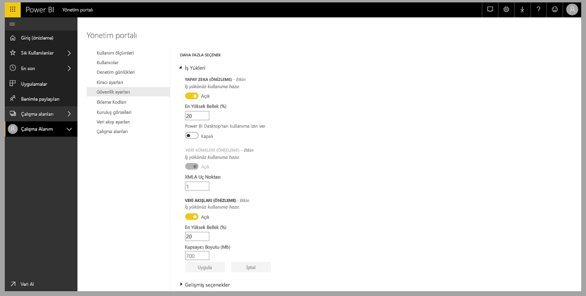
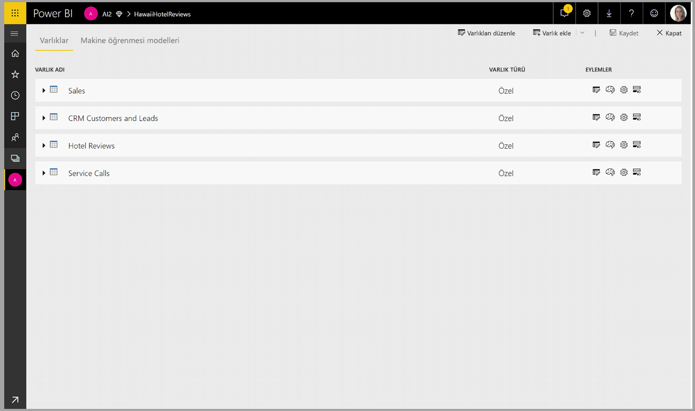
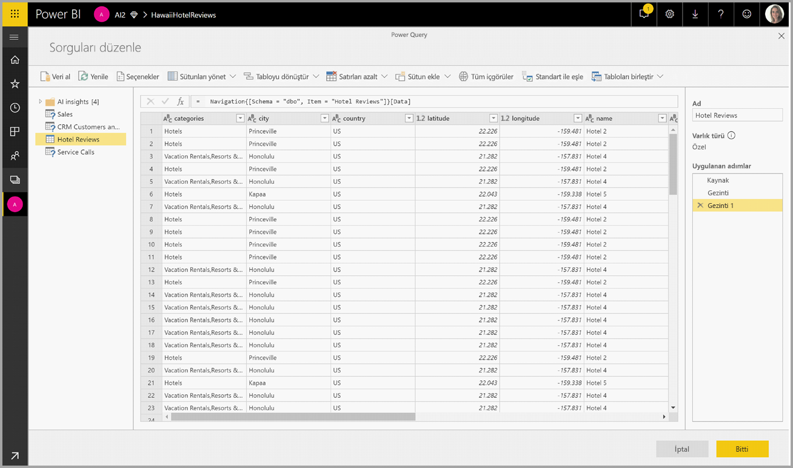
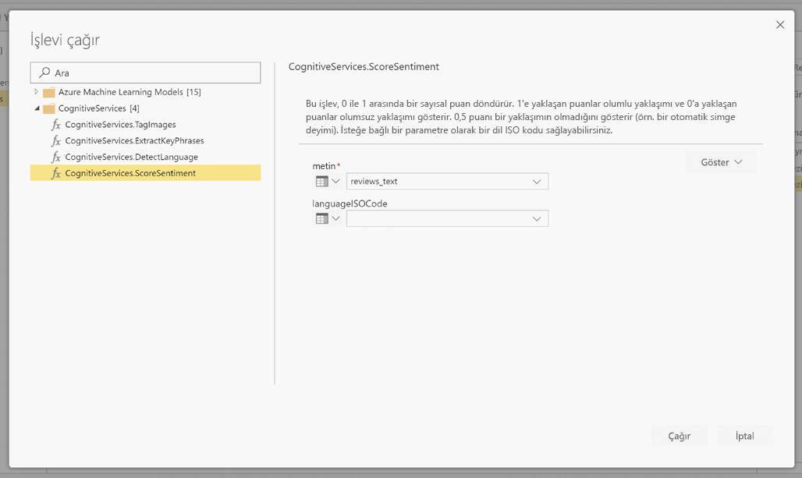
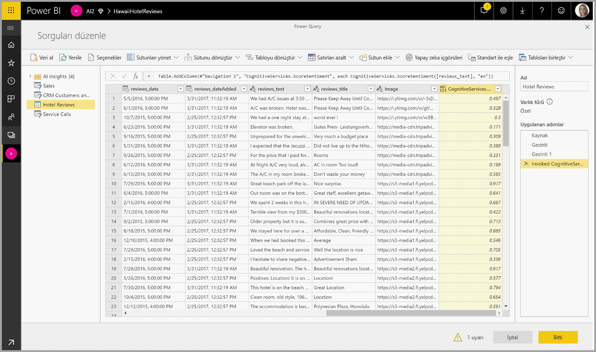
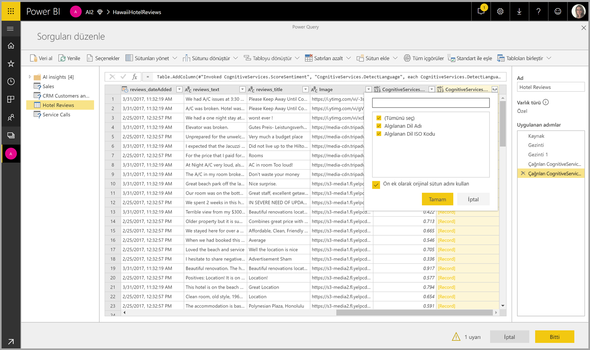

# Power BI'da Bilişsel Hizmetler 

Power BI'da Bilişsel Hizmetlerle, Veri Akışları için self servis veri hazırlığında verileri zenginleştirmek için [Azure Bilişsel Hizmetler](https://azure.microsoft.com/services/cognitive-services/)'den farklı algoritmalar uygulayabilirsiniz.

Bugün desteklenen hizmetler [Yaklaşım Analizi](https://docs.microsoft.com/azure/cognitive-services/text-analytics/how-tos/text-analytics-how-to-sentiment-analysis), [Anahtar İfade Ayıklama](https://docs.microsoft.com/azure/cognitive-services/text-analytics/how-tos/text-analytics-how-to-keyword-extraction), [Dil Algılama](https://docs.microsoft.com/azure/cognitive-services/text-analytics/how-tos/text-analytics-how-to-language-detection) ve [Resim Etiketleme](https://docs.microsoft.com/azure/cognitive-services/computer-vision/concept-tagging-images)'dir. Dönüştürmeler Power BI Hizmetinde yürütülür ve Azure Bilişsel Hizmetler aboneliği gerekmez. Bu özellik için Power BI Premium gerekir.

## **AI özelliklerini etkinleştirme**

Bilişsel hizmetler EM2, A2 veya P1 ve üstü Premium kapasite düğümleri için desteklenir. Bilişsel hizmetleri çalıştırmak için kapasitede ayrı bir AI iş yükü kullanılır. Genel önizleme (Haziran 2019 öncesi) sırasında bu iş yükü varsayılan olarak devre dışı bırakılmıştı. Power BI'da bilişsel hizmetleri kullanmadan önce yönetim portalının kapasite ayarlarında AI iş yükünün etkinleştirilmesi gerekir. İş yükleri bölümünde AI iş yükünü açmalı ve bu iş yükünün kullanmasını istediğiniz en büyük bellek miktarını tanımlamalısınız. Önerilen bellek sınırı %20'dir. Bu sınırın aşılması sorgunun yavaşlamasına neden olur.

## **Power BI’da Bilişsel Hizmetler’i kullanmaya başlama**

Bilişsel Hizmetler dönüştürmeleri, [veri akışları için Self Servis Veri Hazırlığının](https://powerbi.microsoft.com/blog/introducing-power-bi-data-prep-wtih-dataflows/) bir parçasıdır. Verilerinizi Bilişsel Hizmetler'le zenginleştirmek için başlangıç olarak veri akışını düzenleyin.

Power Query Düzenleyicisi'nin üst şeridindeki **AI İç görüler** düğmesini seçin.

Açılan pencerede kullanmak istediğiniz işlevi ve dönüştürmek istediğiniz verileri seçin. Bu örnekte, inceleme metnini içeren sütunun yaklaşımını puanlıyorum.

**Cultureinfo**, metnin dilini belirtmeye yönelik isteğe bağlı bir giriştir. Bu alanda bir ISO kodu beklenir. Cultureinfo için giriş olarak bir sütunu veya statik bir alanı kullanabilirsiniz. Bu örnekte tüm sütun için dil olarak İngilizce (en) belirtilmiştir. Bu alanı boş bırakırsanız, Power BI işlevi uygulamadan önce dili otomatik olarak algılar. Ardından **Çağır**'ı seçin.

İşlevi çağırdıktan sonra, sonuç tabloya yeni bir sütun olarak eklenir. Dönüştürme de sorguya uygulanmış bir adım olarak eklenir.

İşlev birden çok çıkış alanı döndürürse, işlevin çağrılması birden çok çıkış alanının kaydını içeren yeni bir sütun ekler.

Verilerinize bir veya birden çok değeri sütun olarak eklemek için genişletme seçeneğini kullanın.

## **Kullanılabilir işlevler**

Bu bölümde Power BI'da Bilişsel Hizmetler'le kullanılabilen işlevler açıklanır.

### **Dili Algıla**

Dil algılama işlevi metin girişini değerlendirir ve her alan için dil adını ve ISO tanımlayıcısını döndürür. Bu işlev dilin bilinmediği rastgele metinleri toplayan veri sütunlarında kullanışlıdır. İşlev, giriş olarak metin biçiminde veriler bekler.

Metin Analizi 120 dile kadar tanır. Daha fazla bilgi için [desteklenen dillere](https://docs.microsoft.com/azure/cognitive-services/text-analytics/text-analytics-supported-languages) bakın.

### **Anahtar İfadeleri Ayıklama**

**Anahtar İfade Ayıklama** işlevi yapılandırılmamış metinleri değerlendirir ve her metin alanı için bir anahtar ifade listesi döndürür. İşlev, giriş olarak bir metin alanı gerektirir ve **Cultureinfo** için isteğe bağlı girişi kabul eder. (Bu makalenin başlarındaki **Başlarken** bölümüne bakın).

Anahtar ifade ayıklama, üzerinde çalışması için işleve daha büyük metin öbekleri verdiğinizde daha iyi sonuç verir. Bu, küçük metin bloklarında daha iyi çalışan yaklaşım analizinin tam tersidir. Her iki işlemden de en iyi sonuçları almak için, girişleri buna göre yeniden yapılandırmayı göz önünde bulundurun.

### **Yaklaşım Puanlama**

**Yaklaşım Puanlama** işlevi metin girişini değerlendirir ve her belge için 0 (olumsuz) ile 1 (olumlu) arasında bir yaklaşım puanı döndürür. Bu işlev sosyal medyada, müşteri incelemelerinde ve tartışma forumlarında olumlu ve olumsuz yaklaşımı algılamak için yararlıdır.

Metin Analizi'nde 0 ile 1 arasında bir yaklaşım puanı oluşturmak için makine öğrenmesi sınıflandırma algoritması kullanılır. 1'e yaklaşan puanlar olumlu yaklaşımı ve 0'a yaklaşan puanlar olumsuz yaklaşımı gösterir. Model, yaklaşım ilişkilendirmeleri için çok büyük bir metinle önceden eğitilir. Şu anda kendi eğitim verilerinizi sağlamanız mümkün değildir. Model, metin analizi sırasında metin işleme, kısmi konuşma analizi, sözcük değiştirme ve sözcük ilişkilendirmeleri gibi tekniklerin bir bileşimini kullanır. Algoritma hakkında daha fazla bilgi için bkz. [Metin Analizine Giriş](https://blogs.technet.microsoft.com/machinelearning/2015/04/08/introducing-text-analytics-in-the-azure-ml-marketplace/).

Yaklaşım analizi, metindeki belirli bir varlığın yaklaşımını ayıklamak yerine giriş alanının tamamında gerçekleştirilir. Uygulamada, büyük metin blokları yerine bir veya iki tümce içeren belgelerde puanlama doğruluğu gelişme eğilimi gösterir. Nesnellik değerlendirmesi aşamasında, model bir bütün olarak giriş alanının nesnel olduğunu veya yaklaşım içerdiğini saptar. Büyük ölçüde nesnel olan bir giriş alanı yaklaşım algılama aşamasına ilerletilmez; sonuçta 0,50 puan alır ve başka işlem yapılmaz. İşlem hattında ilerleyen giriş alanları için, sonraki aşamada giriş alanında algılanan yaklaşımın derecesine bağlı olarak 0,50'nin üstünde veya altında bir puan oluşturulur.

Şu anda Yaklaşım Analizi İngilizce, Almanca, İspanyolca ve Fransızcayı desteklemektedir. Diğer diller önizleme aşamasındadır. Daha fazla bilgi için bkz. [Desteklenen diller](https://docs.microsoft.com/azure/cognitive-services/text-analytics/text-analytics-supported-languages).

### **Resimleri Etiketleme**

**Resimleri Etiketleme** işlevi 2.000'den fazla nesneye, canlıya, manzaraya ve eyleme dayanarak etiketler döndürür. Etiketler belirsizse veya bilinen gerçeklere uymuyorsa, etiketin anlamını bilinen ayar bağlamında netleştirmek için çıkışta 'ipuçları' sağlanır. Etiketler taksonomi olarak düzenlenmez ve devralınan hiyerarşiler yoktur. İçerik etiketleri koleksiyonu, tam tümceler halinde biçimlendirilmiş insan tarafından okunabilir dilde görüntülenen bir resim 'açıklaması' için temel oluşturur.

Resmi karşıya yükledikten veya resim URL'sini belirttikten sonra, Görüntü İşleme algoritmaları resimde tanımlanan nesnelere, canlılara ve eylemlere dayanarak etiketlerin çıkışını yapar. Etiketleme ön plandaki kişi gibi ana konuyla sınırlı değildir; ortamı (iç mekan veya dış mekan), mobilyaları, araçları, bitkileri, hayvanları, aksesuarları ve gereçleri de içerir.

Bu işleve giriş olarak bir resim URL'si ve base 64 alanı gerekir. Şu anda resim etiketleme İngilizce, İspanyolca, Japonca, Portekizce ve Basitleştirilmiş Çinceyi desteklemektedir. Daha fazla bilgi için bkz. [Desteklenen diller](https://docs.microsoft.com/rest/api/cognitiveservices/computervision/tagimage/tagimage#uri-parameters).

## Sonraki Adımlar

Bu makalede Power BI hizmetiyle Bilişsel Hizmetler'i kullanmaya genel bir bakış sağlandı. Aşağıdaki makaleleri de ilginç ve yararlı bulabilirsiniz. 

* [Öğretici: Power BI'da Machine Learning Studio (klasik) modelini çağırma](service-tutorial-invoke-machine-learning-model.md)
* [Power BI'da Azure Machine Learning tümleştirmesi](service-machine-learning-integration.md)
* [Öğretici: Power BI’da Bilişsel Hizmetler’i kullanma](service-tutorial-use-cognitive-services.md)

Veri akışları hakkında daha fazla bilgi için şu makaleleri okuyabilirsiniz:
* [Power BI’da veri akışları oluşturma ve kullanma](service-dataflows-create-use.md)
* [Power BI Premium'da hesaplanan varlıkları kullanma](service-dataflows-computed-entities-premium.md)
* [Şirket içi veri kaynakları ile veri akışlarını kullanma](service-dataflows-on-premises-gateways.md)
* [Power BI veri akışları için geliştirici kaynakları](service-dataflows-developer-resources.md)
* [Veri akışları ve Azure Data Lake tümleştirmesi (Önizleme)](service-dataflows-azure-data-lake-integration.md)