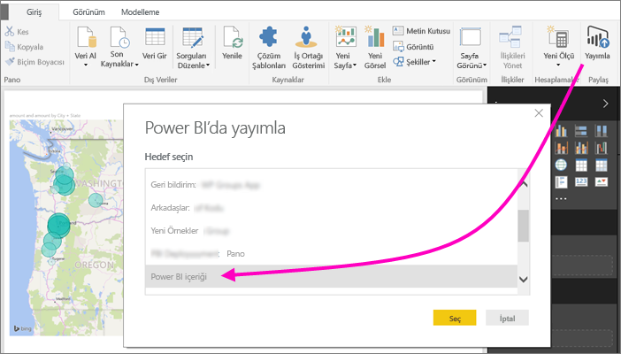
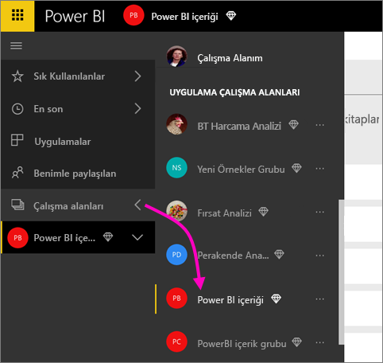
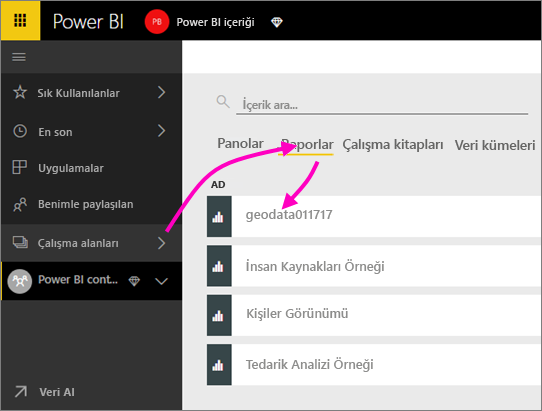
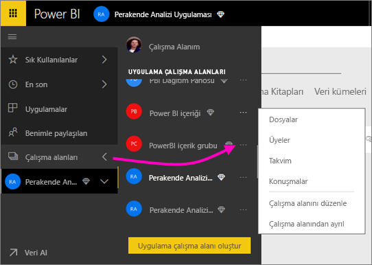
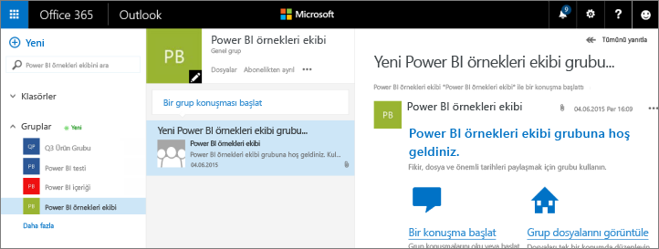
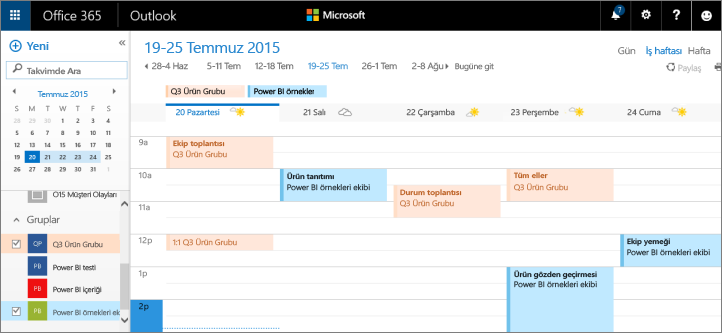

# Power BI uygulama çalışma alanınızda işbirliği yapma
Power BI uygulama çalışma alanları panolar, raporlar ve veri kümeleri üzerinde iş arkadaşlarınızla işbirliği yapıp *uygulamalar* oluşturabileceğiniz harika platformlardır. İşbirliği Power BI'daki çalışma alanları ile sınırlı değildir. Office 365, gruplar için OneDrive İş'te dosya paylaşımı, Exchange'de sohbet, paylaşılan takvim ve görevler gibi başka hizmetler de sunar. [Office 365'teki gruplar](https://support.office.com/article/Create-a-group-in-Office-365-7124dc4c-1de9-40d4-b096-e8add19209e9) hakkında daha fazla bilgi edinin.

> [!NOTE]
> Yeni çalışma alanı deneyimi önizlemesi Power BI çalışma alanlarıyla Office 365 grupları arasındaki ilişkileri değiştirecek. Yeni çalışma alanlarından birini her oluşturduğunuzda otomatik olarak bir Office 365 grubu oluşturmayacaksınız. [Yeni çalışma alanları oluşturma (önizleme)](service-create-the-new-workspaces.md) hakkındaki yazıyı okuyun

Uygulama çalışma alanları yalnızca [Power BI Pro](service-free-vs-pro.md) ile kullanılabilir.

## Uygulama çalışma alanınızda Power BI Desktop dosyaları üzerinde işbirliği yapma
Bir Power BI Desktop dosyası oluşturduktan sonra dosyanızı Power BI uygulama alanında yayımlarsanız çalışma alanınızdaki herkes dosya üzerinde birlikte çalışabilir.

1. Power BI Desktop'ta **Giriş** şeridindeki **Yayımla** seçeneğini belirleyin ve ardından **Hedef seçin** kutusunda uygulama çalışma alanınızı seçin.
   
    
2. Power BI hizmetinde Çalışma Alanı'nın yanındaki oku ve ardından uygulama çalışma alanınızı seçin.
   
    
3. Raporlar sekmesini ve ardından raporunuzu seçin.
   
    
   
    Buradan sonra, Power BI'daki herhangi bir raporda olduğu gibi ilerleriz. Uygulama çalışma alanınızdaki kişilerle birlikte [raporu değiştirip](service-reports.md) kutucukları, seçtiğiniz bir panoya kaydedebilirsiniz.

## Office 365'te işbirliği
Office 365'te işbirliği yapmak için başlangıç noktanız Power BI'daki uygulama çalışma alanıdır.

1. Power BI hizmetinde Çalışma Alanı'nın yanındaki oku ve ardından çalışma alanınızın adının yanında bulunan üç nokta (**…**) simgesini seçin. 
   
   
2. Bu menüden, grubunuzdaki kişilerle birkaç şekilde işbirliği yapabilirsiniz: 
   
   * [Office 365'te grup sohbeti](service-collaborate-power-bi-workspace.md#have-a-group-conversation-in-office-365) yapabilirsiniz.
   * Uygulamanın grup çalışma alanı takviminde [bir etkinlik zamanlayabilirsiniz](service-collaborate-power-bi-workspace.md#schedule-an-event-on-the-group-workspace-calendar).
   
   Office 365'te uygulamanızın grup çalışma alanına ilk kez gittiğinizde bir süre beklemeniz gerekebilir. 15 ila 30 dakika bekledikten sonra tarayıcınızı yenileyin.

## Office 365'te grup sohbeti yapma
1. Uygulama çalışma alanınızın adının yanındaki üç nokta (…) simgesi \> **Konuşmalar** seçeneğini belirleyin. 
   
    
   
   Uygulamanızın grup çalışma alanına ilişkin e-posta ve sohbet sitesi Office 365 için Outlook'ta açılır.
   
   
2. [Office 365 için Outlook'taki grup sohbetleri](https://support.office.com/Article/Have-a-group-conversation-a0482e24-a769-4e39-a5ba-a7c56e828b22) hakkında daha fazla bilgi edinin.

## Uygulamanın grup çalışma alanı takviminde bir etkinlik zamanlama
1. Uygulama çalışma alanınızın adının yanındaki üç nokta (**…**) simgesi \> **Takvim** seçeneğini belirleyin. 
   
   
   
   Bu işlemin ardından Office 365 için Outlook'ta uygulamanızın grup çalışma alanına ilişkin takvim açılır.
   
   
2. [Office 365 için Outlook'taki grup takvimleri](https://support.office.com/Article/Add-edit-and-subscribe-to-group-events-0cf1ad68-1034-4306-b367-d75e9818376a) hakkında daha fazla bilgi edinin.

## Bir uygulama çalışma alanını yönetme
Bir uygulama çalışma alanının sahibi veya yöneticisiyseniz çalışma alanı üyesi ekleyip kaldırma seçeneğiniz de olur. [Power BI uygulama çalışma alanınızı yönetme](service-manage-app-workspace-in-power-bi-and-office-365.md) hakkında daha fazla bilgi edinin.

## Sonraki adımlar
* [Power BI'da uygulama ve uygulama çalışma alanı oluşturma](service-create-distribute-apps.md)
* Başka bir sorunuz mu var? [Power BI Topluluğu'na başvurun](http://community.powerbi.com/)
* Geri bildirimde bulunmak ister misiniz? [Power BI Ideas](https://ideas.powerbi.com/forums/265200-power-bi) sayfasını ziyaret edin

