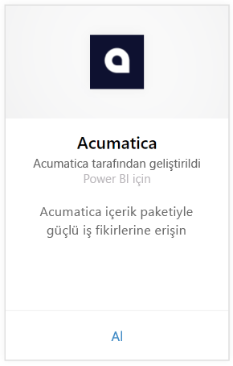
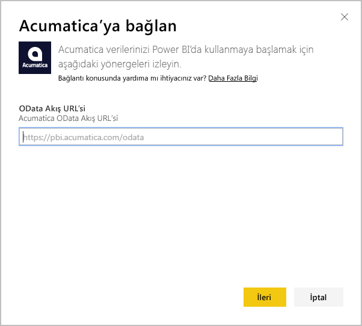
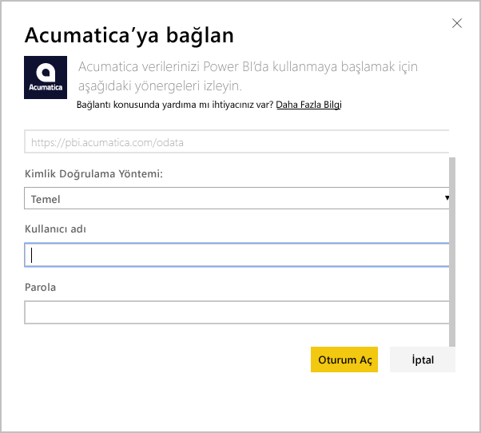
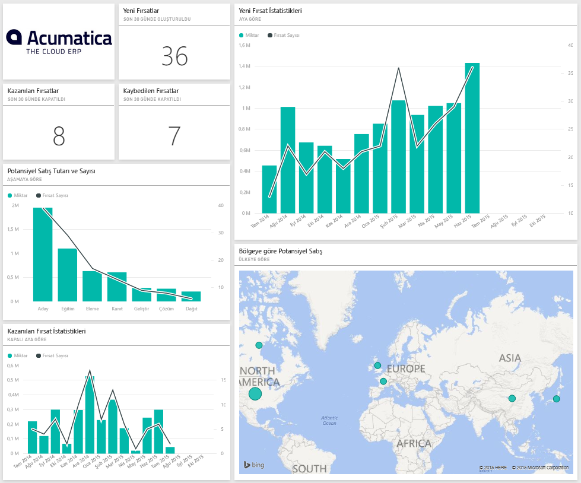
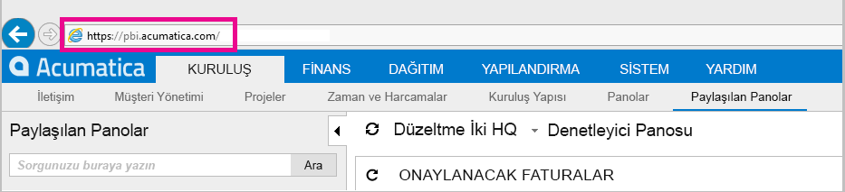
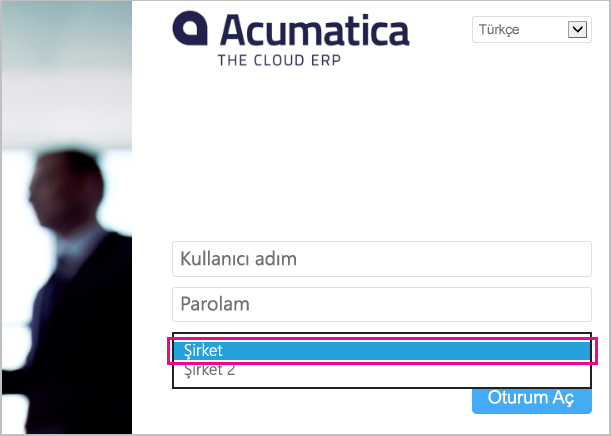

# Power BI ile Acumatica'ya Bağlanma
Power BI Acumatica içerik paketi, fırsat verilerinizle ilgili hızla öngörü elde etmenize olanak sağlar. Power BI; fırsatlar, hesaplar ve müşteriler de dahil olmak üzere verilerinizi alır ve bu verilere dayalı olarak, varsayılan bir pano ve ilgili raporları oluşturur.

[!INCLUDE [include-short-name](./includes/service-deprecate-content-packs.md)]

[Acumatica içerik paketine](https://app.powerbi.com/getdata/services/acumatica) bağlanın veya Power BI ile [Acumatica tümleştirmesi](https://powerbi.microsoft.com/integrations/acumatica) hakkında daha fazla bilgi edinin.

>[!NOTE]
>Bu içerik paketi için Acumatica v5.2 veya sonraki bir sürümü gereklidir.

## Bağlanma
1. Sol gezinti bölmesinin alt kısmında bulunan **Veri Al**'ı seçin.
   
   
2. **Hizmetler** kutusundaki **Al** seçeneğini belirleyin.
   
   
3. **Acumatica** \> **Al**'ı seçin.
   
   
4. Acumatica OData uç noktanızı girin. OData uç noktaları, bir dış sistemin Acumatica'dan veri istemesine olanak sağlar. Acumatica OData uç noktası aşağıdaki gibi biçimlendirilir ve HTTPS ifadesinin kullanılması gerekir:
   
     `https://[sitedomain]/odata/[companyname]`
   
   Şirket Adı bilgisi yalnızca çoklu şirket dağıtımınız varsa gereklidir. Aşağıda, Acumatica hesabınızda bu parametreyi nasıl bulacağınız konusunda daha fazla bilgi yer almaktadır.
   
   
5. Kimlik doğrulama yöntemi için **Temel**'i seçin. Acumatica hesabınıza ilişkin kullanıcı adınızı ve parolanızı girip **Oturum Aç**'a tıklayın.
   
    
6. Veriler Power BI tarafından içeri aktarıldıktan sonra sol gezinti bölmesinde yeni bir pano, rapor ve veri kümesi görürsünüz. Yeni öğeler, sarı bir yıldızla \* işaretlenir. Öğeler bir kez seçildiğinde bu işaret kaybolur. Panoyu seçtiğinizde aşağıdakine benzer bir düzen görürsünüz:
   
    

**Sırada ne var?**

* Panonun üst tarafındaki [Soru-Cevap kutusunda soru sormayı](consumer/end-user-q-and-a.md) deneyin
* Panodaki [kutucukları değiştirin](service-dashboard-edit-tile.md).
* Bağlantılı raporu açmak için [bir kutucuk seçin](consumer/end-user-tiles.md).
* Veri kümeniz günlük olarak yenilenecek şekilde zamanlanır ancak yenileme zamanlamasında değişiklik yapabilir veya **Şimdi Yenile** seçeneğini kullanarak istediğinizde veri kümenizi kendiniz de yenileyebilirsiniz.

## Sistem Gereksinimleri
Bu içerik paketi için Acumatica v5.2 veya sonraki bir sürümü gereklidir. Lütfen Acumatica yöneticinizle iletişime geçerek sürümünüzü kontrol edin.

## Parametreleri bulma
**Acumatica OData Uç Noktası**

Acumatica OData uç noktası aşağıdaki gibi biçimlendirilir ve HTTPS ifadesinin kullanılması gerekir:

    https://[sitedomain]/odata/[companyname]

Acumatica'da oturum açtığınızda, Uygulama Site Etki Alanı bilgisini tarayıcınızdaki adres çubuğunda görebilirsiniz. Aşağıdaki örnekte site etki alanı adı `https://pbi.acumatica.com` olduğundan, sağlanacak OData uç noktası `https://pbi.acumatica.com/odata` olur.

 

Şirket Adı bilgisi yalnızca çoklu şirket dağıtımınız varsa gereklidir. Bu bilgileri Acumatica oturum açma sayfanızda bulabilirsiniz.

## Sorun giderme
Oturum açamıyorsanız, girdiğiniz Acumatica OData uç noktasının doğru olduğundan emin olun.

    https://<application site domain>/odata/<company name>

Bağlanırken sorun yaşıyorsanız lütfen yöneticinizle iletişime geçerek Acumatica sürümünüzü onaylayın. Bu içerik paketi için 5.2 veya sonraki bir sürüm gereklidir.

## Sonraki adımlar
[Power BI ile çalışmaya başlama](service-get-started.md)

[Power BI'da veri alma](service-get-data.md)

