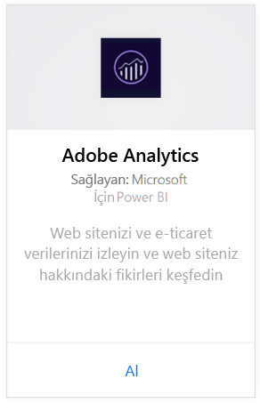
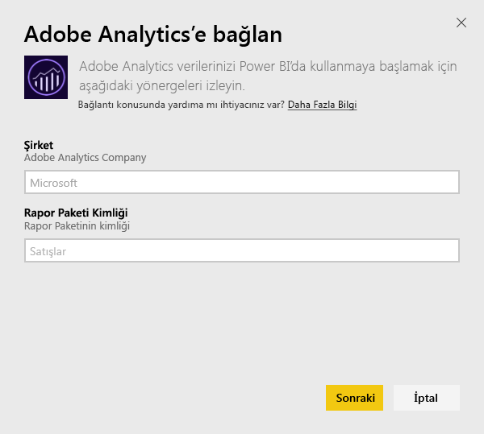
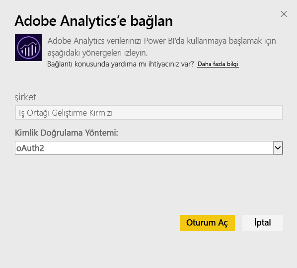
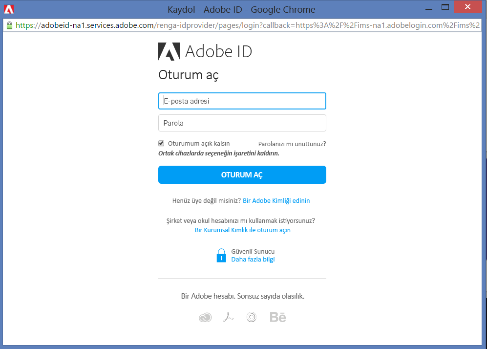
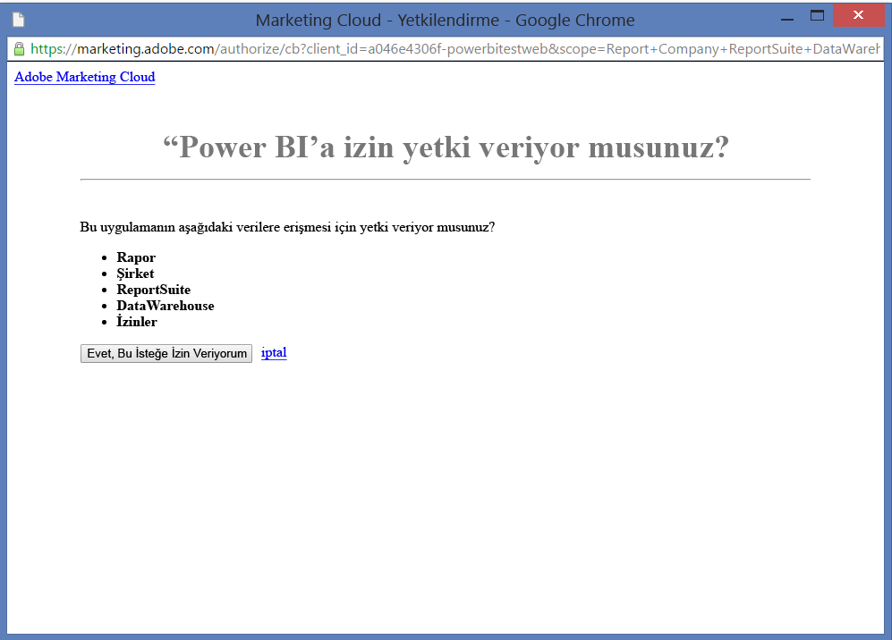
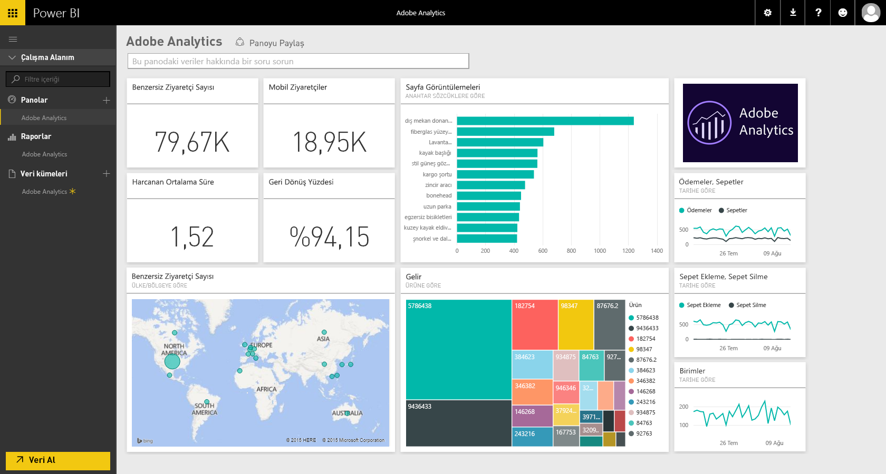
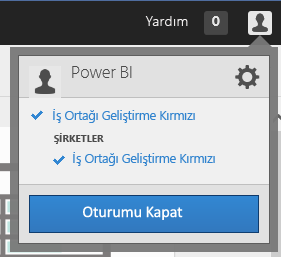
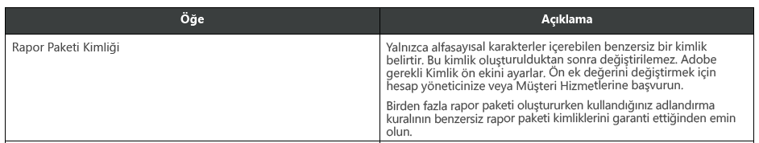

# Power BI ile Adobe Analytics'e bağlanma
Power BI aracılığıyla Adobe Analytics'e bağlanmak için öncelikle Adobe Analytics Marketing Cloud hesabınızı bağlamanız gerekir. Site trafiğinize ve kullanıcılarınıza ilişkin boyutlar hakkında öngörü sağlayan bir Power BI panosu ve bir dizi Power BI raporu içeren bir uygulamaya sahip olursunuz. Veriler günde bir kez otomatik olarak yenilenir. Pano ve raporlar ile etkileşim kurabilirsiniz, ancak değişiklikleri kaydedemezsiniz.

[Adobe Analytics](https://app.powerbi.com/getdata/services/adobe-analytics)'e bağlanın veya Power BI ile [Adobe Analytics'i tümleştirme](https://powerbi.microsoft.com/integrations/adobe-analytics) hakkında daha fazla bilgi edinin.

## Bağlanma
[!INCLUDE [powerbi-service-apps-get-more-apps](./includes/powerbi-service-apps-get-more-apps.md)]

1. **Adobe Analytics** \>  **Al**'ı seçin.
   
   
2. Power BI'ın bağlantı kurması için Adobe Analytics Company (Şirket) ve Report Suite kimliği (Report Suite adı değil) alanlarının gerekli bilgilerle doldurulması gerekir. [Bu parametreleri bulma](#FindingParams) konusundaki ayrıntılı bilgileri aşağıda bulabilirsiniz.
   
   
3. **Kimlik doğrulama yöntemi** için **OAuth2** \> **Oturum aç** seçeneklerini belirleyin. İstendiğinde, Adobe Analytics kimlik bilgilerinizi girin. 
   
    
   
    
4. Power BI'ın Adobe Analytics verilerinize erişmesine izin vermek için **Kabul et**'e tıklayın.
   
   
5. Onay verdikten sonra içeri aktarma işlemi otomatik olarak başlar. 

## Adobe Analytics panosunu ve raporlarını görüntüleme
[!INCLUDE [powerbi-service-apps-open-app](./includes/powerbi-service-apps-open-app.md)]

      

[!INCLUDE [powerbi-service-apps-open-app](./includes/powerbi-service-apps-what-now.md)]

## Neleri kapsar?
Power BI, Adobe Analytics Report API'sini aşağıdaki tablolar için rapor tanımlama ve çalıştırma amacıyla kullanır:

| **Tablo Adı** | **Sütun Ayrıntıları** |
| --- | --- |
| Ürünler |elements= "product" (ilk 25)   metrics="cartadditions", "cartremovals", "carts", "cartviews", "checkouts", "revenue", "units" |
| Browsers (Tarayıcılar) |elements= "browser" (ilk 25)   metrics="bounces", "bouncerate", "visitors", "visits", "uniquevisitors", "totaltimespent", "pageviews" |
| Pages (Sayfalar) |elements= "page" (ilk 25)   metrics="cartadditions", "cartremovals", "carts", "cartviews", "checkouts", "revenue", "units", "visits", "uniquevisitors", "pageviews", "bounces", "bouncerate", "totaltimespent" |
| JavaScript Enabled (JavaScript Etkin) |elements= "javascriptenabled", "browser" (ilk 25) |
| Mobile OS (Mobil İşletim Sistemi) |elements= "mobileos" (ilk 25)  metrics="bounces", "bouncerate", "visitors", "visits", "uniquevisitors", "totaltimespent", "cartadditions", "cartremovals", "checkouts", "revenue", "units", "pageviews" |
| Search Engines Keywords (Arama Motoru Anahtar Sözcükleri) |elements= "searchengine" "searchenginekeyword"   metrics="bounces", "bouncerate", "visitors", "visits", "entries", "uniquevisitors", "totaltimespent", "cartadditions", "cartremovals", "carts", "cartviews", "checkouts", "revenue", "units", "pageviews" |
| Search Engine to Products (Arama Motoru Hedef Ürünleri) |elements= "searchengine", "product"   metrics="bounces", "bouncerate", "visitors", "visits", "entries", "uniquevisitors", "totaltimespent", "cartadditions", "cartremovals", "carts", "cartviews", "checkouts", "revenue", "units", "pageviews" |
| Referring Pages (Başvuran Sayfalar) |elements= "referrer" (ilk 15), "page" (ilk 10)   metrics="bounces", "bouncerate", "visitors", "visits", "entries", "uniquevisitors", "totaltimespent", "cartadditions", "cartremovals", "carts", "cartviews", "checkouts", "revenue", "units", "pageviews" |
| Geocountry Pages (Coğrafi Bölge Sayfaları) |elements= "geocountry" (ilk 20), "page"   metrics="bounces", "bouncerate", "visitors", "visits", "entries", "uniquevisitors", "totaltimespent", "cartadditions", "cartremovals", "carts", "cartviews", "checkouts", "revenue", "units", "pageviews" |
| Geocountry Product (Coğrafi Bölge Ürünü) |elements= "geocountry" (ilk 20), "product"  metrics="bounces", "bouncerate", "visitors", "visits", "entries", "uniquevisitors", "totaltimespent", "cartadditions", "cartremovals", "carts", "cartviews", "checkouts", "revenue", "units" |
| Country and Region Lookup (Ülke ve Bölge Arama) |elements= "geocountry" (ilk 200)   metrics="bounces", "bouncerate", "visitors", "visits", "entries", "uniquevisitors", "totaltimespent", "cartadditions", "cartremovals", "carts", "cartviews", "checkouts", "revenue", "units" |
| Language (Dil) |elements= "language", "browser" (ilk 25)   metrics="bounces", "bouncerate", "visitors", "visits", "uniquevisitors", "totaltimespent", "pageviews", "cartadditions", "cartremovals", "checkouts", "carts", "cartviews" |
| Search Engines Look Up (Arama Motoru Arama) |elements= "searchengine" (ilk 100)   metrics="bounces", "bouncerate", "visitors", "visits", "entries", "uniquevisitors", "totaltimespent", "cartadditions", "cartremovals", "carts", "cartviews", "checkouts", "revenue", "units" |
| Browser Lookup (Tarayıcı Arama) |elements= "browser" (ilk 25) |

## Sistem gereksinimleri
Aşağıda belirtilen doğru parametrelere erişim de dahil olmak üzere, [Adobe Analytics](http://www.adobe.com/marketing-cloud/web-analytics.html) erişimi gereklidir.

## Parametreleri bulma
**Company**

Company değerini oturum açtıktan sonra hesap sayfanızın sağ üst köşesinde bulabilirsiniz. Değer büyük/küçük harfe ve boşluklara duyarlıdır. Hesabınızda gördüğünüz şekilde girin.

**Report Suite ID**

Suite ID, Report Suite oluşturulduğunda düzenlenir. ID değerini tanımlamak için yöneticinize başvurabilirsiniz. Bunun Report Suite adı olmadığına dikkat edin.

Adobe [belgelerinden](https://marketing.adobe.com/resources/help/en_US/reference/new_report_suite.html):

## Sorun giderme
Kimlik bilgilerinizi girdikten sonra gerekli izinlere sahip olmadığınızı belirten bir hata görüyorsanız lütfen yöneticinize başvurarak Adobe Analytics API'sine erişim izniniz olduğunu doğrulayın. Ayrıca girdiğiniz Adobe ID'nin Marketing Cloud Organization (bir Adobe Analytics şirketiyle ilişkili olan) kuruluşunuzla bağlantılı olduğundan emin olun.

Kimlik bilgileri ekranını hata almadan geçtiyseniz raporların tamamlanması çok uzun sürüyor olabilir. Sık karşılaşılan hatalardan biri *"Adobe Analytics raporundan veri alınamadı. Dahil edilen içerik &quot; başvuran, sayfa &quot;, yaklaşık süre xx saniyeydi"* şeklindedir. Lütfen "Neleri kapsar" bölümünü inceleyin ve Adobe örneğinizin boyutunu karşılaştırın. Maalesef bu zaman aşımı için bilinen bir geçici çözüm mevcut değildir. Ancak daha büyük örnekler için daha fazla destek sunma amacıyla güncelleştirme yapmayı düşünüyoruz. Lütfen geri bildiriminizi https://ideas.powerbi.com adresine giderek Power BI ekibiyle paylaşın

## Sonraki adımlar
* [Power BI'da uygulamalar ne anlama gelir?](service-install-use-apps.md)
* [Power BI'da veri alma](service-get-data.md)
* Başka bir sorunuz mu var? [Power BI Topluluğu'na sorun](http://community.powerbi.com/)

