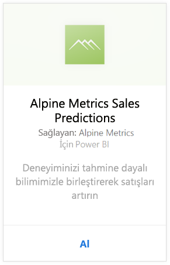
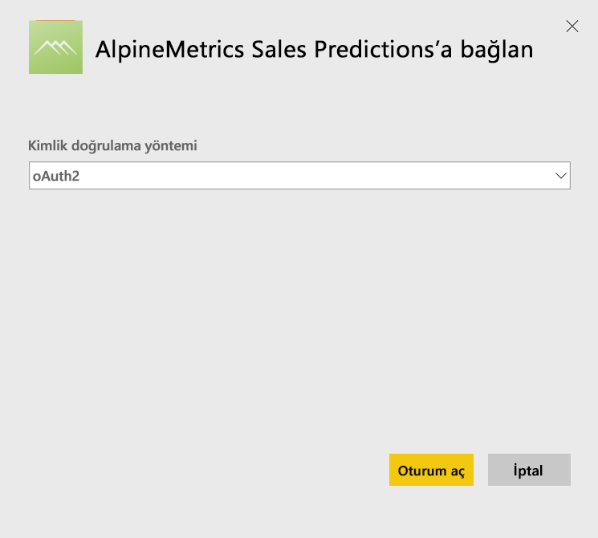
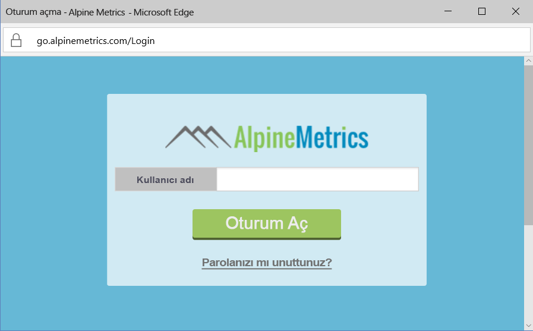
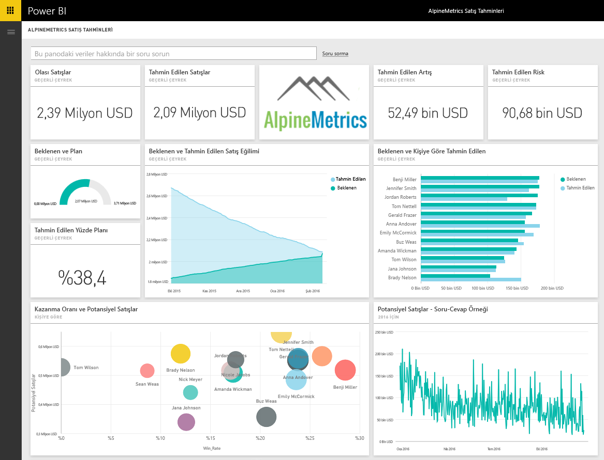

# Power BI ile Alpine Metrics Sales Predictions'a bağlanma
Alpine Metrics, küçük ve büyük ölçekli satış kuruluşlarının isteği üzerine bulutta son teknoloji Tahmine Dayalı Satış Süreci Optimizasyonu olanağı sağlar. Power BI için Alpine Metrics Sales Predictions içerik paketinde, potansiyel ve öngörülen satışlar ve riskler gibi, işinizin geleceğine yönelik ayrıntılı öngörüler edinmenizi sağlayan ölçümler bulunur. 

Power BI için [Alpine Metrics Sales Predictions içerik paketine](https://app.powerbi.com/getdata/services/alpine-metrics) bağlanın.

## Bağlanma
1. Sol gezinti bölmesinin alt kısmındaki Veri Al seçeneğini belirleyin.  
   
    
2. **Hizmetler** kutusundaki **Al** seçeneğini belirleyin.  
   
    
3. **AlpineMetrics Sales Predictions**'ı ve ardından **Al**'ı seçin.  
   
    
4. **OAuth2**'yi ve ardından **Oturum Aç** seçeneğini belirleyin. İstendiğinde, AlpineMetrics kimlik bilgilerinizi girin.
   
    
   
    
5. Bağlandıktan sonra otomatik olarak bir pano, rapor ve veri kümesi yüklenir. Yükleme tamamlandığında, kutucuklar hesabınızdaki veriler ile güncelleştirilir.
   
    

**Sırada ne var?**

* Panonun üst tarafındaki [Soru-Cevap kutusunda soru sormayı](power-bi-q-and-a.md) deneyin
* Panodaki [kutucukları değiştirin](service-dashboard-edit-tile.md).
* Bağlantılı raporu açmak için [bir kutucuk seçin](service-dashboard-tiles.md).
* Veri kümeniz günlük olarak yenilenecek şekilde zamanlanır ancak yenileme zamanlamasında değişiklik yapabilir veya **Şimdi Yenile** seçeneğini kullanarak istediğinizde veri kümenizi kendiniz de yenileyebilirsiniz

## Neleri kapsar?
İçerik paketi şu tablolardaki verileri içerir:  

    - Account (Hesap)    
    - Business (İş)    
    - Country (Ülke)    
    - Industry (Sektör)    
    - Opportunity (Fırsat)  
    - Person (Kişi)  
    - Prediction (Tahmin)    
    - Prediction History (Tahmin geçmişi)    
    - Product (Ürün)  
    - Region (Bölge)    

## Sistem gereksinimleri
Bu içerik paketinin bir örneğini oluşturmak için yukarıdaki tabloların izinlerine sahip bir Alpine Metrics hesabı gereklidir.

## Sonraki adımlar
[Power BI ile çalışmaya başlama](service-get-started.md)

[Power BI - Temel Kavramlar](service-basic-concepts.md)

