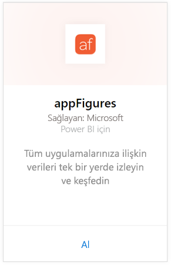
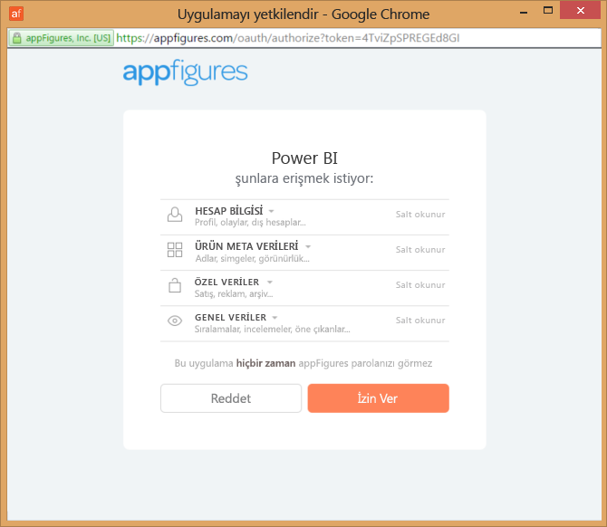
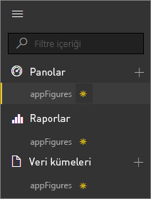
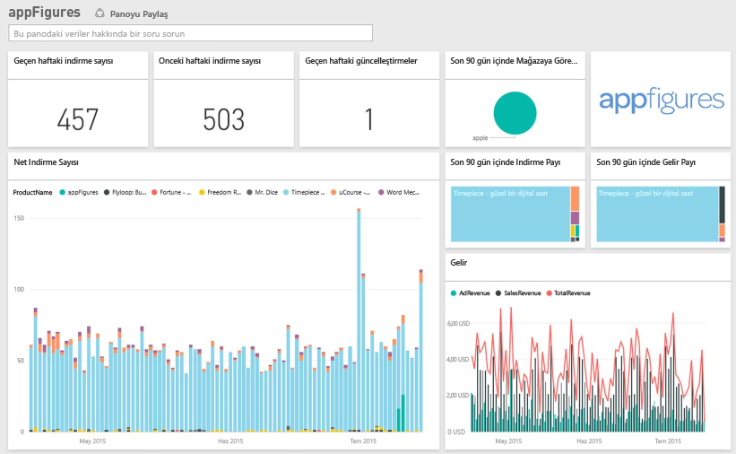
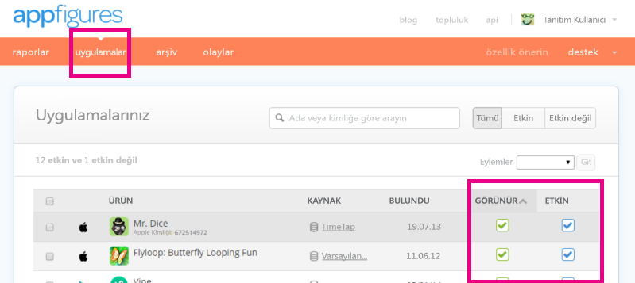

# Power BI ile appFigures'a bağlanma
Power BI ve appFigures içerik paketi ile uygulamalarınıza ilişkin önemli istatistikleri izlemek son derece kolaydır. Power BI; uygulama satışları, indirmeler ve reklam istatistikleri gibi verilerinizi alarak varsayılan bir pano ve bu verilere dayalı raporlar oluşturur.

[appFigures içerik paketine](https://app.powerbi.com/getdata/services/appfigures) bağlanın veya Power BI ile [appFigures tümleştirmesi](https://powerbi.microsoft.com/integrations/appfigures) hakkında daha fazla bilgi edinin.

## Bağlanma
1. Sol gezinti bölmesinin alt kısmında bulunan **Veri Al**'ı seçin.
   
   
2. **Hizmetler** kutusundaki **Al** düğmesini seçin.
   
   
3. **appFigures** \> **Al** seçeneğini belirleyin.
   
   
4. **Kimlik doğrulama yöntemi** için **OAuth2** \> **Oturum aç** seçeneklerini belirleyin. İstendiğinde appFigures kimlik bilgilerinizi girin ve appFigures kimlik doğrulama işlemindeki diğer adımlarla devam edin.
   
   İlk bağlandığınızda Power BI, hesabınıza yalnızca okuma erişim izni vermenizi ister. İçeri aktarma işlemini başlatmak için **Allow** (İzin ver) seçeneğini belirleyin. Bu işlem, hesabınızdaki verilerin hacmine bağlı olarak birkaç dakika sürebilir.
   
   
5. Veriler Power BI tarafından içeri aktarıldıktan sonra sol gezinti bölmesinde yeni bir pano, rapor ve veri kümesi görürsünüz. Yeni öğeler sarı yıldız işareti \* ile gösterilir:
   
    
6. appFigures panosunu seçin. Bu, Power BI'ın verilerinizi görüntülemek için oluşturduğu varsayılan panodur. Bu panoyu, verilerinizi istediğiniz herhangi bir biçimde görüntüleyecek şekilde değiştirebilirsiniz.
   
    

**Sırada ne var?**

* Panonun üst tarafındaki [Soru-Cevap kutusunda soru sormayı](power-bi-q-and-a.md) deneyin
* Panodaki [kutucukları değiştirin](service-dashboard-edit-tile.md).
* Bağlantılı raporu açmak için [bir kutucuk seçin](service-dashboard-tiles.md).
* Veri kümeniz günlük olarak yenilenecek şekilde zamanlanır ancak yenileme zamanlamasında değişiklik yapabilir veya **Şimdi Yenile** seçeneğini kullanarak istediğinizde veri kümenizi kendiniz de yenileyebilirsiniz

## Neleri kapsar?
Power BI'da appFigures ile kullanabileceğiniz veriler aşağıdadır.

| **Tablo Adı** | **Açıklama** |
| --- | --- |
| Countries |Bu tablo, ülke adı bilgisini sağlar. |
| Dates |Bu tablo, içinde bulunduğunuz günden başlayarak, appFigures hesabınızda Active (Etkin) ve Visible (Görünür) durumda olan uygulamaların en erken Yayımlanma Tarihine kadar olan tarihleri içerir. |
| Events |Bu tabloda ülkelere göre günlük olarak her bir uygulamaya ilişkin indirme, satış ve reklam bilgileri bulunur. Hem uygulama hem de uygulama içi satın alma bilgilerinin tümünün bu tek tabloda verileceğini ve bunları ayırt etmek için <strong>Type</strong> sütununu kullanabileceğinizi unutmayın. |
| Inapps |Bu tablo, appFigures hesabınızdaki Active (Etkin) ve Visible (Görünür) durumdaki uygulamalarla ilişkili farklı Uygulama İçi Satın Alma türleri ile ilgili verileri içerir. |
| Ürünler |Bu tablo, appFigures hesabınızda Active (Etkin) ve Visible (Görünür) olan farklı uygulamalar ile ilgili verileri içerir. |

## Sorun giderme
Bazı uygulamalarınızdan alınan veriler Power BI'da gösterilmiyorsa bu uygulamaların appFigures sitesindeki **apps** (uygulamalar) sekmesinde Visible (Görünür) ve Active (Etkin) durumda olup olmadıklarını denetleyin.

## Sonraki adımlar
* [Power BI ile çalışmaya başlama](service-get-started.md)
* [Power BI'da veri alma](service-get-data.md)

