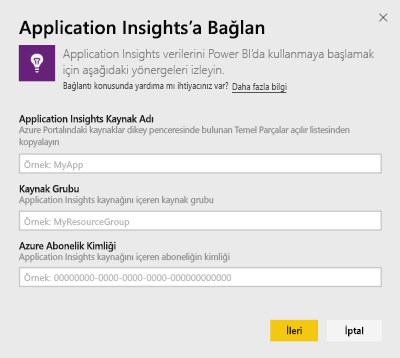
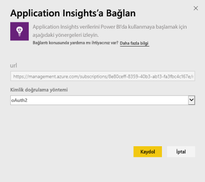
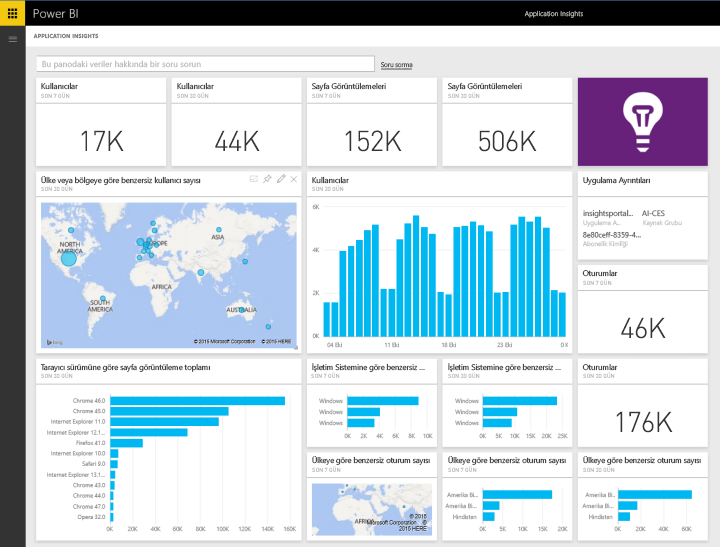
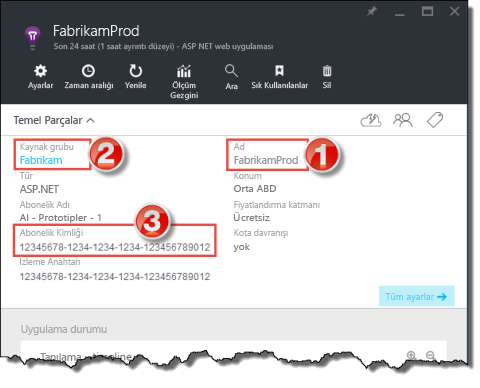
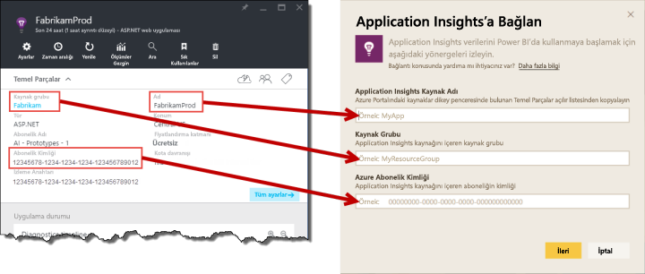

# Power BI ile Application Insights'a Bağlanma
[Application Insights](https://azure.microsoft.com/documentation/articles/app-insights-overview/) telemetrisiyle güçlü, özel panolar oluşturmak için Power BI'ı kullanın. Uygulama telemetrinizi yeni yöntemlerle tasarlayın. Birden çok uygulama veya bileşen hizmetinden alınan ölçümleri tek bir panoda birleştirin. Power BI için Application Insights içerik paketinin ilk sürümünde kullanım ile ilgili yaygın ölçümlere (etkin kullanıcılar, sayfa görünümü, oturumlar, tarayıcı, ve işletim sistemi sürümü, kullanıcıların harita üzerindeki coğrafi dağılımı gibi) ilişkin pencere öğeleri bulunmaktadır.

[Power BI için Application Insights içerik paketine](https://app.powerbi.com/getdata/services/application-insights) bağlanın.

>[!NOTE]
>Bu tümleştirme yöntemi **kullanım dışıdır**. Application Insights ile Power BI bağlantısı için tercih edilen yöntem hakkında daha fazla bilgi için [analitik sorguyu dışarı aktarma işlevini](https://docs.microsoft.com/azure/application-insights/app-insights-export-power-bi#export-analytics-queries) kullanın.

## Bağlanma
1. Sol gezinti bölmesinin alt kısmındaki **Veri Al**'ı seçin.
   
    
2. **Hizmetler** kutusundaki **Al** seçeneğini belirleyin.
   
    
3. **Application Insights** > **Al**'ı seçin.
   
    
4. **Application Insights Resource Name** (Application Insights Kaynak Adı), **Resource Group** (Kaynak Grubu) ve **Subscription ID** (Abonelik Kimliği) de dahil olmak üzere bağlanmak istediğiniz uygulama ile ilgili bilgileri girin. Daha ayrıntılı bilgi için bkz. [Application Insights parametrelerinizi bulma](#FindingAppInsightsParams).
   
        
5. Bağlanmak için **Oturum Aç**'ı seçin ve karşınıza çıkan ekranlardaki yönergeleri uygulayın.
   
    
6. İçeri aktarma işlemi otomatik olarak başlar. İşlem tamamlandığında bir bildirim gösterilir ve Gezinti Bölmesinde yeni bir pano, rapor ve veri kümesi (yıldız işaretiyle birlikte) görünür.  İçeri aktarılan verilerinizi görüntülemek için panoyu seçin.
   
    

**Sırada ne var?**

* Panonun üst tarafındaki [Soru-Cevap kutusunda soru sormayı](consumer/end-user-q-and-a.md) deneyin
* Panodaki [kutucukları değiştirin](service-dashboard-edit-tile.md).
* Bağlantılı raporu açmak için [bir kutucuk seçin](consumer/end-user-tiles.md).
* Veri kümeniz günlük olarak yenilenecek şekilde zamanlanır ancak yenileme zamanlamasında değişiklik yapabilir veya **Şimdi Yenile** seçeneğini kullanarak istediğinizde veri kümenizi kendiniz de yenileyebilirsiniz.

## Neleri kapsar?
Application Insights içerik paketi, aşağıdaki tablo ve ölçümleri içerir:  

    ´´´
    - ApplicationDetails  
    - UniqueUsersLast7Days   
    - UniqueUsersLast30Days   
    - UniqueUsersDailyLast30Days  
    - UniqueUsersByCountryLast7Days  
    - UniqueUsersByCountryLast30Days   
    - PageViewsDailyLast30Days   
    - SessionsLast7Days   
    - SessionsLast30Days  
    - PageViewsByBrowserVersionDailyLast30Days   
    - UniqueUsersByOperatingSystemLast7Days   
    - UniqueUsersByOperatingSystemLast30Days    
    - SessionsDailyLast30Days   
    - SessionsByCountryLast7Days   
    - SessionsByCountryLast30Days   
    - PageViewsByCountryDailyLast30Days  
    ´´´ 

## Parametreleri bulma
Kaynak Adı, Kaynak Grubu ve Abonelik Kimliği bilgilerinizin tamamını Azure Portal'da bulabilirsiniz. Ad'ı seçtiğinizde ayrıntılı bir görünüm açılır ve ihtiyacınız olan tüm değerleri bulmak için Temel Parçalar açılan listesini kullanabilirsiniz.

Bu değerleri kopyalayıp Power BI'daki alanlara yapıştırın:

## Sonraki adımlar
[Power BI ile çalışmaya başlama](service-get-started.md)

[Power BI'da veri alma](service-get-data.md)

