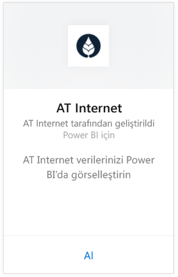
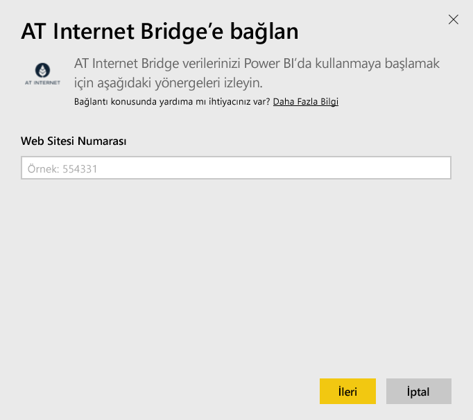
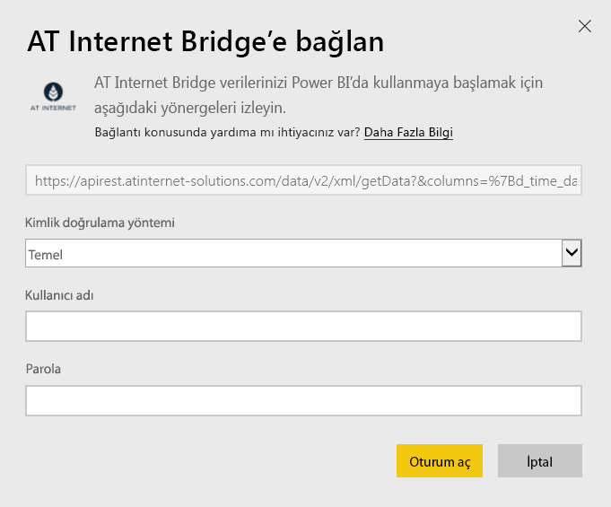

# Power BI ile AT Internet Bridge'e bağlanma
AT Internet, sahip olduğu birleşik dijital analiz platformu Analytics Suite'i kullanarak verilerinizden anında faydalanabilmenize yardımcı olur. Power BI için AT Internet Bridge içerik paketinde siteniz için ziyaretler, kaynaklar, yerelleştirme ve cihazlar ile ilgili veriler bulunur.

Power BI için [AT Internet Bridge içerik paketine](https://app.powerbi.com/getdata/services/at-internet-bridge) bağlanın.

## Bağlanma
1. Sol gezinti bölmesinin alt kısmında bulunan **Veri Al**'ı seçin.
   
    
2. **Hizmetler** kutusundaki **Al** seçeneğini belirleyin.
   
    
3. **AT Internet Bridge** \> **Al** seçeneğini belirleyin.
   
   
4. Bağlanmak istediğiniz AT Internet Website Number'ı (AT Internet Web Sitesi Numarası) girin.
   
   
5. Kimlik Doğrulama Yöntemi olarak **Temel** seçeneğini belirleyin, AT Internet kullanıcı adınızı ve parolanızı girin ve **Oturum aç**'ı seçin.
   
   
6. İçeri aktarma sürecini başlatmak için **Bağlan**'a tıklayın. İşlem tamamlandığında Gezinti Bölmesinde yeni bir pano, rapor ve model görünür. İçeri aktarılan verilerinizi görüntülemek için panoyu seçin.
   
    

**Sırada ne var?**

* Panonun üst tarafındaki [Soru-Cevap kutusunda soru sormayı](power-bi-q-and-a.md) deneyin
* Panodaki [kutucukları değiştirin](service-dashboard-edit-tile.md).
* Bağlantılı raporu açmak için [bir kutucuk seçin](service-dashboard-tiles.md).
* Veri kümeniz günlük olarak yenilenecek şekilde zamanlanır ancak yenileme zamanlamasında değişiklik yapabilir veya **Şimdi Yenile** seçeneğini kullanarak istediğinizde veri kümenizi kendiniz de yenileyebilirsiniz

## Neleri kapsar?
Bu içerik paketinde, aşağıdaki tablolarda yer alan veriler (son 45 güne ait) bulunur:  

    - Conversion (Dönüştürme)  
    - Devices (Cihazlar)  
    - Localization (Yerelleştirme)  
    - Sources (Kaynaklar)  
    - Global Visits (Genel Ziyaretler)  

## Sonraki adımlar
[Power BI ile çalışmaya başlama](service-get-started.md)

[Power BI - Temel Kavramlar](service-basic-concepts.md)

