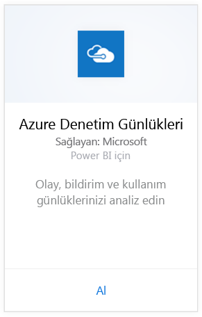
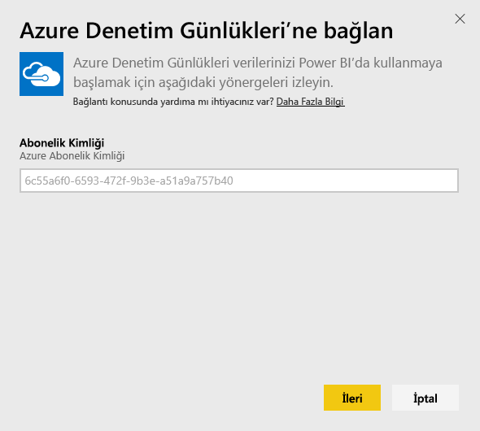
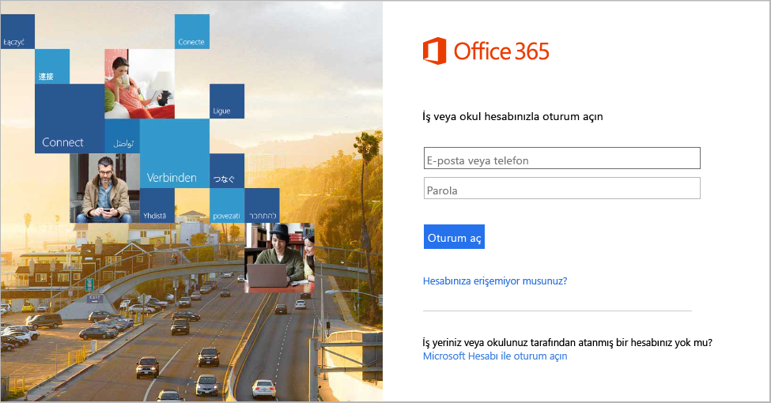
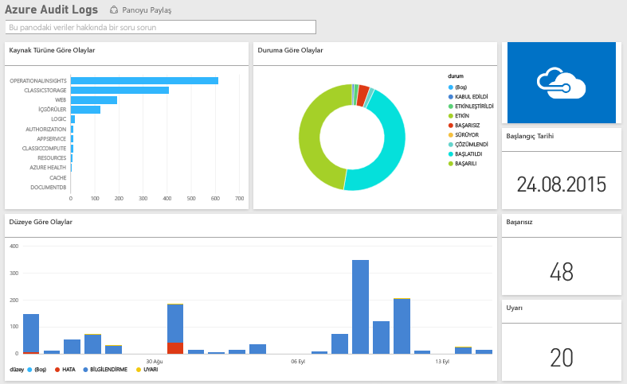

# Power BI ile Azure Audit Logs'a bağlanma
Azure Audit Logs içerik paketini kullanarak, denetim günlüklerinde depolanan bilgileri çözümleyebilir ve görselleştirebilirsiniz. Power BI verilerinizi alır, kullanıma hazır bir pano ve söz konusu verilere dayalı raporlar oluşturur.

[Azure Audit Logs içerik paketine bağlanın](https://app.powerbi.com/getdata/services/azure-audit-logs) veya Power BI ile [Azure Audit Logs tümleştirmesi](https://powerbi.microsoft.com/integrations/azure-audit-logs) hakkında daha fazla bilgi edinin.

## Bağlanma
1. Sol gezinti bölmesinin alt kısmında bulunan **Veri Al**'ı seçin.  
   
    
2. **Hizmetler** kutusundaki **Al** seçeneğini belirleyin.  
   
     
3. **Azure Audit Logs** > **Al** seçeneklerini belirleyin.  
   
   
4. İstendiğinde, **Azure Abonelik Kimliğinizi** girin. [Abonelik Kimliğinizi](#FindingParams) bulma ile ilgili ayrıntılara bakın.   
   
    
5. **Kimlik doğrulama yöntemi** için **OAuth2** \> **Oturum aç** seçeneklerini belirleyin.
   
    
6. Oturum açma işlemini tamamlamak için hesabınızın kimlik bilgilerini girin.
   
    
7. Power BI, Azure Audit Logs verilerinizi alır ve kullanıma hazır bir pano ve rapor oluşturur. 
   
    

**Sırada ne var?**

* Panonun üst tarafındaki [Soru-Cevap kutusunda soru sormayı](power-bi-q-and-a.md) deneyin
* Panodaki [kutucukları değiştirin](service-dashboard-edit-tile.md).
* Bağlantılı raporu açmak için [bir kutucuk seçin](service-dashboard-tiles.md).
* Veri kümeniz günlük olarak yenilenecek şekilde zamanlanır ancak yenileme zamanlamasında değişiklik yapabilir veya **Şimdi Yenile** seçeneğini kullanarak istediğinizde veri kümenizi kendiniz de yenileyebilirsiniz

## Sistem gereksinimleri
Azure Audit Logs içerik paketi için Azure Portal'da Denetim Günlükleri erişimi gerekir. [Burada](https://azure.microsoft.com/en-us/documentation/articles/insights-debugging-with-events/) daha ayrıntılı bilgilere ulaşabilirsiniz.

## Parametreleri bulma
Abonelik kimliğinizi bulmanın iki kolay yolu vardır.

1. https://portal.azure.com -&gt; Gözat -&gt; Abonelikler -&gt; ABONELİK KİMLİĞİ'ne giderek
2. https://manage.windowsazure.com -&gt; Ayarlar -&gt; Abonelik Kimliği'ne giderek

Abonelik kimliğiniz yukarıda bulunan \#4 numaralı adımdaki örneğe benzer şekilde sayılardan ve karakterlerden oluşan uzun bir dizidir. 

## Sorun giderme
Bir kimlik bilgileri hatası veya geçeriz kimlik bilgileri nedeniyle yenileme hatasıyla karşılaşırsanız lütfen Azure Audit Logs içerik paketinin tüm örneklerini silin ve yeniden bağlanmayı deneyin.

## Sonraki adımlar
[Power BI ile çalışmaya başlama](service-get-started.md)  
[Power BI - Temel Kavramlar](service-basic-concepts.md)  

