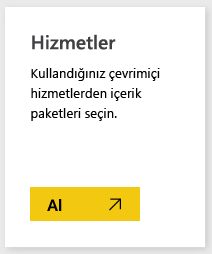
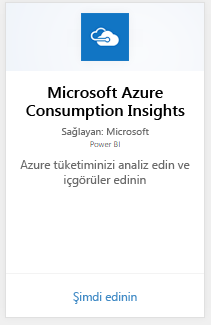
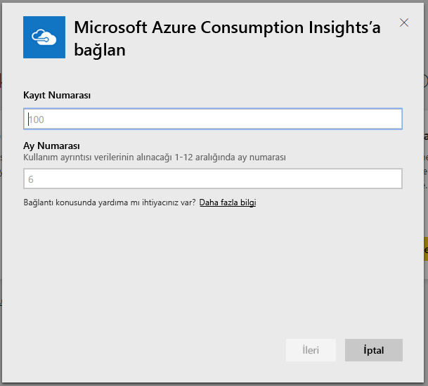
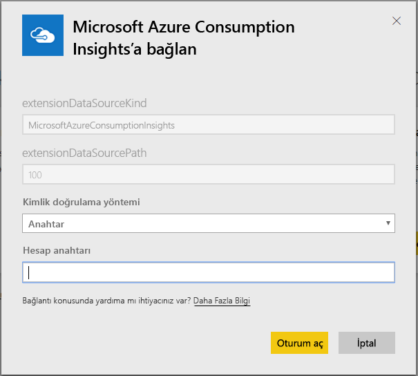
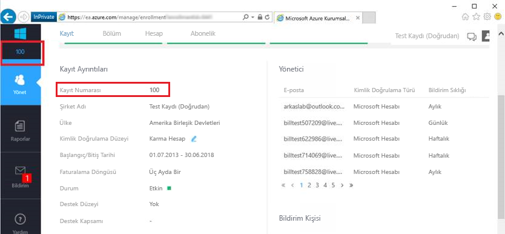
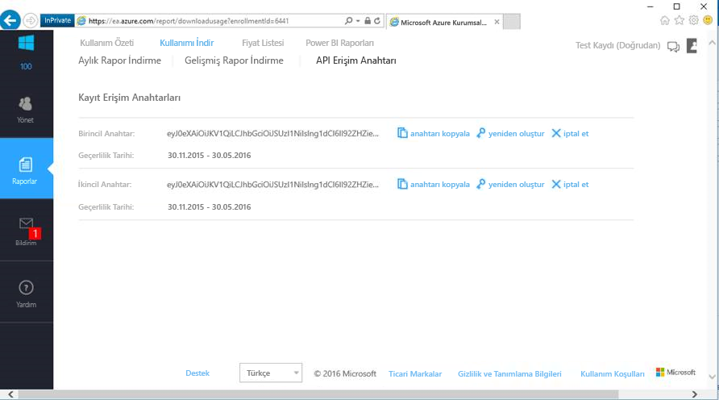

# Power BI ile Microsoft Azure Tüketim Öngörüleri'ne bağlanma
Power BI içerik paketiyle Power BI'daki Microsoft Azure kullanım verilerinizi araştırın ve izleyin. Veriler her gün otomatik olarak yenilenir.

Power BI için [Microsoft Azure Consumption Insights içerik paketine](https://app.powerbi.com/getdata/services/azureconsumption) bağlanın.

## Bağlanma
1. Sol gezinti bölmesinin alt kısmında bulunan **Veri Al**'ı seçin.
   
    
2. **Hizmetler** kutusundaki **Al** seçeneğini belirleyin.
   
   
3. **Microsoft Azure Consumption Insights** \> **Al**'ı seçin. 
   
   
4. Son kaç aya ilişkin veriyi içeri aktarmak istediğinizi ve Azure Kurumsal aboneliğinizin kayıt numarasını girin. [Bu parametreleri bulmaya](#FindingParams) ilişkin ayrıntılı bilgi için aşağıya bakın.
   
    
5. Bağlanmak için Erişim anahtarınızı girin. Kaydınıza ilişkin anahtarı Azure EA Portal'da bulabilirsiniz. 
   
    
6. İçeri aktarma işlemi otomatik olarak başlar. İşlem tamamlandığında Gezinti Bölmesinde yeni bir pano, rapor ve model görünür. İçeri aktarılan verilerinizi görüntülemek için panoyu seçin.
   
   

**Sırada ne var?**

* Panonun üst tarafındaki [Soru-Cevap kutusunda soru sormayı](power-bi-q-and-a.md) deneyin
* Panodaki [kutucukları değiştirin](service-dashboard-edit-tile.md).
* Bağlantılı raporu açmak için [bir kutucuk seçin](service-dashboard-tiles.md).
* Veri kümeniz günlük olarak yenilenecek şekilde zamanlanır ancak yenileme zamanlamasında değişiklik yapabilir veya **Şimdi Yenile** seçeneğini kullanarak istediğinizde veri kümenizi kendiniz de yenileyebilirsiniz

## Neleri kapsar?
Microsoft Azure Consumption Insights içerik paketi, bağlantı akışı sırasında sağladığınız ay aralığına ilişkin aylık raporlama verilerini içerir. Bu değişken bir aralık olduğundan, dahil edilen tarihler veri kümesi yenilendikçe güncelleştirilir.

## Sistem Gereksinimleri
İçerik paketi için Azure Portal'da Kurumsal özelliklerine erişim gereklidir. 

## Parametreleri bulma
Power BI raporlama özelliği, fatura bilgilerini görüntüleyebilen EA Doğrudan, İş Ortağı ve Dolaylı Müşterileri tarafından kullanılabilir. Bağlantı akışında sağlamanız gereken değerlerin her birini nasıl bulacağınız hakkında ayrıntılı bilgi edinmek için lütfen aşağıdaki bölümü okuyun.

**Ay Sayısı**

* Bu değer, (içinde bulunduğunuz günden itibaren) son kaç aya ilişkin veriyi içeri aktarmak istediğinizi belirten, 1 ila 36 arasında bir sayı olmalıdır.

**Kayıt Numarası**

* Bu, [Azure Enterprise Portal](https://ea.azure.com/)'ın giriş ekranındaki "Kayıt Ayrıntıları" bölümünde bulabileceğiniz Azure Kurumsal kayıt numaranızdır.
  
    

**Erişim Anahtarı**

* Anahtarınızı, Azure Enterprise Portal'da "İndirme Kullanımı" > "API Erişim Anahtarı" bölümünde bulabilirsiniz
  
    

**Daha Fazla Yardım**

* Azure Kurumsal Power BI Paketini ayarlama hakkında daha fazla yardım almak istiyorsanız Azure Enterprise Portal'da oturum açın, "Yardım" bölümündeki API Yardım Dosyasını ve Raporlar -> İndirme Kullanımı -> API Erişim Anahtarı bölümündeki ek yönergeleri görüntüleyin. 

## Sonraki adımlar
[Power BI ile çalışmaya başlama](service-get-started.md)

[Power BI'da veri alma](service-get-data.md)

