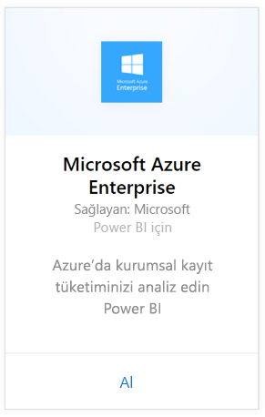
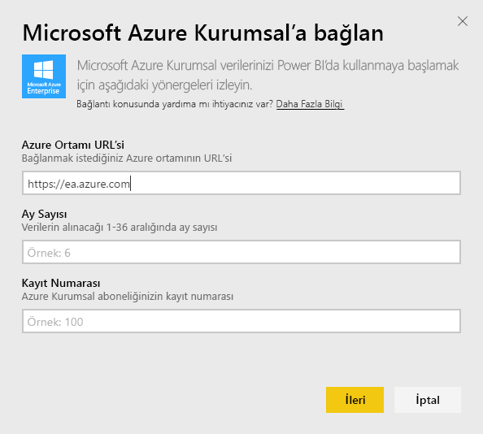
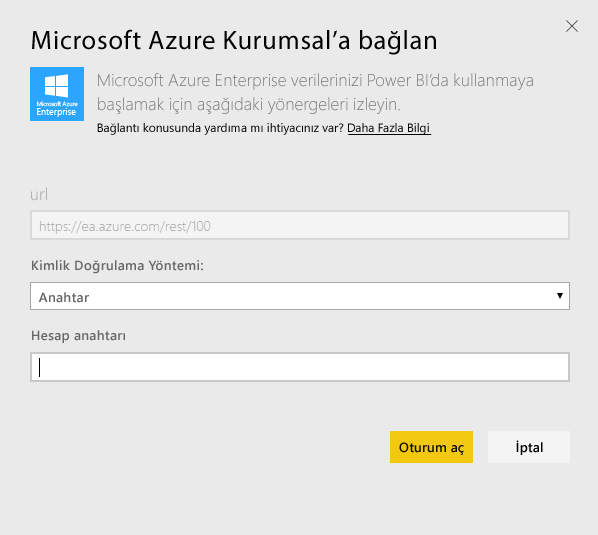
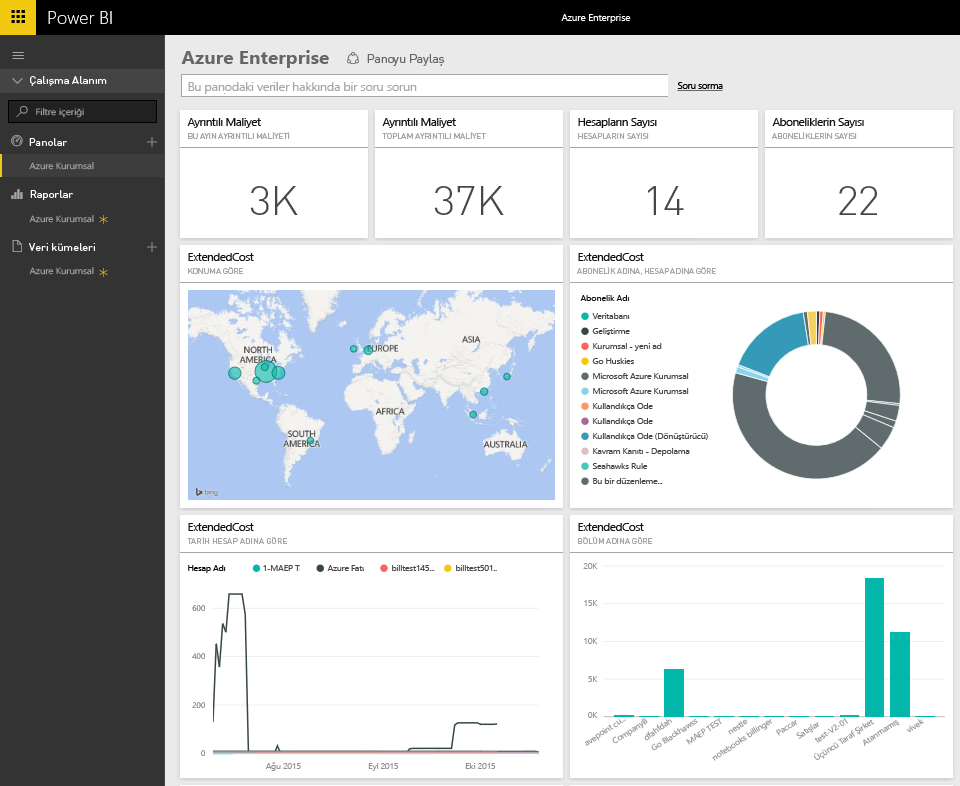
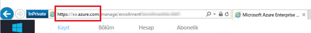
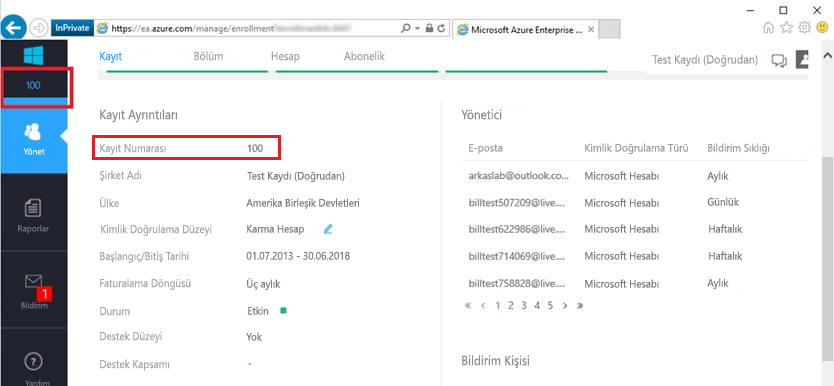
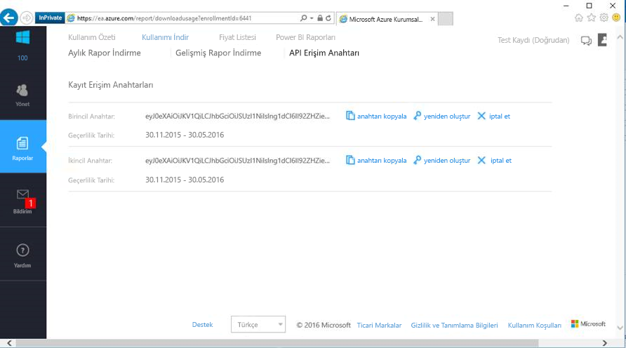

# Power BI ile Microsoft Azure Kurumsal'a bağlanma
Power BI içerik paketi ile Power BI'da Microsoft Azure Kurumsal verilerinizi araştırın ve izleyin. Veriler günde bir kez otomatik olarak yenilenir.

Power BI için [Microsoft Azure Kurumsal içerik paketine](https://app.powerbi.com/getdata/services/azure-enterprise) bağlanın.

## Bağlanma
1. Sol gezinti bölmesinin alt kısmındaki **Veri Al**'ı seçin.
   
    
2. **Hizmetler** kutusundaki **Al** seçeneğini belirleyin.
   
   
3. **Microsoft Azure Enterprise** \> **Al**'ı seçin.
   
   
4. Azure Ortamı URL'sini, son kaç aya ilişkin veriyi içeri aktarmak istediğinizi ve Azure Kurumsal aboneliğinizin kayıt numarasını girin. Azure Ortamı URL'niz `https://ea.azure.com` veya `https://ea.windowsazure.cn` olacaktır. [Bu parametreleri bulmaya](#FindingParams) ilişkin ayrıntılı bilgi için aşağıya bakın.
   
    
5. Bağlanmak için Erişim anahtarınızı girin. Kaydınıza ilişkin anahtarı Azure EA Portalı'nda bulabilirsiniz.
   
    
6. İçeri aktarma işlemi otomatik olarak başlar. İşlem tamamlandığında Gezinti bölmesinde yeni bir pano, rapor ve model görünür. İçeri aktarılan verilerinizi görüntülemek için panoyu seçin.
   
   

**Sırada ne var?**

* Panonun üst kısmındaki [Soru-Cevap kutusunu kullanarak bir soru sormayı](service-q-and-a.md) deneyin
* Panodaki [kutucukları değiştirin](service-dashboard-edit-tile.md).
* Bağlantılı raporu açmak için [bir kutucuk seçin](service-dashboard-tiles.md).
* Veri kümeniz günlük olarak yenilenecek şekilde zamanlanır ancak yenileme zamanlamasında değişiklik yapabilir veya **Şimdi Yenile** seçeneğini kullanarak istediğinizde veri kümenizi kendiniz de yenileyebilirsiniz

## Neleri kapsar?
Azure Enterprise içerik paketi, bağlantı akışı sırasında sağladığınız ay aralığına ilişkin aylık raporlama verilerini içerir. Bu değişken bir aralık olduğundan, dahil edilen tarihler veri kümesi yenilendikçe güncelleştirilir.

## Sistem Gereksinimleri
İçerik paketi için Azure Portal'da Kurumsal özelliklerine erişim gereklidir.

## Parametreleri bulma
Power BI raporlama özelliği, fatura bilgilerini görüntüleyebilen EA Doğrudan, İş Ortağı ve Dolaylı Müşterileri tarafından kullanılabilir. Bağlantı akışında sağlamanız gereken değerlerin her birini nasıl bulacağınız hakkında ayrıntılı bilgi almak için lütfen aşağıdaki bölümü okuyun.

**Azure Ortamı URL'si**

* Bu değer genellikle https://ea.azure.com'dur ancak onaylamak için, oturum açtıktan sonra URL'yi kontrol edebilirsiniz.
  
    

**Ay Sayısı**

* Bu değer, (içinde bulunduğunuz günden itibaren) son kaç aya ilişkin veriyi içeri aktarmak istediğinizi belirten, 1 ila 36 arasında bir sayı olmalıdır.

**Kayıt Numarası**

* Bu numara, [Azure Enterprise Portal](https://ea.azure.com/)'ın giriş ekranındaki "Kayıt Ayrıntıları" bölümünde bulabileceğiniz Azure Kurumsal kayıt numaranızdır.
  
    

**Erişim Anahtarı**

* Anahtarınızı, Azure Enterprise Portal'da "İndirme Kullanımı" > "API Erişim Anahtarı" bölümünde bulabilirsiniz
  
    

**Daha Fazla Yardım**

* Azure Enterprise Power BI Paketini ayarlama hakkında daha fazla yardım almak istiyorsanız Azure Enterprise Portal'da oturum açın, "Yardım" bölümündeki API Yardım Dosyasını ve Raporlar -> İndirme Kullanımı -> API Erişim Anahtarı bölümündeki ek yönergeleri görüntüleyin.

## Sonraki adımlar
[Power BI ile çalışmaya başlama](service-get-started.md)

[Power BI'da veri alma](service-get-data.md)

