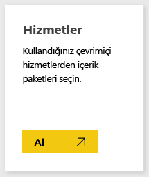
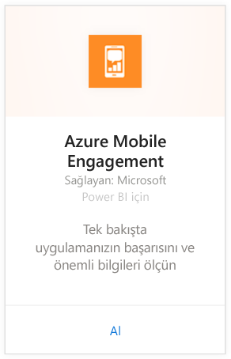
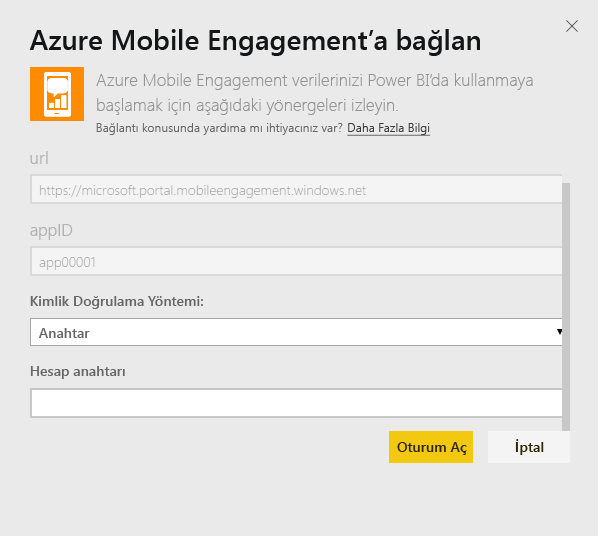
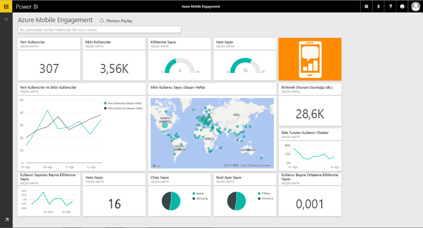

# Power BI ile Azure Mobile Engagement'a bağlanma
Power BI Azure Mobile Engagement içerik paketi sayesinde uygulama verileriniz konusunda hızla öngörü edinirsiniz.

Power BI için [Azure Mobile Engagement içerik paketine](https://app.powerbi.com/groups/me/getdata/services/azme) bağlanın.

## Bağlanma
1. Sol gezinti bölmesinin alt kısmındaki **Veri Al**'ı seçin.
   
    
2. **Hizmetler** kutusundaki **Al** düğmesini seçin.
   
    
3. **Azure Mobile Engagement** \> **Al** seçeneğini belirleyin.
   
     
4. Uygulama Koleksiyonu ve Uygulama Adı bilgilerinizi girin. Bu bilgilere Azure Mobile Engagement hesabınızdan ulaşabilirsiniz.
   
     
5. Kimlik Doğrulama Yöntemi için Anahtar bilginizi girin ve ardından Oturum aç düğmesine tıklayın.
   
    
6. Veriler Power BI tarafından içeri aktarıldıktan sonra sol gezinti bölmesinde yeni bir pano, rapor ve veri kümesi görürsünüz. Yeni öğeler, sarı yıldız işareti \* ile gösterilir ve ilgili öğe seçildiğinde bu işaret artık görünmez:
   
    

 **Sırada ne var?**

* Panonun üst kısmındaki [Soru-Cevap kutusunda soru sormayı](service-q-and-a.md) deneyin
* Panodaki [kutucukları değiştirin](service-dashboard-edit-tile.md).
* Bağlantılı raporu açmak için [bir kutucuk seçin](service-dashboard-tiles.md).
* Veri kümeniz günlük olarak yenilenecek şekilde zamanlanır ancak yenileme zamanlamasında değişiklik yapabilir veya **Şimdi Yenile** seçeneğini kullanarak istediğinizde veri kümenizi kendiniz de yenileyebilirsiniz

## Sonraki adımlar
[Power BI ile çalışmaya başlama](service-get-started.md)

[Power BI'da veri alma](service-get-data.md)

