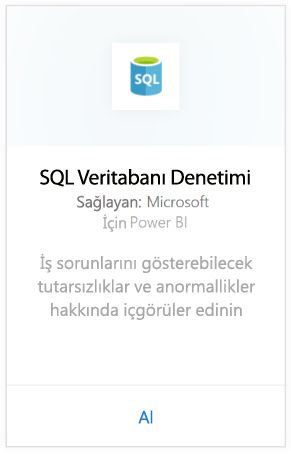
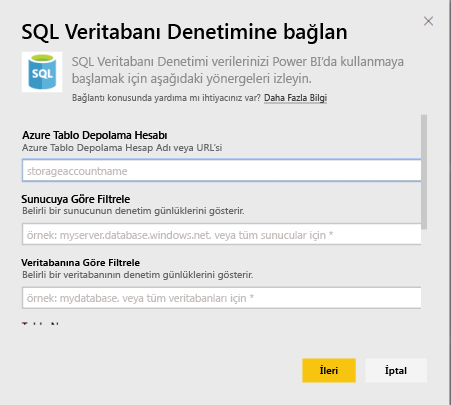
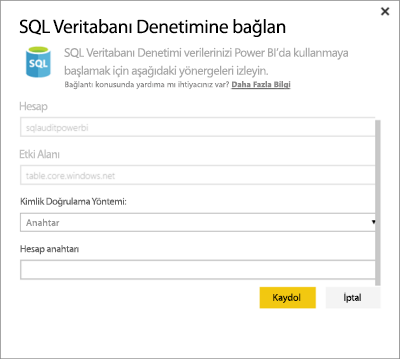
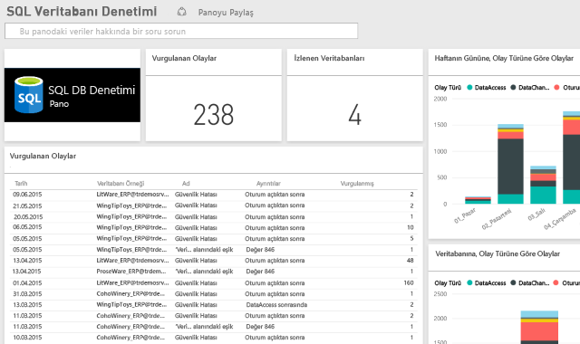

# Power BI için SQL Database Auditing içerik paketi
Power BI için Azure [SQL Database Auditing](http://azure.microsoft.com/documentation/articles/sql-database-auditing-get-started/) içerik paketi, veritabanınızdaki etkinlikleri anlamanıza, işle ilgili endişeleri ifade eden tutarsızlıklar ve anomaliler veya şüphe duyulan güvenlik ihlalleri hakkında daha fazla bilgi almanıza olanak sağlar. 

Power BI için [SQL Database Auditing içerik](https://app.powerbi.com/getdata/services/sql-db-auditing) paketine bağlanın.

>[!NOTE]
>İçerik paketi, adında "AuditLogs" bulunan tüm tablolardaki verileri içeri aktarıp "AuditLogs" olarak adlandırılan tek bir veri modeli tablosuna ekler. Son 250.000 olay eklenir ve veriler günlük olarak yenilenir.

## Bağlanma
1. Sol gezinti bölmesinin alt kısmındaki **Veri Al**'ı seçin.
   
    
2. Hizmetler kutusundaki Al düğmesini seçin.
   
    
3. **SQL Database Auditing** \> **Al** seçeneğini belirleyin.
   
   
4. Bağlan: SQL Database Auditing penceresinde:
   
   - Günlüklerinizin depolandığı Azure Tablo Depolaması hesabının adını veya URL'sini girin.
   
   - Bağlanmak istediğiniz SQL sunucusunun adını girin. Tüm sunuculara ilişkin denetim günlüklerini yüklemek için "\*" yazın.
   
   - Bağlanmak istediğiniz SQL veritabanının adını girin. Tüm veritabanlarına ilişkin denetim günlüklerini yüklemek için "\*" yazın.
   
   - Almak istediğiniz günlükleri içeren Azure tablosunun adını girin. Adında "AuditLogs" bulunan tüm tablolardaki denetim günlüklerini yüklemek için "\*" yazın.
   
   >[!IMPORTANT]
   >Tüm denetim günlükleri tek bir tabloda depolanıyor olsa da performans açısından daima açık bir tablo adı belirtilmesi önerilir.
   
   - Hangi tarihten sonrasına ait denetim günlüklerini almak istediğinizi belirtin. Denetim günlüklerini alt süre sınırı olmadan yüklemek için "\*", son güne ait denetim günlüklerini yüklemek için "1d" yazın.
   
   - Hangi tarihe kadar olan denetim günlüklerini almak istediğinizi belirtin. Denetim günlüklerini üst süre sınırı olmadan yüklemek için "\*" yazın.
   
   
5. Kimlik Doğrulaması Yöntemi olarak **Anahtar**’ı seçin, **Hesap Anahtarı** bilgisini sağlayın ve \> **Oturum açın** seçeneğini belirleyin.
   
   
6. Veriler Power BI tarafından içeri aktarıldıktan sonra sol gezinti bölmesinde yeni bir pano, rapor ve veri kümesi görürsünüz. Yeni öğeler sarı yıldız işareti \* ile gösterilir.
   
   

**Sırada ne var?**

* Panonun üst tarafındaki [Soru-Cevap kutusunda soru sormayı](power-bi-q-and-a.md) deneyin
* Panodaki [kutucukları değiştirin](service-dashboard-edit-tile.md).
* Bağlantılı raporu açmak için [bir kutucuk seçin](service-dashboard-tiles.md).
* Veri kümeniz günlük olarak yenilenecek şekilde zamanlanır ancak yenileme zamanlamasında değişiklik yapabilir veya **Şimdi Yenile** seçeneğini kullanarak istediğinizde veri kümenizi kendiniz de yenileyebilirsiniz

## Sonraki adımlar
[Power BI için veri alma](service-get-data.md)
[Power BI ile çalışmaya başlama](service-get-started.md)
