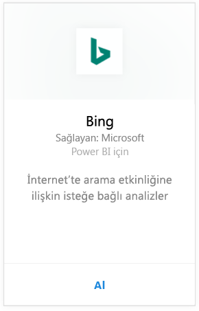
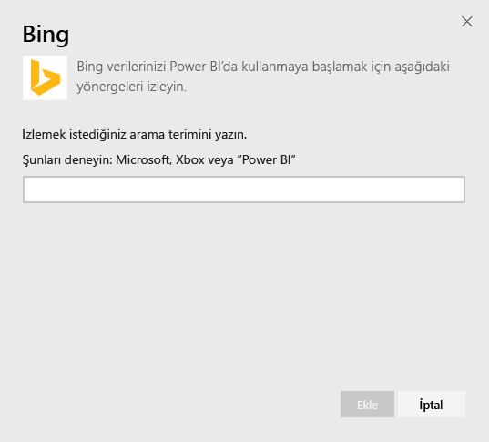
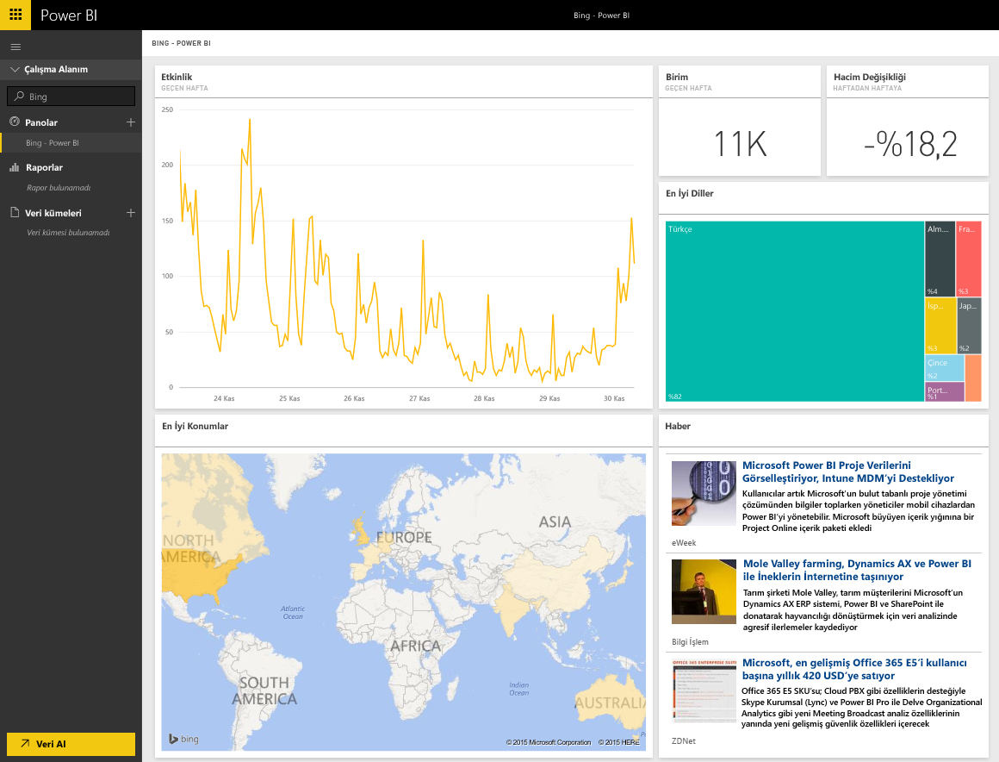

# Power BI ile Bing'e bağlanma
Bing içerik paketi, seçtiğiniz bir terimin İnternet üzerinde aranmasına ilişkin etkinlikle ilgili analizleri görüntülemenize olanak sağlar.

Power BI için [Bing içerik paketine](https://app.powerbi.com/groups/me/getdata/services/bing) bağlanın.

>[!NOTE]
>Bing kutucukları her ~5 dakikada bir güncelleştirilir ve seçilebilen tek kutucuk, sizi ilgili haber makalesine yönlendiren News kutucuğudur. 

>[!NOTE]
>Bing içerik paketindeki kutucuklar mobil uygulamalarda görünmez. Bu sorunu çözmek için çalışıyoruz.

1. Sol gezinti bölmesinin alt kısmında bulunan **Veri Al**'ı seçin.
   
    
2. **Hizmetler** kutusundaki **Al** seçeneğini belirleyin.
   
    
3. **Bing** > **Al** seçeneğini belirleyin.
   
    
4. Parametreler iletişim kutusunda, izlemek istediğiniz arama terimini girin ve Ekle'ye basın.
   
        
5. Sol taraftaki pano listenizde, Bing ve girdiğiniz arama terimi ile adlandırılan yeni bir giriş görürsünüz. Bu panoyla ilişkili bir veri kümesi veya rapor bulunmadığına dikkat edin. Kutucukların yüklenmesi biraz zaman alabilir ancak yükleme tamamlandıktan sonra aşağıdakine benzer bir yerleşimle karşılaşırsınız.
   
    

Yüklemenin tamamlanmasının ardından verilerinizi araştırmaya (bu panodaki kutucukları hesabınızdaki başka panolara sabitleme de dahil) başlayabilirsiniz.

