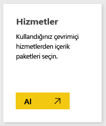
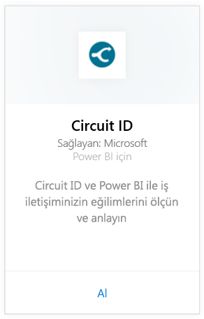
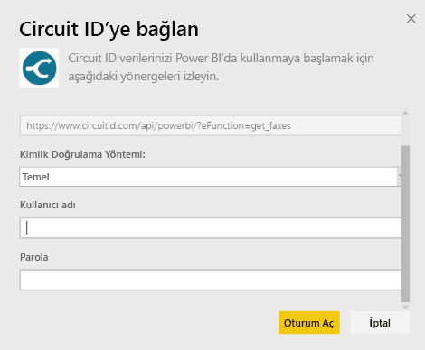
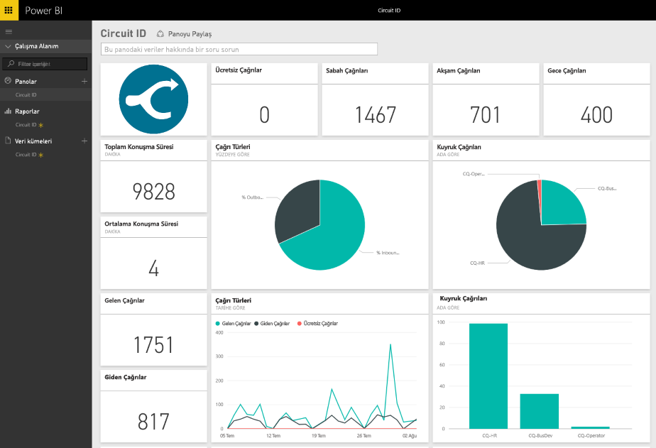

# Power BI ile Circuit ID'ye bağlanma
Power BI ile iletişim verilerinizi Circuit ID'den kolayca çözümleyebilirsiniz. Power BI, verilerinizi alır ve ardından varsayılan bir pano ve bu verilere dayalı raporlar oluşturur. Bağlantıyı oluşturduktan sonra, verilerinizi araştırabilir ve panoyu gereksinimlerinizi karşılayacak şekilde özelleştirebilirsiniz. Veriler her gün otomatik olarak yenilenir.

Power BI için [Circuit ID içerik paketine](https://app.powerbi.com/getdata/services/circuitid) bağlanın.

## Bağlanma
1. Sol gezinti bölmesinin alt kısmında bulunan **Veri Al**'ı seçin.
   
    
2. **Hizmetler** kutusundaki **Al** seçeneğini belirleyin.
   
    
3. **Circuit ID** \> **Al** seçeneğini belirleyin.
   
    
4. Kimlik Doğrulama Yöntemi için Temel seçeneğini belirleyin, ardından kullanıcı adınızı ve parolanızı sağlayın. Ardından Oturum aç'ı seçin.
   
    
5. Veriler Power BI tarafından içeri aktarıldıktan sonra sol gezinti bölmesinde yeni bir pano, rapor ve veri kümesi görürsünüz. Yeni öğeler sarı yıldız işareti ile gösterilir.
   
    

**Sırada ne var?**

* Panonun üst tarafındaki [Soru-Cevap kutusunda soru sormayı](power-bi-q-and-a.md) deneyin
* Panodaki [kutucukları değiştirin](service-dashboard-edit-tile.md).
* Bağlantılı raporu açmak için [bir kutucuk seçin](service-dashboard-tiles.md).
* Veri kümeniz günlük olarak yenilenecek şekilde zamanlanır ancak yenileme zamanlamasında değişiklik yapabilir veya **Şimdi Yenile** seçeneğini kullanarak istediğinizde veri kümenizi kendiniz de yenileyebilirsiniz

## Sonraki adımlar
[Power BI nedir?](power-bi-overview.md)

[Power BI için veri alma](service-get-data.md)

