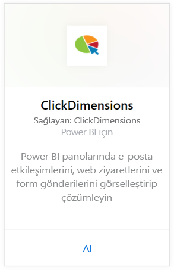
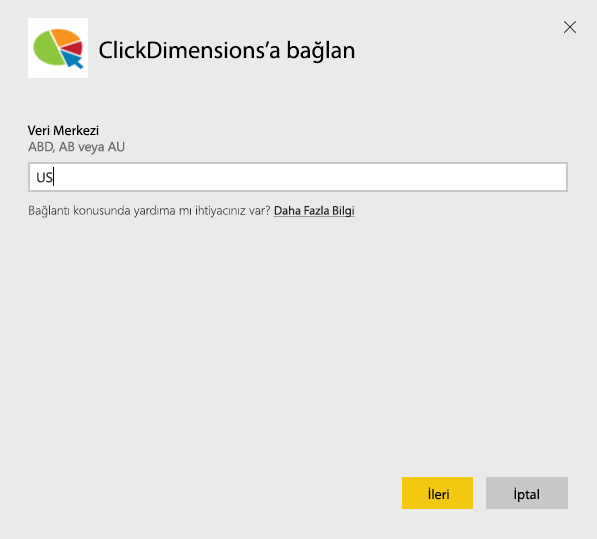
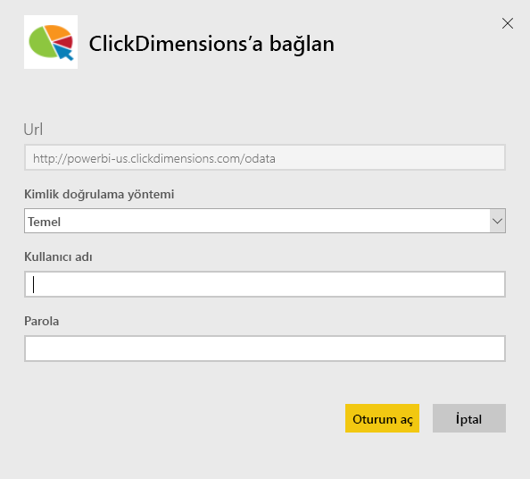
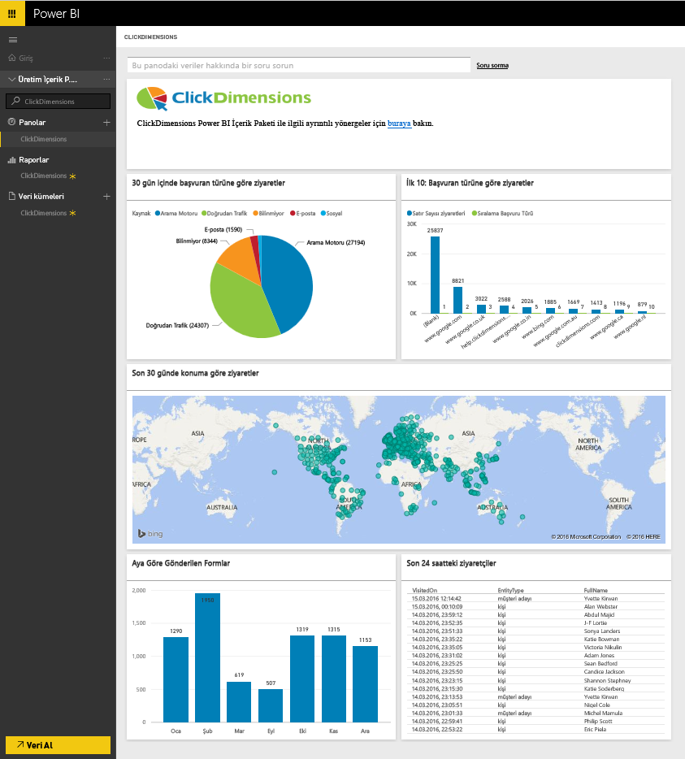
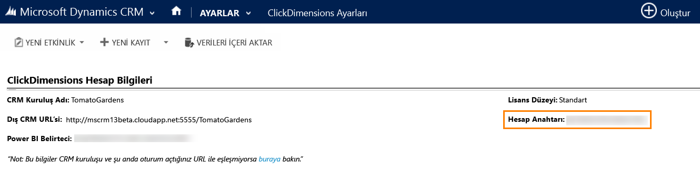
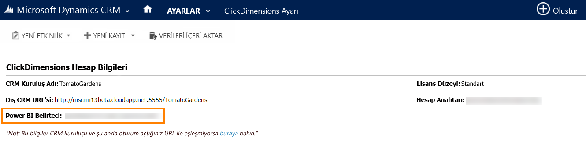

# Power BI ile ClickDimensions'a bağlanma
Power BI için ClickDimensions içerik paketi, kullanıcıların, ClickDimensions pazarlama verilerini Power BI'da kullanarak yönetim ekiplerine, gerçekleştirdikleri satış ve pazarlama çalışmalarının başarısına ilişkin daha fazla öngörü sunmasına olanak sağlar. Power BI panolarında ve raporlarında e-posta etkileşimlerini, web ziyaretlerini ve form gönderilerini görselleştirip çözümleyin.

Power BI için [ClickDimensions içerik paketine](https://app.powerbi.com/getdata/services/click-dimensions) bağlanın.

## Bağlanma
1. Sol gezinti bölmesinin alt kısmında bulunan **Veri Al**'ı seçin.
   
   
2. **Hizmetler** kutusundaki **Al** seçeneğini belirleyin.
   
   
3. **ClickDimensions** \>  **Al**'ı seçin.
   
   
4. Veri merkezinizin konumunu (US, EU veya AU) girin ve **Sonraki** seçeneğini belirleyin.
   
   
5. **Kimlik Doğrulama Yöntemi**  için **Temel** \> **Oturum aç**'ı seçin. İstendiğinde, ClickDimensions kimlik bilgilerinizi girin. [Bu parametreleri bulma](#FindingParams) konusundaki ayrıntılı bilgileri aşağıda bulabilirsiniz
   
    
6. Onayladıktan sonra içeri aktarma işlemi otomatik olarak başlar. İşlem tamamlandığında Gezinti Bölmesinde yeni bir pano, rapor ve model görünür. İçeri aktarılan verilerinizi görüntülemek için panoyu seçin.
   
     

**Sırada ne var?**

* Panonun üst kısmındaki [Soru-Cevap kutusunda soru sormayı](service-q-and-a.md) deneyin
* Panodaki [kutucukları değiştirin](service-dashboard-edit-tile.md).
* Bağlantılı raporu açmak için [bir kutucuk seçin](service-dashboard-tiles.md).
* Veri kümeniz günlük olarak yenilenecek şekilde zamanlanır ancak yenileme zamanlamasında değişiklik yapabilir veya **Şimdi Yenile** seçeneğini kullanarak istediğinizde veri kümenizi kendiniz de yenileyebilirsiniz

## Sistem gereksinimleri
Power BI içerik paketine bağlanmak için, hesabınıza ilişkin veri merkezini girmeniz ve ClickDimensions hesabıyla oturum açmanız gerekir. Hangi veri merkezini gireceğinizden emin değilseniz lütfen yöneticinize danışın.

## Parametreleri bulma
Account Key (Hesap Anahtarı), CRM Settings (CRM Ayarları) \> ClickDimensions Settings (ClickDimensions Ayarları) bölümünde bulunur. ClickDimensions Settings (ClickDimensions Ayarları) bölümündeki Account Key'i (Hesap Anahtarı) kopyalayıp Kullanıcı adı alanına yapıştırın.  

  

ClickDimensions Settings (ClickDimensions Ayarları) bölümündeki Power BI Token'ı (Power BI Belirteci) kopyalayıp Kullanıcı adı alanına yapıştırın. Power BI Token (Power BI Belirteci), CRM Settings (CRM Ayarları) \> ClickDimensions Settings (ClickDimensions Ayarları) bölümünde bulunur.  

  

## Sonraki adımlar
[Power BI ile çalışmaya başlama](service-get-started.md)

[Power BI'da veri alma](service-get-data.md)

