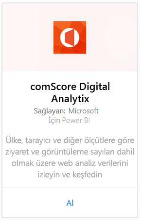
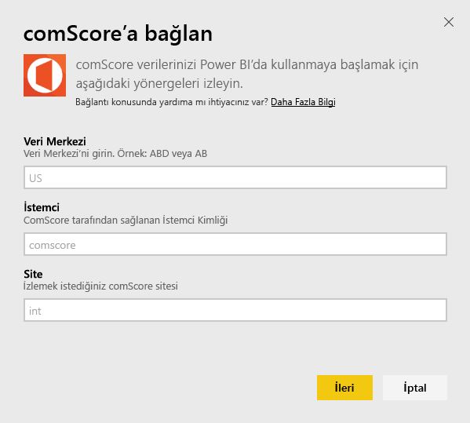
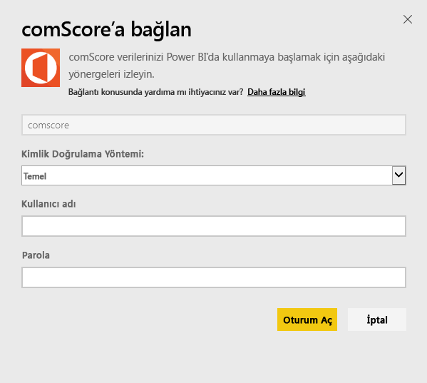
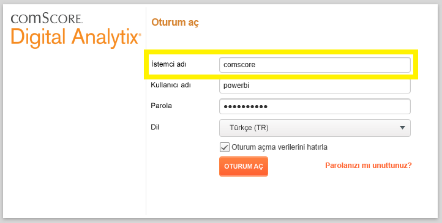
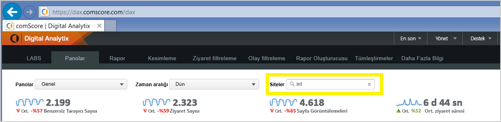

# Power BI ile comScore Digital Analytix'e bağlanma
Power BI içerik paketi ile Power BI'da comScore Digital Analytix verilerinizi görselleştirin ve araştırın. Veriler, günde bir kez otomatik olarak yenilenir.

[Power BI için comScore içerik paketine](https://app.powerbi.com/getdata/services/comscore) bağlanın.

>[!NOTE]
>İçerik paketine bağlanmak için comScore DAx kullanıcı hesabına ve comScore API erişimine sahip olmanız gerekir. Aşağıda daha fazla [ayrıntıya](#Requirements) yer verilmiştir.

## Bağlanma
1. Sol gezinti bölmesinin alt kısmındaki Veri Al seçeneğini belirleyin.
   
   
2. **Hizmetler** kutusundaki **Al**'ı seçin.
   
   
3. **comScore Digital Analytix** \> **Al** seçeneğini belirleyin.
   
   
4. Bağlanmak istediğiniz veri merkezini, comScore İstemci Kimliğini ve Siteyi girin. Bu değerleri nasıl bulacağınızla ilgili daha fazla ayrıntı için aşağıdaki [comScore Parametrelerinizi bulma](#FindingParams) bölümüne bakın.
   
   
5. Bağlanmak için comScore kullanıcı adınızı ve parolanızı girin. Bu değeri bulmaya ilişkin ayrıntılar için aşağıya bakın.
   
   
6. İçeri aktarma süreci otomatik olarak başlar. İşlem tamamlandığında Gezinti Bölmesinde yeni bir pano, rapor ve model görünür. İçeri aktarılan verilerinizi görüntülemek için panoyu seçin.

**Sırada ne var?**

* Panonun üst tarafındaki [Soru-Cevap kutusunda soru sormayı](power-bi-q-and-a.md) deneyin
* Panodaki [kutucukları değiştirin](service-dashboard-edit-tile.md).
* Bağlantılı raporu açmak için [bir kutucuk seçin](service-dashboard-tiles.md).
* Veri kümeniz günlük olarak yenilenecek şekilde zamanlanır ancak yenileme zamanlamasında değişiklik yapabilir veya **Şimdi Yenile** seçeneğini kullanarak istediğinizde veri kümenizi kendiniz de yenileyebilirsiniz

## Sistem gereksinimleri
Bağlanmak için comScore DAx kullanıcı hesabı ve comScore DAx API erişimi gerekir. Hesabınızı doğrulamak için lütfen comScore DAx yöneticinizle iletişime geçin.

## Parametreleri bulma
comScore parametrelerinizin her birini nasıl bulacağınıza ilişkin ayrıntılar aşağıdadır.

**Veri Merkezi**

Bağlandığınız veri merkezi comScore'da gittiğiniz URL tarafından belirlenir.

https://dax.comscore.com kullanıyorsanız "US" öğesini, https://dax.comscore.eu kullanıyorsanız "EU" öğesini girin.

 

**İstemci**

İstemci, comScore DAx'te oturum açarken girdiğiniz istemcidir.

 

**Site**

comScore sitesi, verilerini görmek istediğiniz siteyi belirler. comScore hesabınızdan sitelerin listesini bulabilirsiniz.

## Sonraki adımlar
[Power BI ile çalışmaya başlama](service-get-started.md)

[Power BI'da veri alma](service-get-data.md)

