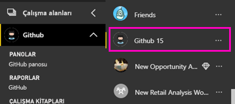
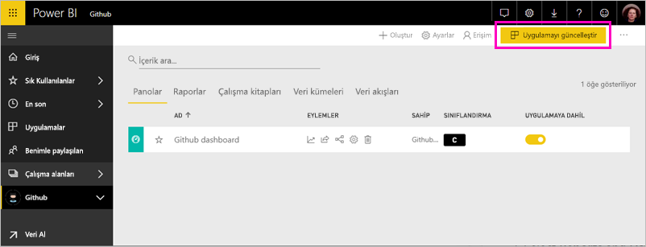

# Power BI ile GitHub'a bağlanma
Bu makalede GitHub hesabınızı Power BI şablon uygulama ile verilerinizden çekme gösterilmektedir. Şablon uygulaması ile bir pano, raporlar ve bir veri kümesi oluşturarak GitHub verilerinizi araştırmanıza olanak tanımak için bir çalışma alanı oluşturur. Power BI için GitHub uygulamasına, depo olarak da bilinir, katkılar, sorunlar, çekme istekleri ve etkin kullanıcıların geçici verilerle GitHub deponuza Öngörüler gösterir.

Şablon uygulamayı yükledikten sonra panoyu ve raporu değiştirebilirsiniz. Ardından, bu iş arkadaşlarınıza bir uygulama olarak, kuruluşunuzda dağıtabilirsiniz.

Bağlanma [GitHub şablon uygulaması](https://app.powerbi.com/getdata/services/github) veya daha fazla bilgi edinin [GitHub tümleştirmesi](https://powerbi.microsoft.com/integrations/github) Power BI ile.

Ayrıca deneyebilirsiniz [GitHub öğretici](service-tutorial-connect-to-github.md). Power BI belgeleri için ortak depo hakkında gerçek GitHub veri yükler.

>[!NOTE]
>Şablon uygulaması depoya erişime sahip bir GitHub hesabı gerektirir. Aşağıda, gereksinimlerle ilgili daha ayrıntılı bilgi verilmiştir.

## Bağlanma
[!INCLUDE [powerbi-service-apps-get-more-apps](./includes/powerbi-service-apps-get-more-apps.md)]
   
3. Seçin **GitHub** \> **şimdi edinin**.
4. İçinde **bu Power BI uygulaması yükleme?** seçin **yükleme**.
4. İçinde **uygulamaları** bölmesinde **GitHub** Döşe.

    

6. İçinde **yeni uygulamanızı ile çalışmaya başlama**seçin **verilere**.

    

5. Depo adını ve sahibini girin. [Bu parametreleri bulmaya](#FindingParams) ilişkin ayrıntılı bilgi için aşağıya bakın.
   
    

5. (Tarayıcınız oturum zaten oturum açtıysanız bu adımı atlayabilirsiniz) GitHub kimlik bilgilerinizi girin. 
6. **Kimlik doğrulama yöntemi** için **OAuth2** \> **Oturum aç** seçeneklerini belirleyin. 
7. GitHub kimlik doğrulaması ekranlarındaki yönergeleri uygulayın. GitHub için GitHub verileri Power BI şablon uygulama izni verin.
   
   
   
    Power BI, verilerinizi ve GitHub ile bağlanır.  Veriler, günde bir kez yenilenir. Verileri Power BI tarafından içeri aktarıldıktan sonra yeni bir GitHub çalışma alanınızı içeriğini görürsünüz.

## Değiştirme ve uygulamanızı dağıtın

GitHub şablon uygulaması yüklediniz. GitHub uygulama çalışma alanı da oluşturmuş olduğunuz anlamına gelir. Çalışma alanında, rapor ve Pano değiştirebilir ve ardından olarak dağıtmak bir *uygulama* kuruluşunuzdaki iş arkadaşlarınıza. 

1. Sol gezinti çubuğunda bulunan çalışma alanı adı yanındaki oku seçin. Bir Pano ve rapor içeren görürsünüz.

    

8. Yeni [GitHub Panosu](https://powerbi.microsoft.com/integrations/github).    
    

3. Sol gezinti çubuğunda yeni GitHub çalışma alanınızda, tüm içeriğini görüntülemek için seçin **çalışma alanları** > **GitHub**.
 
   

    Bu görünüm çalışma alanı için içerik listesidir. Sağ üst köşedeki gördüğünüz **uygulamayı Güncelleştir**. İş arkadaşlarınız için uygulamanızı dağıtmaya hazır olduğunuzda nereden başlayacaksınız olmasıdır. 

    

2. Seçin **raporları** ve **veri kümeleri** çalışma alanındaki diğer öğeleri görmek için.

    Hakkında bilgi edinin [uygulama dağıtmaya](service-create-distribute-apps.md) iş arkadaşlarınıza önerilmesini sağlayın.

## Uygulama içinde neler dahildir
Aşağıdaki verilere Power BI ile GitHub'dan erişilebilir:     

| Tablo adı | Açıklama |
| --- | --- |
| Katkılar |Katkılar tablosunda, toplam ekleme, silme ve her hafta katkıda bulunan tarafından yazılanları kaydeder sağlar. En çok katkıda bulunan 100 kişi tabloya dahil edilir. |
| Issues |Seçili depo ile ilgili tüm sorunları listeler ve bir sorunun kapatılmasına kadar geçen toplam ve ortalama süre, toplam açık sorun sayısı ve toplam kapalı sorun sayısı gibi hesaplar içerir. Depoda herhangi bir sorun olmadığında bu tablo boş olur. |
| Pull requests |Bu tabloda, depo için gerçekleştirilen tüm Çekme İstekleri ve çekme isteğini kimin gerçekleştirdiği gösterilir. Ayrıca, kaç açık, kapalı ve toplam çekme istekleri etrafında hesaplamalar, çekme isteklerinin ne kadar sürdüğünü ve çekme isteğinin ortalama ne kadar sürdüğünü de içerir. Depoda herhangi bir sorun olmadığında bu tablo boş olur. |
| Kullanıcılar |Bu tabloda, GitHub kullanıcılarının ya da kimin, katkı yapmış, sorun bildirmiş veya seçili depo için çekme isteklerini Çözüldü katkıda bulunanlar listesini sağlar. |
| Milestones |Seçili depo ile ilgili tüm kilometre taşlarını gösterir. |
| DateTable |Bu tablo, bugün ve GitHub verilerinizi tarihe göre çözümlemenizi sağlayan son yıllarda tarihleri içerir. |
| ContributionPunchCard |Bu tablo, seçili depo için yapılan katkıları gösteren bir ödül kartı olarak kullanılabilir. Haftanın günlerine ve saatlere göre yürütmeleri gösterir. Bu tablo, modeldeki diğer tablolara bağlı değildir. |
| RepoDetails |Bu tabloda, seçili depo ile ilgili ayrıntılar sunulur. |

## Sistem gereksinimleri
* Depoya erişimi bulunan bir GitHub hesabı.  
* İlk oturum açma işlemi sırasında Power BI için GitHub uygulamasına izin verme. Erişim iptali ile ilgili aşağıdaki ayrıntılı bilgilere bakın.  
* Veri çekme ve yenileme için kullanılabilen yeterli miktarda API çağrısı.  

### Power BI yetkisini kaldırma
GitHub deponuza bağlı yetkisini Power BI için GitHub için erişimi iptal edebilirsiniz. Bkz. Bu [GitHub Yardım](https://help.github.com/articles/keeping-your-ssh-keys-and-application-access-tokens-safe/#reviewing-your-authorized-applications-oauth) Ayrıntılar için konu.

## Parametreleri bulma
GitHub'daki depoya bakarak sahibi ve depoyu belirlemeniz mümkündür:

İlk parça olan "Azure" sahibi, ikinci parça olan "azure-sdk-for-php" ise depoyu göstermektedir.  Depo URL'sinde aynı iki öğeyi görürsünüz:

    <https://github.com/Azure/azure-sdk-for-php> .

## Sorun giderme
Gerekirse GitHub kimlik bilgilerinizi doğrulayabilirsiniz.  

1. Başka bir tarayıcı penceresinde GitHub web sitesine gidin ve Github'da oturum açın. GitHub sitesindeyken sağ üst köşeye bakarak, oturum açmış olduğunuzu görebilirsiniz.    
2. GitHub'da, Power BI'ı kullanarak erişmek istediğiniz deponun URL'sine gidin. Örneğin: https://github.com/dotnet/corefx.  
3. Power BI'da GitHub'a bağlanmayı deneyin. GitHub Yapılandırma iletişim kutusunda, deponun ve sahibinin adını kullanın.  

## Sonraki adımlar

* [Öğretici: Power BI ile GitHub deposuna bağlanın](service-tutorial-connect-to-github.md)
* [Power BI'da yeni çalışma alanları oluşturma](service-create-the-new-workspaces.md)
* [Power BI'da uygulamaları yükleme ve kullanma](consumer/end-user-apps.md)
* [Dış hizmetler için Power BI uygulamaları bağlanma](service-connect-to-services.md)
* Sorularınız mı var? [Power BI Topluluğu'na sorun](http://community.powerbi.com/)

