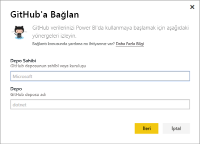
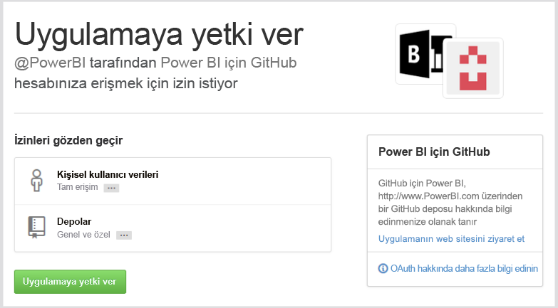
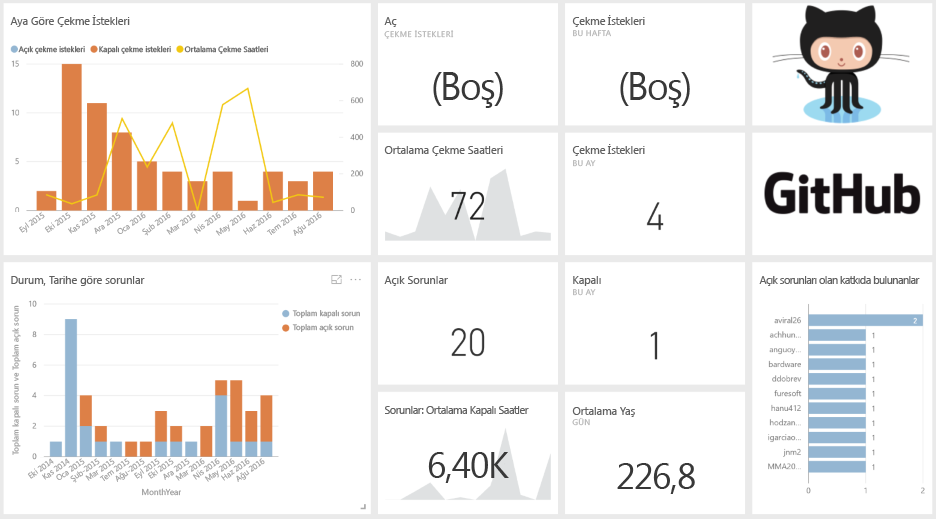
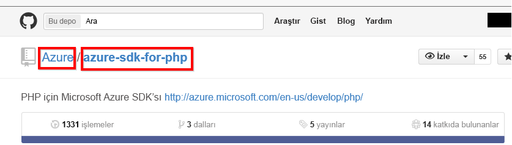

# Power BI ile GitHub'a bağlanma
Power BI için GitHub içerik paketi; yapılan katkılar, sorunlar, çekme istekleri ve etkin kullanıcılar ile ilgili veriler içeren bir GitHub deposuna (depo olarak da bilinir) ilişkin öngörüler edinmenize olanak tanır.

[GitHub içerik paketi](https://app.powerbi.com/getdata/services/github)'ne bağlanın veya Power BI ile [GitHub tümleştirmesi](https://powerbi.microsoft.com/integrations/github) hakkında daha fazla bilgi edinin.

>[!NOTE]
>İçerik paketi depoya erişim için bir GitHub hesabı gerektirir. Aşağıda, gereksinimlerle ilgili daha ayrıntılı bilgi verilmiştir.

## Bağlanma
1. Sol gezinti bölmesinin alt kısmında bulunan **Veri Al**'ı seçin.
   
    
2. **Hizmetler** kutusundaki **Al** seçeneğini belirleyin.
   
    
3. **GitHub** \> **Al**'ı seçin.
   
   
4. Depo adını ve sahibini girin. [Bu parametreleri bulma](#FindingParams) konusundaki ayrıntılı bilgileri aşağıda bulabilirsiniz.
   
   
5. GitHub kimlik bilgilerinizi girin (tarayıcınızda önceden oturum açtıysanız bu adımı atlayabilirsiniz). 
6. **Kimlik doğrulama yöntemi** için **OAuth2** \> **Oturum aç** seçeneklerini belirleyin. 
7. GitHub kimlik doğrulaması ekranlarındaki yönergeleri uygulayın. Power BI için GitHub içerik paketine, GitHub verilerine erişim izni verin.
   
   
   
   Böylece Power BI GitHub'a bağlanır ve verilere erişebilir.  Veriler, günde bir kez yenilenir.
8. Depoyla bağlantı kurulmasının ardından Power BI, verileri içeri aktarır. Sol gezinti bölmesinde yeni bir [GitHub panosu](https://powerbi.microsoft.com/integrations/github), raporu ve veri kümesi görürsünüz. Yeni öğeler sarı yıldız işareti \* ile gösterilir.
   
   

**Sırada ne var?**

* Panonun üst tarafındaki [Soru-Cevap kutusunda soru sormayı](power-bi-q-and-a.md) deneyin
* Panodaki [kutucukları değiştirin](service-dashboard-edit-tile.md).
* Bağlantılı raporu açmak için [bir kutucuk seçin](service-dashboard-tiles.md).
* Veri kümeniz günlük olarak yenilenecek şekilde zamanlanır ancak yenileme zamanlamasında değişiklik yapabilir veya **Şimdi Yenile** seçeneğini kullanarak istediğinizde veri kümenizi kendiniz de yenileyebilirsiniz

## Neleri kapsar?
Aşağıdaki verilere Power BI ile GitHub'dan erişilebilir:     

| Tablo adı | Açıklama |
| --- | --- |
| Contributions |Katkılar tablosunda, katkıda bulunan kişi tarafından gerçekleştirilen ve haftalık olarak hesaplanan toplam ekleme, silme ve yürütme işlemi sayısı gösterilir. En çok katkıda bulunan 100 kişi tabloya dahil edilir. |
| Issues |Seçili depo ile ilgili tüm sorunları listeler ve bir sorunun kapatılmasına kadar geçen toplam ve ortalama süre, toplam açık sorun sayısı ve toplam kapalı sorun sayısı gibi hesaplar içerir. Depoda herhangi bir sorun olmadığında bu tablo boş olur. |
| Pull requests |Bu tabloda, depo için gerçekleştirilen tüm Çekme İstekleri ve çekme isteğini kimin gerçekleştirdiği gösterilir. Açık, kapalı ve toplam çekme isteği sayısı, çekme isteklerinin gerçekleştirilmesinin ne kadar sürdüğü ve bir çekme isteğinin ortalama ne kadar sürdüğü ile ilgili hesaplamalar da içerir. Depoda herhangi bir sorun olmadığında bu tablo boş olur. |
| Users |Bu tabloda katkı yapmış, sorun bildirmiş veya seçili depo için Çekme isteklerini çözmüş GitHub kullanıcılarının ya da katkıda bulunan kişilerin bir listesi bulunmaktadır. |
| Milestones |Seçili depo ile ilgili tüm kilometre taşlarını gösterir. |
| DateTable |Bu tabloda, GitHub verilerinizi tarihe göre çözümleme konusunda yararlanabileceğiniz, güncel ve geçmiş tarihler bulunur. |
| ContributionPunchCard |Bu tablo, seçili depo için yapılan katkıları gösteren bir ödül kartı olarak kullanılabilir. Haftanın günlerine ve saatlere göre yürütmeleri gösterir. Bu tablo, modeldeki diğer tablolara bağlı değildir. |
| RepoDetails |Bu tabloda, seçili depo ile ilgili ayrıntılar sunulur. |

## Sistem gereksinimleri
* Depoya erişimi bulunan bir GitHub hesabı.  
* İlk oturum açma işlemi sırasında Power BI için GitHub uygulamasına izin verme. Erişim iptali ile ilgili aşağıdaki ayrıntılı bilgilere bakın.  
* Veri çekme ve yenileme için kullanılabilen yeterli miktarda API çağrısı.  

### Power BI yetkisini kaldırma
Power BI'ın GitHub deponuza bağlanma yetkisini kaldırmak üzere GitHub için Erişimi iptal et işlemini gerçekleştirebilirsiniz. Daha fazla bilgi için [GitHub Help](https://help.github.com/articles/keeping-your-ssh-keys-and-application-access-tokens-safe/#reviewing-your-authorized-applications-oauth) konusuna bakın.

## Parametreleri bulma
GitHub'daki depoya bakarak sahibi ve depoyu belirlemeniz mümkündür:

İlk parça olan "Azure" sahibi, ikinci parça olan "azure-sdk-for-php" ise depoyu göstermektedir.  Depo URL'sinde aynı iki öğeyi görürsünüz:

    <https://github.com/Azure/azure-sdk-for-php> .

## Sorun giderme
Gerekirse GitHub kimlik bilgilerinizi doğrulayabilirsiniz.  

1. Başka bir tarayıcı penceresinde GitHub web sitesine gidin ve GitHub'da oturum açın. GitHub sitesindeyken sağ üst köşeye bakarak, oturum açmış olduğunuzu görebilirsiniz.    
2. GitHub'da, Power BI'ı kullanarak erişmek istediğiniz deponun URL'sine gidin. Örneğin: https://github.com/dotnet/corefx.  
3. Power BI'da GitHub'a bağlanmayı deneyin. GitHub Yapılandırma iletişim kutusunda, deponun ve sahibinin adını kullanın.  

## Sonraki adımlar
* [Power BI ile çalışmaya başlama](service-get-started.md)
* [Veri alma](service-get-data.md)
