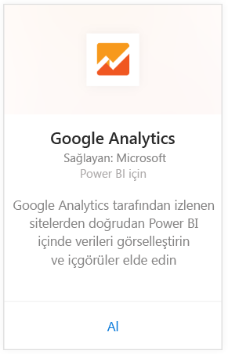
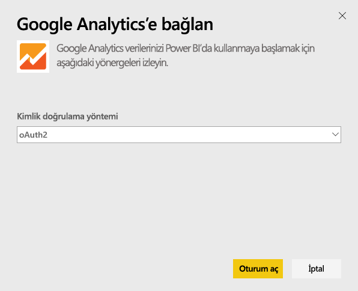
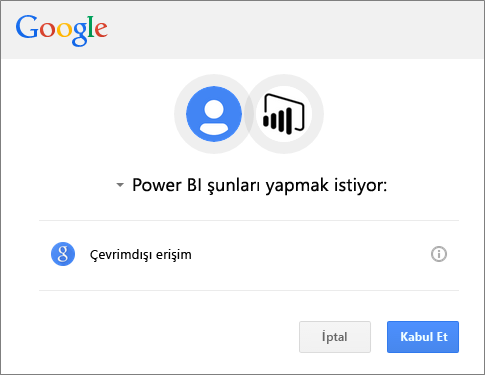
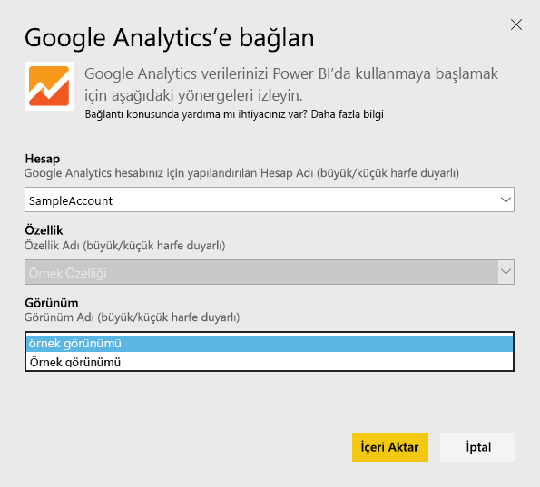
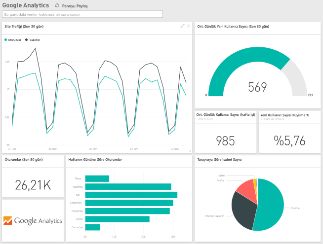
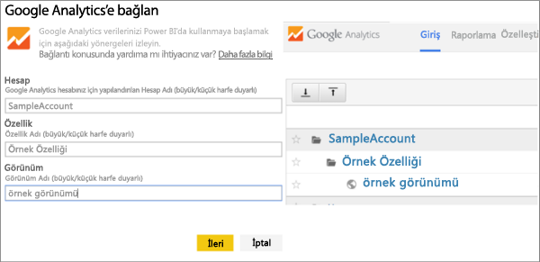

# Power BI ile Google Analytics'e bağlanma
Power BI aracılığıyla Google Analytics'e bağlanmak için ilk olarak Google Analytics hesabınıza bağlanırsınız. Site trafiğiniz ve kullanıcılarınıza ilişkin ölçülerle ilgili öngörüler sağlayan bir Power BI panosu ile bir dizi Power BI raporu edinirsiniz. Pano ve raporlarla etkileşim kurabilir ancak değişiklikleri kaydedemezsiniz. Veriler günde bir kez otomatik olarak yenilenir.

Power BI için [Google Analytics](https://app.powerbi.com/getdata/services/google-analytics)'e bağlanın. Power BI ile [Google Analytics tümleştirmesi](https://powerbi.microsoft.com/integrations/google-analytics) hakkında daha fazla bilgi edinin.

Power BI Desktop'ta [Google Analytics bağlayıcısının](service-google-analytics-connector.md) bulunduğu bölüme giderek, özelleştirilmiş panolar ve raporlar oluşturmaya başlayabilirsiniz. Özel raporlar oluşturmak için Google Analytics hesabınızla bağlanmanız yeterlidir. Daha sonra bu özel raporları Power BI hizmetinde yayımlayabilirsiniz.

## Bağlanma
[!INCLUDE [powerbi-service-apps-get-more-apps](./includes/powerbi-service-apps-get-more-apps.md)]

1. **Google Analytics** \> **Al**'ı seçin.
   
   
2. İstendiğinde, Google Analytics kimlik bilgilerinizi girin. Kimlik doğrulama yöntemi olarak **OAuth2**'yi seçin ve **Oturum Aç**'a tıklayın. Google kimlik doğrulama akışını takip edin. Daha önce yapılandırmış olmanız halinde bu akışta iki öğeli kimlik doğrulama da uygulanabilir.
   
   
3. Power BI'ın, Google Analytics verilerinize erişmesine izin vermek için **Accept**'e (Kabul et) tıklayın.
   
   
4. Power BI belirli bir Google Analytics Görünümüne bağlanır. Bağlanmak istediğiniz hesap adını, özellik adını ve görünüm adını seçin. Bu bilgiler, Google Analytics hesabınızdaki sol üst kısımda veya **Ana Sayfa** sekmesinde bulunabilir. Ayrıntıları aşağıda bulabilirsiniz. 
   
   
5. İçeri aktarma işlemini başlatmak için **Connect**'e (Bağlan) tıklayın. 

## Google Analytics panosunu ve raporları görüntüleme
[!INCLUDE [powerbi-service-apps-open-app](./includes/powerbi-service-apps-open-app.md)]

      

[!INCLUDE [powerbi-service-apps-open-app](./includes/powerbi-service-apps-what-now.md)]

## Sistem gereksinimleri
Power BI'dan bağlanmak için bir [Google Analytics](https://www.google.com/analytics/) hesabınız olması gerekir. Kendisine bağlı bir Google Analytics hesabı olmayan diğer Google hesapları bir kimlik doğrulama hatası alır.

## Sorun giderme
**Kimlik bilgileri** Birden çok Google hesabınız varsa bağlantı sırasında doğru hesabın kullanıldığından emin olmak için lütfen gizli veya özel bir tarayıcı penceresi kullanın.

Kimlik bilgilerinizin geçersiz olduğunu belirten bir hata alıyor ancak Google'da oturum açabiliyorsanız lütfen bir [Google Analytics](https://www.google.com/analytics/) hesabınız olduğunu doğrulayın.

**Parametreler** Şu anda parametreler için benzersiz adlar gereklidir. Seçtiğiniz değerin yinelendiğini belirten bir hata ile karşılaştıysanız lütfen başka bir değer seçin veya Google Analytics'te adları benzersiz olacak şekilde değiştirin. Bu sorunu iyileştirmek için yoğun bir şekilde çalışıyoruz.

>[!NOTE]
>Parametreler büyük/küçük harfe duyarlıdır. Parametreleri, tam olarak Google Analytics hesabınızda göründüğü gibi girin.

Sorun hâlâ çözülmedi mi? Power BI ekibine ulaşmak için bir destek bileti açın:

* Power BI uygulamasındayken soru işareti \> **Destek Ekibine Başvur** seçeneğini belirleyin.
* Bu makaleyi okuduğunuz Power BI Destek sitesinde sayfanın sağ tarafında bulunan **Contact Support**'u (Destek Ekibine Başvur) seçin.

## Sonraki adımlar
* [Power BI'da uygulamalar ne anlama gelir?](service-install-use-apps.md)
* [Power BI'da veri alma](service-get-data.md)
* Başka bir sorunuz mu var? [Power BI Topluluğu'na sorun](http://community.powerbi.com/)

