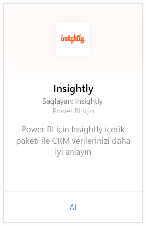
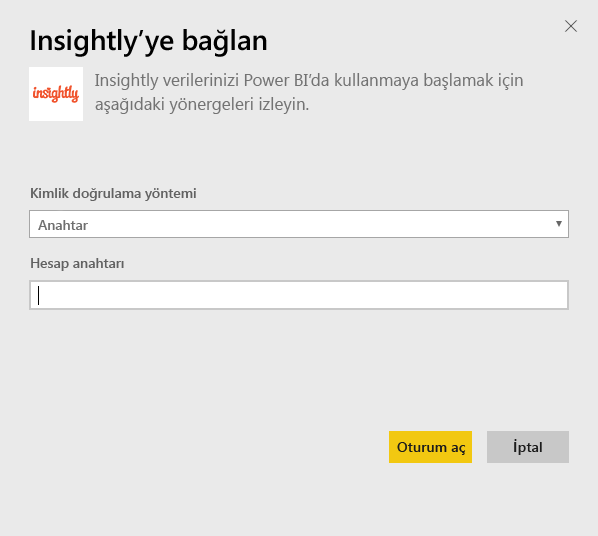
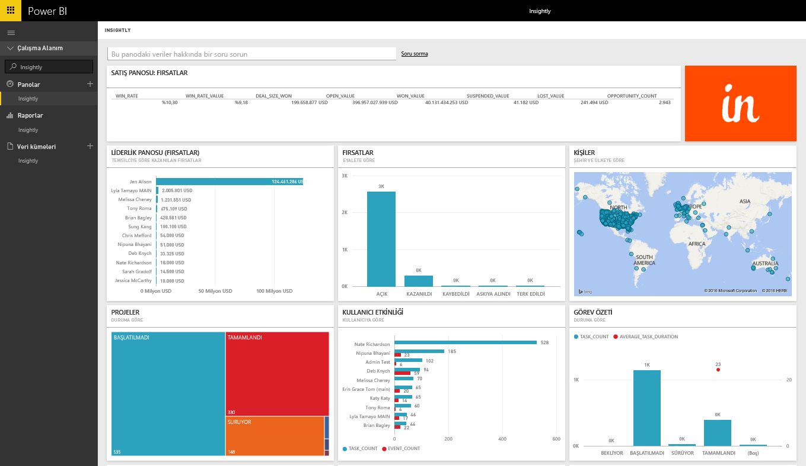
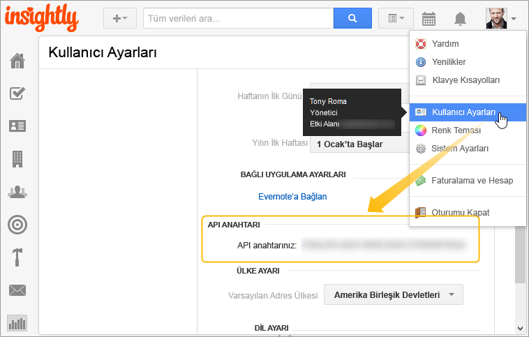

# Power BI ile Insightly'ye Bağlanma
Insightly içerik paketi ile Power BI'da Insightly CRM verilerinizi görselleştirin ve paylaşın. CRM verilerinizden raporlar ve panolar oluşturup bunları görüntülemek için Insightly API anahtarınızı kullanarak Power BI'a bağlanın. Power BI ile verileri yeni yöntemlerle çözümleyebilir, etkileyici graflar ve grafikler oluşturabilir, ayrıca kişileri, müşteri adaylarını ve kuruluşları harita üzerinde görüntüleyebilirsiniz.

Power BI için [Insightly içerik paketine](https://app.powerbi.com/getdata/services/insightly) bağlanma.

## Bağlanma
1. Sol gezinti bölmesinin alt kısmında bulunan **Veri Al**'ı seçin.
   
   
2. **Hizmetler** kutusundaki **Al** seçeneğini belirleyin.
   
   
3. **Insightly** \>  **Al**'ı seçin.
   
   
4. Kimlik doğrulama yöntemi olarak **Anahtar**'ı seçin ve Insight API Anahtarınızı girip **Oturum aç** seçeneğini belirleyin. Aşağıda, [bu parametreleri bulma](#FindingParams) ile ilgili ayrıntılara ulaşabilirsiniz.
   
   
5. Onaylamanızın ardından içeri aktarma işlemi otomatik olarak başlatılır. İşlem tamamlandığında Gezinti Bölmesinde yeni bir pano, rapor ve model görünür. İçeri aktarılan verilerinizi görüntülemek için panoyu seçin.
   
     

**Sırada ne var?**

* Panonun üst tarafındaki [Soru-Cevap kutusunda soru sormayı](consumer/end-user-q-and-a.md) deneyin
* Panodaki [kutucukları değiştirin](service-dashboard-edit-tile.md).
* Bağlantılı raporu açmak için [bir kutucuk seçin](consumer/end-user-tiles.md).
* Veri kümeniz günlük olarak yenilenecek şekilde zamanlanır ancak yenileme zamanlamasında değişiklik yapabilir veya **Şimdi Yenile** seçeneğini kullanarak istediğinizde veri kümenizi kendiniz de yenileyebilirsiniz.

## Neleri kapsar?
İçerik paketi, aşağıdaki tablolarla birlikte ilgili kayıtları gösterir:

| Tablolar |  |  |  |
| --- | --- | --- | --- |
| Contacts |Opportunities |Pipeline Stages |Task Complete Date |
| Custom Fields |Opportunity Close Date |Project Complete Date |Tasks |
| Events |Opportunity Forecast Date |Projects |Teams/Members |
| Leads |Organizations |Tags |Users |

Çoğu tabloda ve raporda şunlar gibi benzersiz, hesaplanan alanlar da bulunur:  

* "Gruplandırılmış" tahmini fırsat kapanış tarihleri, gerçek fırsat kapanış tarihleri, proje tamamlanma tarihleri ve aya, üç aylık döneme veya yıla göre çözümlemeye yönelik görev tamamlanma tarihleri.  
* Fırsatlara yönelik bir ağırlıklı değer alanı (fırsat değeri * kazanma olasılığı).  
* Başlangıç ve tamamlanma tarihlerine göre belirlenen, görevlere ilişkin ortalama ve toplam süre alanları.  
* Fırsat kazanma oranına (kazanma sayısı/toplam fırsat sayısı) ve kazanma oranı değerine (kazanma değeri/toplam fırsat değeri) yönelik hesaplanan alanlar içeren raporlar.  

## Sistem gereksinimleri
Insightly API erişimi olan bir Insightly hesabı. Görünürlük izinleri, Power BI ile bağlantı kurmak için kullanılan API anahtarına göre değişir. Size görünür olan tüm Insightly kayıtları, başkalarıyla paylaştığınız Power BI Raporları ve panolar için de görünür.

## Parametreleri bulma
**API Anahtarı**

Insightly'deki API anahtarınızı kopyalamak için Insightly profil menüsünde User Settings (Kullanıcı Ayarları) seçeneğini belirleyin ve ekranı aşağı kaydırın. Bu karakter dizesi, verilerinizi Power BI'a bağlamak için kullanılır.

## Sorun giderme
Verileriniz, Insightly aboneliği plan düzeyinize bağlı günlük bir sınır içeren Insightly API aracılığıyla içeri aktarılır. Sınırlar, API belgelerimizin Rate Limiting/Throttling Requests (Hız Sınırlama/İstekleri Azaltma) bölümünde belirtilmiştir: https://api.insight.ly/v2.2/Help#!/Overview/Introduction#ratelimit

Sağlanan raporlar Insightly'deki varsayılan alanları kullanır ve özelleştirmelerinizi içermeyebilir. Kullanılabilir tüm alanları görüntülemek için raporu düzenleyin.

## Sonraki adımlar
[Power BI ile çalışmaya başlama](service-get-started.md)

[Power BI'da veri alma](service-get-data.md)

