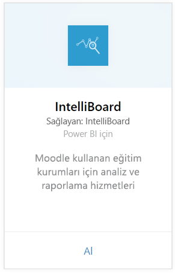
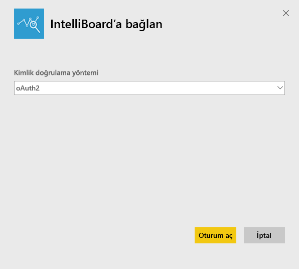
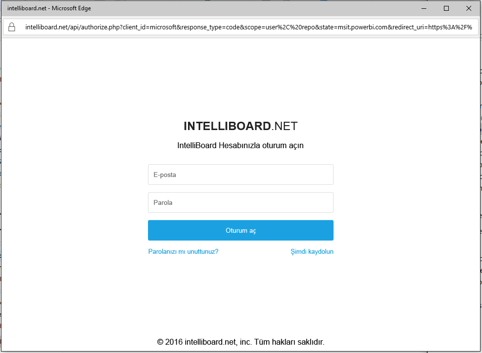
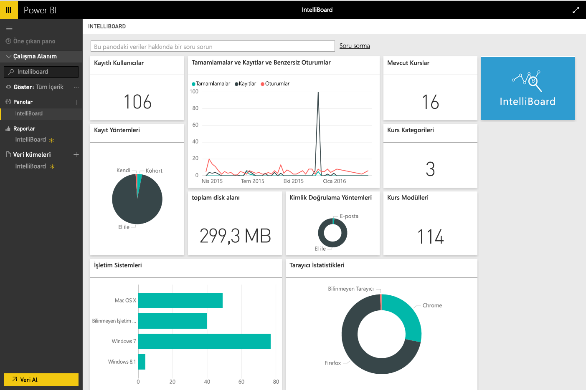

# Power BI ile IntelliBoard'a bağlanma
IntelliBoard, raporlama hizmetleri üzerinden Moodle öğrenme yönetim sistemi verilerinize yönelik basitleştirilmiş erişim sunar. Power BI için IntelliBoard içerik paketi; kurslarınız, kayıtlı kullanıcılarınız, genel performansınız ve LMS etkinliklerinize ilişkin ölçümler de dahil olmak üzere ek analizler sunar.

Power BI için [IntelliBoard içerik paketine](https://app.powerbi.com/getdata/services/intelliboard) bağlanın.

## Bağlanma
1. Sol gezinti bölmesinin alt kısmında bulunan **Veri Al**'ı seçin.  
   
    
2. **Hizmetler** kutusundaki **Al** seçeneğini belirleyin.  
   
    
3. **IntelliBoard**'u ve ardından **Al**'ı seçin.  
   
    
4. **OAuth2**'yi ve ardından **Oturum Aç**'ı seçin. İstendiğinde IntelliBoard kimlik bilgilerinizi girin.
   
    
   
    
5. Bağlandıktan sonra bir pano, rapor ve veri kümesi otomatik olarak yüklenir. Bu işlem tamamlandığında kutucuklar, IntelliBoard hesabınızdaki veriler ile güncelleştirilir.
   
    

**Sırada ne var?**

* Panonun üst tarafındaki [Soru-Cevap kutusunda soru sormayı](consumer/end-user-q-and-a.md) deneyin
* Panodaki [kutucukları değiştirin](service-dashboard-edit-tile.md).
* Bağlantılı raporu açmak için [bir kutucuk seçin](consumer/end-user-tiles.md).
* Veri kümeniz günlük olarak yenilenecek şekilde zamanlanır ancak yenileme zamanlamasında değişiklik yapabilir veya **Şimdi Yenile** seçeneğini kullanarak istediğinizde veri kümenizi kendiniz de yenileyebilirsiniz.

## Neleri kapsar?
İçerik paketi şu tablolardaki verileri içerir:  

    - Activity  
    - Agents  
    - Auth  
    - Countries  
    - CoursesProgress  
    - Enrollments
    - Lang  
    - Platform  
    - Totals  
    - UsersProgress    

## Sistem Gereksinimleri
Bu içerik paketinin bir örneğini oluşturmak için, yukarıdaki tablolara yönelik izinlere sahip bir IntelliBoard hesabı gereklidir.

## Sonraki adımlar
[Power BI nedir?](power-bi-overview.md)

[Power BI - Temel Kavramlar](consumer/end-user-basic-concepts.md)

