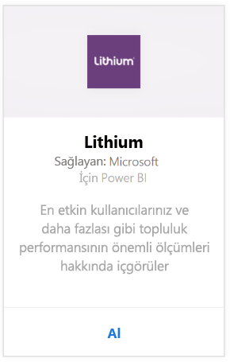
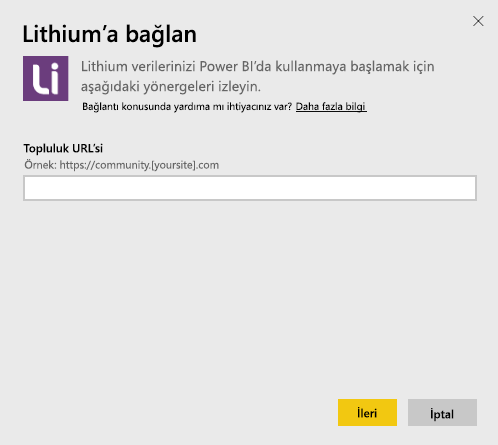
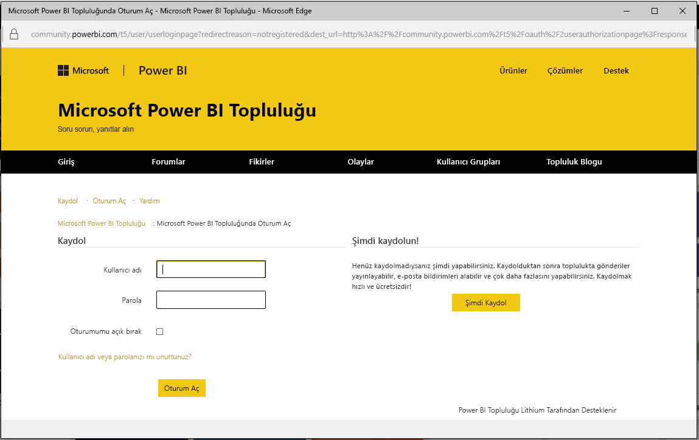
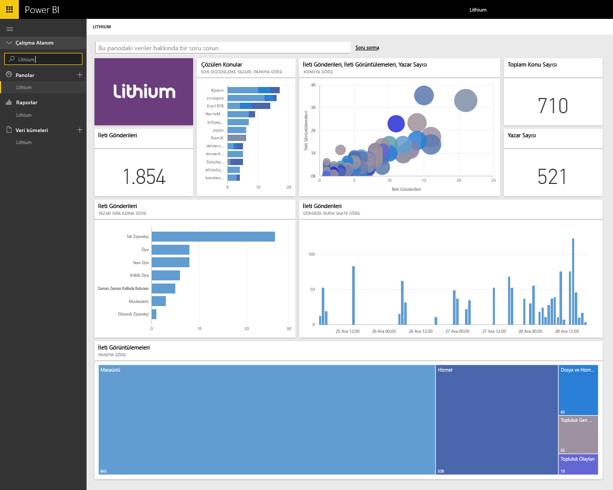

# Power BI ile Lithium'a bağlanma
Lithium, kullanıcıların, sorularına ilişkin cevaplar almasına ve deneyimlerini paylaşmasına yardımcı olarak dünyanın en iyi markaları ile müşterileri arasında güvenilir ilişkiler inşa eder. Lithium içerik paketini Power BI'a ekleyerek satışların ve müşteri bağlılığının artırılmasına ve hizmet maliyetlerinin azaltılmasına yardımcı olmak üzere çevrimiçi topluluğunuza ilişkin ana ölçümler gerçekleştirebilirsiniz. 

Power BI için [Lithium içerik paketine](https://app.powerbi.com/getdata/services/lithium) bağlanın.

>[!NOTE]
>Power BI içerik paketi Lithium API'sini kullanır. Belirli sayıyı aşan API çağrıları Lithium'un ek ücret uygulamasına neden olabilir; lütfen Lithium yöneticinize danışın.

## Bağlanma
1. Sol gezinti bölmesinin alt kısmında bulunan **Veri Al**'ı seçin.
   
    
2. **Hizmetler** kutusundaki **Al**'ı seçin.
   
    
3. **Lithium** \> **Al** seçeneğini belirleyin.
   
   
4. Lithium topluluğunuzun URL'sini girin. *https://community.yoursite.com* biçiminde olur.
   
   
5. İstendiğinde Lithium kimlik bilgilerinizi girin. Kimlik doğrulama yöntemi olarak **OAuth2**'yi seçin ve **Oturum aç**'a tıklayıp Lithium kimlik doğrulaması akışındaki adımları uygulayın.
   
   
   
   
6. Oturum açma akışı tamamlandığında içeri aktarma işlemi başlar. İçeri aktarma işlemi sona erdiğinde, Gezinti Bölmesinde yeni bir pano, rapor ve model görünür. İçeri aktarılan verilerinizi görüntülemek için panoyu seçin.
   
    

**Sırada ne var?**

* Panonun üst tarafındaki [Soru-Cevap kutusunda soru sormayı](consumer/end-user-q-and-a.md) deneyin
* Panodaki [kutucukları değiştirin](service-dashboard-edit-tile.md).
* Bağlantılı raporu açmak için [bir kutucuk seçin](consumer/end-user-tiles.md).
* Veri kümeniz günlük olarak yenilenecek şekilde zamanlanır ancak yenileme zamanlamasında değişiklik yapabilir veya **Şimdi Yenile** seçeneğini kullanarak istediğinizde veri kümenizi kendiniz de yenileyebilirsiniz.

## Sistem Gereksinimleri
Lithium içerik paketi için Lithium Community v15.9 veya sonraki bir sürümü gerekir. Doğrulamak için lütfen Lithium yöneticinize danışın.

## Sonraki adımlar
[Power BI nedir?](power-bi-overview.md)

[Power BI - Temel Kavramlar](consumer/end-user-basic-concepts.md)

