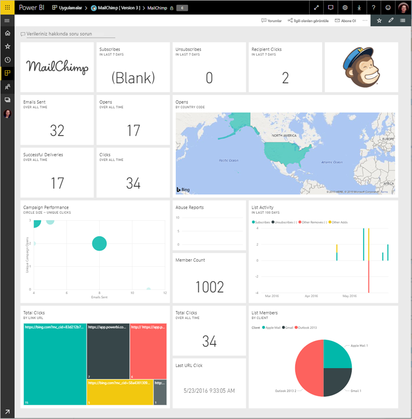
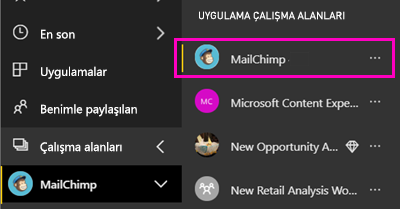
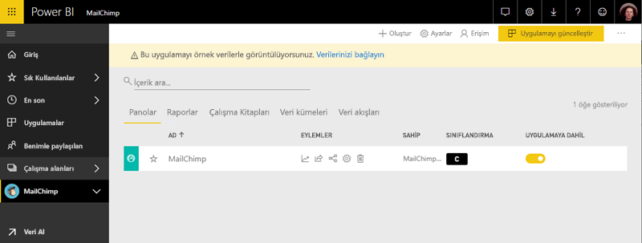

# Power BI ile MailChimp'e bağlanma
Bu makalede, Power BI şablon uygulama ile MailChimp hesabınızdan veri çekme gösterilmektedir. Şablon uygulaması ile bir pano, raporlar kümesi ve bir veri kümesi oluşturarak MailChimp verilerinizi araştırmanıza olanak tanımak için bir çalışma alanı oluşturur. Analiz verileri çekerek [MailChimp panoları](https://powerbi.microsoft.com/integrations/mailchimp) oluşturun ve kampanyalarınızda, raporlarınızda ve bireysel abonelerinizde görülen eğilimleri hızla tanımlayın. İzlemekte verilerin güncel olduğunu verileri günlük olarak yeniler.

Şablon uygulamayı yükledikten sonra panoyu ve raporu değiştirebilirsiniz. Ardından, bu iş arkadaşlarınıza bir uygulama olarak, kuruluşunuzda dağıtabilirsiniz.

Bağlanma [MailChimp şablon uygulaması](https://app.powerbi.com/getdata/services/mailchimp) Power BI için.

## Bağlanma

[!INCLUDE [powerbi-service-apps-get-more-apps](./includes/powerbi-service-apps-get-more-apps.md)]

3. Seçin **MailChimp** \> **şimdi edinin**.
4. İçinde **bu Power BI uygulaması yükleme?** seçin **yükleme**.
4. İçinde **uygulamaları** bölmesinde **MailChimp** Döşe.

    

6. İçinde **yeni uygulamanızı ile çalışmaya başlama**seçin **verilere**.

    

1. Kimlik Doğrulama Yöntemi için **OAuth2** \> **Oturum aç** seçeneğini belirleyin.
   
    İstendiğinde, MailChimp kimlik bilgilerinizi girin ve kimlik doğrulaması işlemini gerçekleştirin.
   
    İlk kez bağlandığınızda Power BI, hesabınıza salt okunur erişime izin vermenizi ister. İçeri aktarma işlemini başlatmak için **Allow** (İzin ver) seçeneğini belirleyin. Bu işlem hesabınızdaki verilerin hacmine bağlı olarak birkaç dakika sürebilir.
   
    

5. Veriler Power BI tarafından içeri aktarıldıktan sonra MailChimp panosu açılır.
   
    

## Değiştirme ve uygulamanızı dağıtın

MailChimp şablon uygulaması yüklediniz. MailChimp uygulama çalışma alanı da oluşturmuş olduğunuz anlamına gelir. Çalışma alanında, rapor ve Pano değiştirebilir ve ardından olarak dağıtmak bir *uygulama* kuruluşunuzdaki iş arkadaşlarınıza. 

1. Sol gezinti çubuğunda yeni MailChimp çalışma alanınızda, tüm içeriğini görüntülemek için seçin **çalışma alanları** > **MailChimp**. 

    

    Bu görünüm çalışma alanı için içerik listesidir. Sağ üst köşedeki gördüğünüz **uygulamayı Güncelleştir**. İş arkadaşlarınız için uygulamanızı dağıtmaya hazır olduğunuzda nereden başlayacaksınız olmasıdır.

    

2. Seçin **raporları** ve **veri kümeleri** çalışma alanındaki diğer öğeleri görmek için. 

    Hakkında bilgi edinin [uygulama dağıtmaya](service-create-distribute-apps.md) iş arkadaşlarınıza önerilmesini sağlayın.

## Sonraki adımlar

* [Power BI'da yeni çalışma alanları oluşturma](service-create-the-new-workspaces.md)
* [Power BI'da uygulamaları yükleme ve kullanma](consumer/end-user-apps.md)
* [Dış hizmetler için Power BI uygulamaları](service-connect-to-services.md)
* Sorularınız mı var? [Power BI Topluluğu'na sorun](http://community.powerbi.com/)

