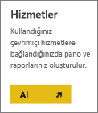
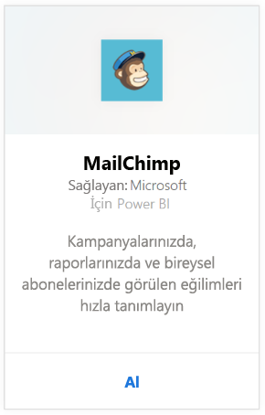
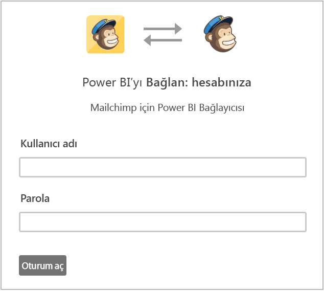
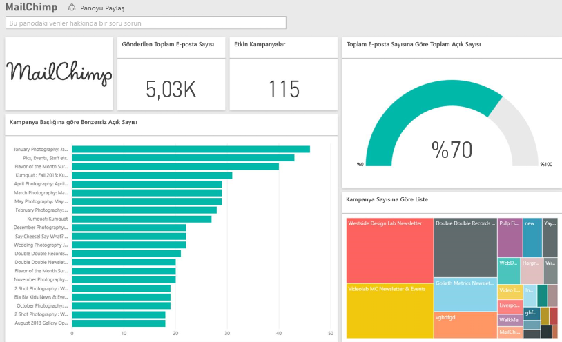

# Power BI ile MailChimp'e bağlanma
Power BI içerik paketi MailChimp hesabınızdan veri çeker ve bir pano, raporlar kümesi ve veri kümesi oluşturarak verilerinizi araştırmanıza olanak sağlar. Analiz verileri çekerek [MailChimp panoları](https://powerbi.microsoft.com/integrations/mailchimp) oluşturun ve kampanyalarınızda, raporlarınızda ve bireysel abonelerinizde görülen eğilimleri hızla tanımlayın. Veriler, güncel bir izleme deneyimi elde etmenizi sağlamak üzere günlük olarak yenilenir.

Power BI için [MailChimp içerik paketine](https://app.powerbi.com/getdata/services/mailchimp) bağlanın.

## Bağlanma
1. Sol gezinti bölmesinin alt kısmında bulunan **Veri Al**'ı seçin.
   
    
2. **Hizmetler** kutusundaki **Al**'ı seçin.
   
   
3. **MailChimp** \> **Al** seçeneğini belirleyin.
   
   
4. Kimlik doğrulama yöntemi için **OAuth2** \> **Oturum aç** seçeneklerini belirleyin.
   
    İstendiğinde, MailChimp kimlik bilgilerinizi girin ve kimlik doğrulaması işlemini gerçekleştirin.
   
    İlk kez bağlandığınızda Power BI'ın hesabınıza salt okunur şekilde erişimine izin vermeniz istenir. İçeri aktarma işlemine başlamak için **İzin Ver**'i seçin, bu işlem hesabınızdaki verilerin hacmine bağlı olarak birkaç dakika sürebilir.
   
    
5. Power BI verileri içeri aktardıktan sonra sol gezinti bölmesinde yeni bir pano, rapor ve veri kümesi görürsünüz. Bu, Power BI'ın verilerinizi görüntülemek için oluşturduğu varsayılan panodur. Bu panoyu, verilerinizi istediğiniz herhangi bir biçimde görüntüleyecek şekilde değiştirebilirsiniz.
   
   

**Sırada ne var?**

* Panonun üst tarafındaki [Soru-Cevap kutusunda soru sormayı](consumer/end-user-q-and-a.md) deneyin
* Panodaki [kutucukları değiştirin](service-dashboard-edit-tile.md).
* Bağlantılı raporu açmak için [bir kutucuk seçin](consumer/end-user-tiles.md).
* Veri kümeniz günlük olarak yenilenecek şekilde zamanlanır ancak yenileme zamanlamasında değişiklik yapabilir veya **Şimdi Yenile** seçeneğini kullanarak istediğinizde veri kümenizi kendiniz de yenileyebilirsiniz.

## Sonraki adımlar
[Power BI nedir?](power-bi-overview.md)

[Power BI - Temel Kavramlar](consumer/end-user-basic-concepts.md)

