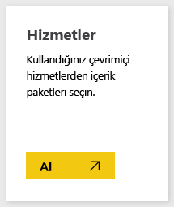
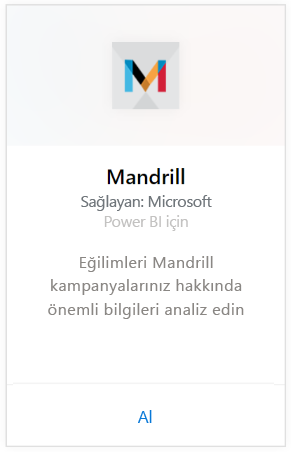
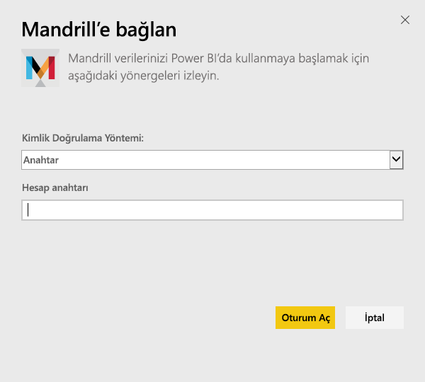
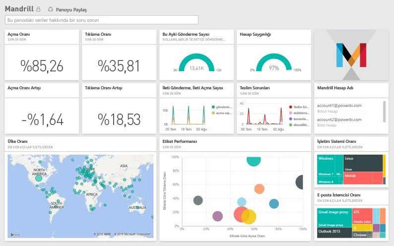

# Power BI ile Mandrill'e bağlanma
Power BI içerik paketi Mandrill hesabınızdan veri çeker ve bir pano, bir raporlar kümesi ve bir veri kümesi oluşturarak verilerinizi araştırmanıza olanak sağlar. Mandrill'in analizini kullanarak bülten veya pazarlama kampanyanız hakkında öngörüler elde edin. Veriler, güncel bir izleme deneyimi elde etmenizi sağlamak üzere günlük olarak yenilenir.

[!INCLUDE [include-short-name](./includes/service-deprecate-content-packs.md)]

[Power BI için Mandrill içerik paketine](http://app.powerbi.com/getdata/services/mandrill) bağlanın.

## Bağlanma
1. Sol gezinti bölmesinin alt kısmında bulunan **Veri Al**'ı seçin.
   
    
2. **Hizmetler** kutusundaki **Al** seçeneğini belirleyin.
   
    
3. **Mandrill** > **Al** seçeneğini belirleyin.
   
    
4. **Kimlik Doğrulama Yöntemi** için **Anahtar** seçeneğini belirleyin ve API anahtarınızı sağlayın. Anahtarı Mandrill panosunun **Ayarlar** sekmesinde bulabilirsiniz. İçeri aktarma işlemine başlamak için **Oturum aç**'ı seçin, bu işlem hesabınızdaki verilerin hacmine bağlı olarak birkaç dakika sürebilir.
   
    
5. Veriler Power BI tarafından içeri aktarıldıktan sonra sol gezinti bölmesinde yeni bir pano, rapor ve veri kümesi görürsünüz. Bu, Power BI'ın verilerinizi görüntülemek için oluşturduğu varsayılan panodur.
   
    

**Sırada ne var?**

* Panonun üst tarafındaki [Soru-Cevap kutusunda soru sormayı](consumer/end-user-q-and-a.md) deneyin
* Panodaki [kutucukları değiştirin](service-dashboard-edit-tile.md).
* Bağlantılı raporu açmak için [bir kutucuk seçin](consumer/end-user-tiles.md).
* Veri kümeniz günlük olarak yenilenecek şekilde zamanlanır ancak yenileme zamanlamasında değişiklik yapabilir veya **Şimdi Yenile** seçeneğini kullanarak istediğinizde veri kümenizi kendiniz de yenileyebilirsiniz.

## Sonraki adımlar
[Power BI nedir?](power-bi-overview.md)

[Power BI hizmetinde tasarımcılar için temel kavramlar](service-basic-concepts.md)

