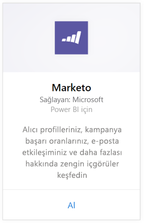
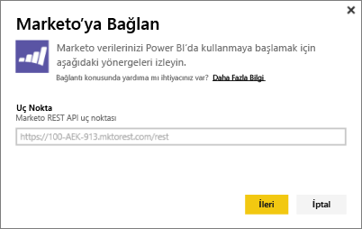
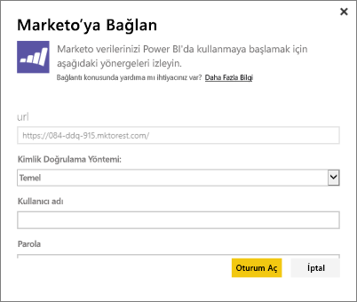
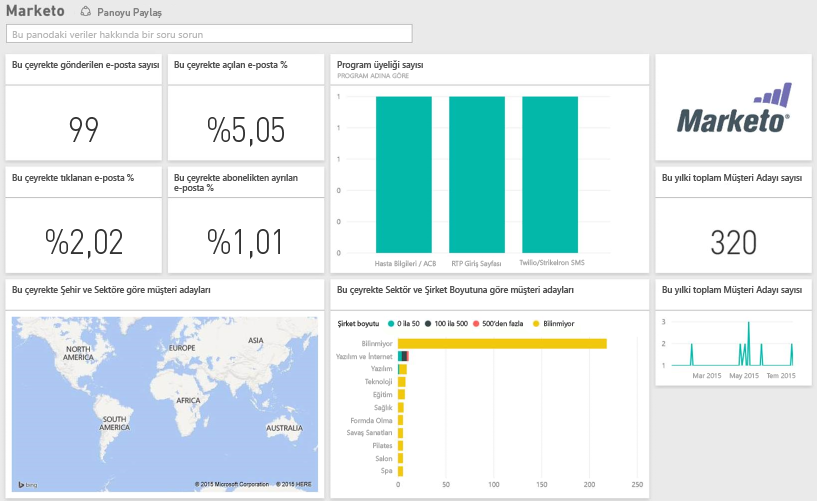

# Power BI ile Marketo'ya bağlanma
Power BI için Marketo içerik paketi, Müşteri Adayları ve gerçekleştirdikleri etkinlikler ile ilgili verileri kullanarak Marketo hesabınıza ilişkin öngörüler elde etmenizi sağlar. Bu bağlantıyı oluşturduğunuzda verileriniz alınır ve bu verileri temel alan bir pano ve ilgili raporlar otomatik olarak sunulur.

Power BI için [Marketo içerik paketi](https://app.powerbi.com/getdata/services/marketo)'ne bağlanın.

## Bağlanma
1. Sol gezinti bölmesinin alt kısmında bulunan **Veri Al**'ı seçin.
   
   
2. **Hizmetler** kutusundaki **Al** seçeneğini belirleyin.
   
    
3. **Marketo** \> **Al**'ı seçin.
   
   
4. Marketo veya Marketo yöneticiniz tarafından verilen Marketo REST uç noktasını girin ve Sonraki seçeneğini belirleyin.
   
   
   
   Marketo REST uç noktası hakkında daha fazla bilgi edinin: [http://developers.marketo.com/documentation/rest/endpoint-url/ ](http://developers.marketo.com/documentation/rest/endpoint-url/).
5. Kimlik doğrulama yöntemi olarak **Temel** seçeneğini, **Kullanıcı adı** olarak İstemci Kimliğini **Parola** olarak ise Gizli Anahtarı girin. İstemci Kimliğini ve Gizli Anahtarı Marketo'da bulabilir veya Marketo yöneticinizden isteyebilirsiniz ([http://developers.marketo.com/documentation/rest/custom-service/](http://developers.marketo.com/documentation/rest/custom-service/)). 
   
   
   
   Böylece, *Marketo for Power BI* içerik paketinin [Marketo analizi](https://powerbi.microsoft.com/integrations/marketo) verilerinize erişebilmesi ve verilerinizin Power BI’da çözümlenebilmesi sağlanır. Veriler, günde bir kez yenilenir.
6. Marketo hesabınıza bağlanmanızın ardından tüm verilerinizi içeren bir pano yüklenir:
   
   

**Sırada ne var?**

* Panonun üst tarafındaki [Soru-Cevap kutusunda soru sormayı](power-bi-q-and-a.md) deneyin
* Panodaki [kutucukları değiştirin](service-dashboard-edit-tile.md).
* Bağlantılı raporu açmak için [bir kutucuk seçin](service-dashboard-tiles.md).
* Veri kümeniz günlük olarak yenilenecek şekilde zamanlanır ancak yenileme zamanlamasında değişiklik yapabilir veya **Şimdi Yenile** seçeneğini kullanarak istediğinizde veri kümenizi kendiniz de yenileyebilirsiniz

## Neleri kapsar?
Power BI'da, Marketo'nun sunduğu, günümüzle bir yıl öncesi arasındaki dönemde gerçekleşen etkinliklere ilişkin aşağıdaki verilere erişilebilir:

| Tablo adı | Açıklama |
| --- | --- |
| EmailActivities |Cihazlar, kategoriler, geri dönme sayısı ve yüzdesi, tıklama sayısı ve yüzdesi, açma sayısı ve yüzdesi ve program adı hakkındaki ayrıntılı bilgileri içeren, müşteri adaylarına/kişilere gönderilen e-postalarla ilgili veriler. Power BI'da gösterildiği şekilde Email Activities, yalnızca bir e-posta teslimat raporudur ve verilere ek bir mantık uygulamaz. Bu nedenle, Marketo istemcisi ile Power BI'da farklı sonuçlar görmeniz mümkündür. |
| ProgramActivites |Durumu değişen programlar hakkındaki veriler. Neden, Başarı, Program alma sayısı ve yüzdesi ile program başarı sayısı ve yüzdesi gibi ayrıntılı bilgileri içerir. |
| WebPageActivities |Arama aracısı, kullanıcı aracısı, web sayfası ve günün saati de dahil olmak üzere kullanıcının web sayfasına yaptığı ziyaretlerden alınan veriler. |
| Datetable |Güncel ve geçmiş yıla ilişkin tarihler.  Marketo verilerinizi tarihe göre çözümlemenizi sağlar. |
| Leads |Şirket, gelir boyutu, çalışan sayısı, ülke, sektör, müşteri adayı puanı ve müşteri durumu gibi müşteri adayı bilgileri. Müşteri adayları; e-posta, program ve web sayfası etkinlik verilerindeki varlıklarına göre alınır. |

Tüm tarihler UTC biçimindedir. Tarihler, hesabınızın bulunduğu saat dilimine bağlı olarak değişiklik gösterebilir (Marketo istemcisinde görüldüğü gibi)

## Sistem gereksinimleri
* Bağlanmak için kullandığınız Marketo hesabının müşteri adaylarına ve etkinliklere erişme iznine sahip olması.
* Verilere bağlanmak için kullanılabilen yeterli miktarda API çağrısı.  Marketo'da her hesap için bir API mevcuttur.  Sınıra ulaşıldığında verilerinizi Power BI'a yükleyemezsiniz. 

**API Sınırı Ayrıntıları**

Marketo'dan veri aktarma işlemleri için Marketo API'leri kullanılır. Her Marketo müşterisinin günlük olarak toplam 10.000 API çağrısı sınırı bulunur ve bu sınır, Marketo API'lerini kullanan tüm uygulamalar arasında paylaşılır. Power BI tümleştirmesinin yanı sıra diğer tümleştirmeler için de API'leri kullanabilirsiniz. API'ler hakkında daha fazla bilgi için bkz. <http://developers.marketo.com/documentation/rest/>.

Power BI'ın Marketo için gerçekleştirdiği API çağrılarının miktarı Marketo hesabınızda bulunan veri miktarına bağlıdır. Power BI son yıla ilişkin tüm Müşteri Adaylarını ve Etkinlikleri içeri aktarır. İçeri aktarma sırasında Power BI'ın kullandığı API çağrılarının miktarı ve Marketo'dan alınan verilere yönelik örnek aşağıda verilmiştir:  

| Veri Türü | Satır Sayısı | API Çağrıları |
| --- | --- | --- |
| Müşteri adayları bilgileri |15.000 |50 |
| Posta etkinlikleri |150.000 |1.000 |
| Program etkinlikleri |15.000 |100 |
| Web etkinlikleri |150.000 |1.000 |
| Program değişiklikleri |7.500 |50 |
| **Toplam API Çağrıları** | |**2.200** |

## Sonraki adımlar
[Power BI ile çalışmaya başlama](service-get-started.md)

[Power BI için veri alma](service-get-data.md)

[Power BI blogu: Marketo verilerinizi Power BI ile izleyip çözümleme](http://blogs.msdn.com/b/powerbi/archive/2015/03/19/monitor-and-analyze-your-marketo-data-with-power-bi.aspx)

