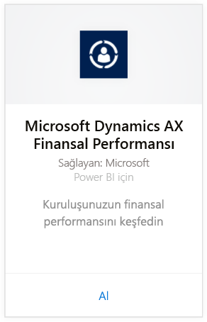
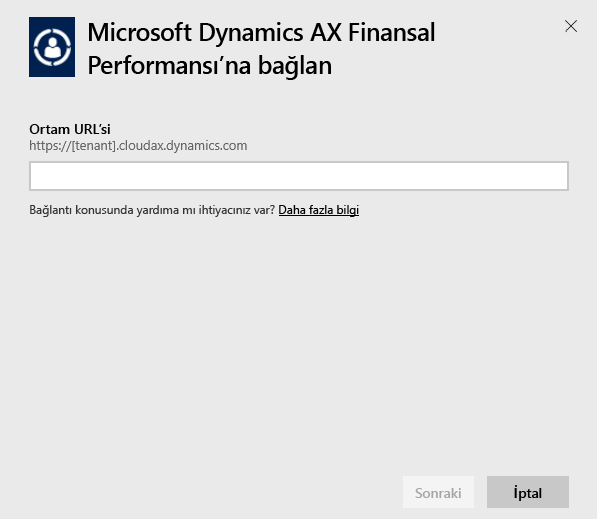
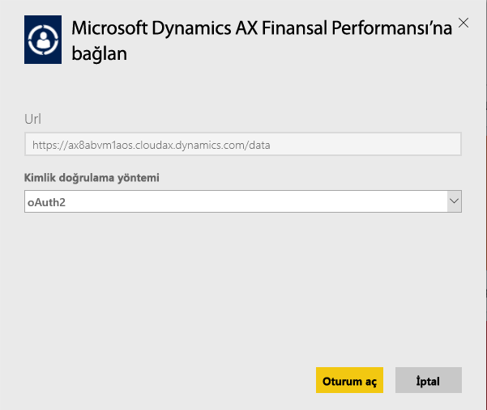
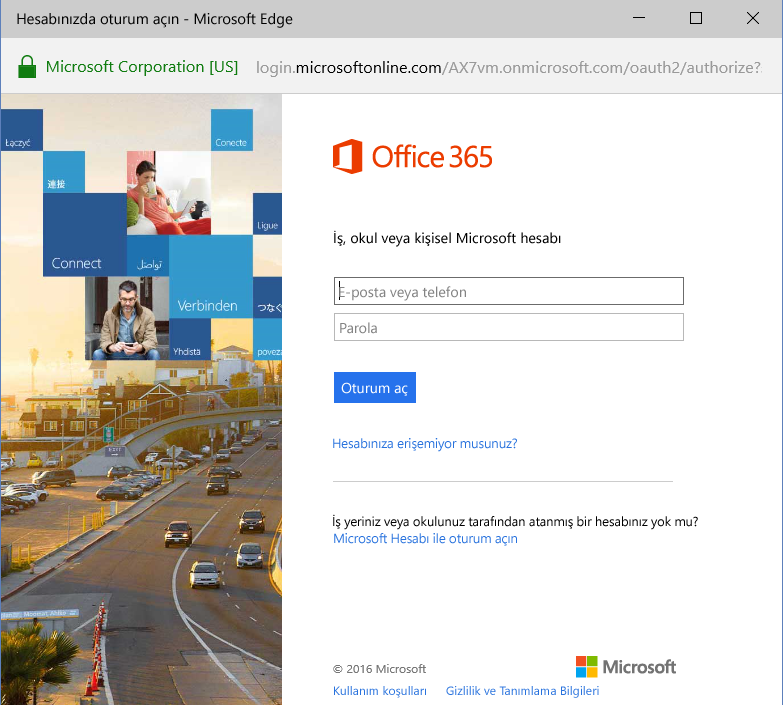
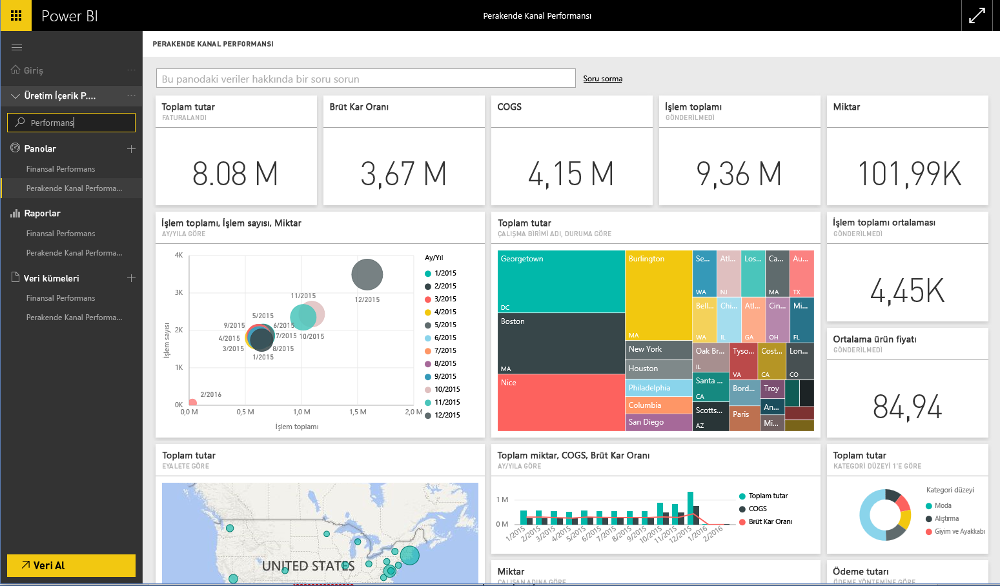

# Power BI ile Microsoft Dynamics AX içerik paketine bağlanma
Microsoft Dynamics AX, farklı işletme kullanıcılarına yönelik üç farklı Power BI içerik paketine sahiptir. CFO'lar için tasarlanmış olan Financial Performance içerik paketi, kuruluşunuzun mali performansıyla ilgili öngörülere erişim sağlar. Kanal yöneticileri için tasarlanmış olan Retail Channel Performance içerik paketi, Perakende ve Ticaret verilerini doğrudan çekerek eğilimleri tahmin etmek ve öngörüleri keşfetmek için satış performansına odaklanır. COO ve CFO'lar için tasarlanmış olan Cost Management, operasyonel performans hakkında ayrıntılı bilgiler sunar.

Power BI için Microsoft Dynamics AX [Retail Channel Performance](https://app.powerbi.com/getdata/services/dynamics-ax-retail-channel-performance), [Financial Performance](https://app.powerbi.com/getdata/services/dynamics-ax-financial-performance) veya [Cost Management](https://app.powerbi.com/getdata/services/dynamics-ax-cost-management) içerik paketine bağlanın.

## Bağlanma
1. Sol gezinti bölmesinin alt kısmında bulunan **Veri Al**'ı seçin.
   
   
2. **Hizmetler** kutusundaki **Al** seçeneğini belirleyin.
   
   
3. Dynamics AX içerik paketlerinden birini belirleyip **Al**'ı seçin.
   
   
4. Dynamics AX 7 ortamınızın URL'sini belirtin. [Bu parametreleri bulma](#FindingParams) konusundaki ayrıntılı bilgileri aşağıda bulabilirsiniz.
   
   
5. **Kimlik doğrulama yöntemi** için **OAuth2** \> **Oturum aç** seçeneklerini belirleyin. İstendiğinde Dynamics AX kimlik bilgilerinizi girin.
   
    
   
    
6. Onayladıktan sonra içeri aktarma işlemi otomatik olarak başlar. İşlem tamamlandığında Gezinti Bölmesinde yeni bir pano, rapor ve model görünür. İçeri aktarılan verilerinizi görüntülemek için panoyu seçin.
   
     

**Sırada ne var?**

* Panonun üst tarafındaki [Soru-Cevap kutusunda soru sormayı](power-bi-q-and-a.md) deneyin
* Panodaki [kutucukları değiştirin](service-dashboard-edit-tile.md).
* Bağlantılı raporu açmak için [bir kutucuk seçin](service-dashboard-tiles.md).
* Veri kümeniz günlük olarak yenilenecek şekilde zamanlanır ancak yenileme zamanlamasında değişiklik yapabilir veya **Şimdi Yenile** seçeneğini kullanarak istediğinizde veri kümenizi kendiniz de yenileyebilirsiniz

## Neleri kapsar?
İçerik paketi Dynamics AX 7 OData akışını kullanarak Perakende Kanalı, Mali ve Maliyet Yönetimi performanslarıyla ilgili bilgiler içeri aktarır.

## Sistem gereksinimleri
Bu içerik paketi için Dynamics AX 7 ortamı URL'si sağlanması ve kullanıcının OData akışına erişim sahibi olması gerekir.

## Parametreleri bulma

Kullanıcı, Dynamics AX 7 ortamı URL'sine oturum açtıktan sonra tarayıcıdan ulaşabilir. Dynamics AX ortamının kök dizininin URL'sini Power BI iletişim kutusuna kopyalamanız yeterlidir.

## Sorun giderme
Örneğinizin boyutuna bağlı olarak verilerin yüklenmesi biraz zaman alabilir. Power BI'da boş raporlar görüyorsanız lütfen raporlar için gerekli olan OData tablolarına erişim sahibi olduğunuzdan emin olun.

## Sonraki adımlar
[Power BI ile çalışmaya başlama](service-get-started.md)

[Power BI'da veri alma](service-get-data.md)

