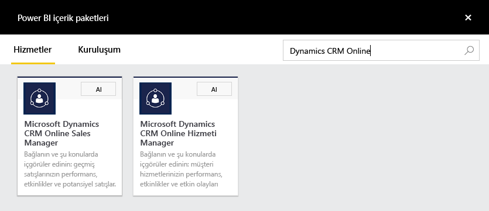
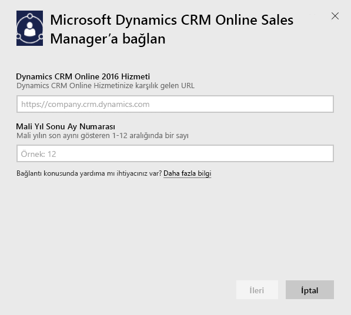
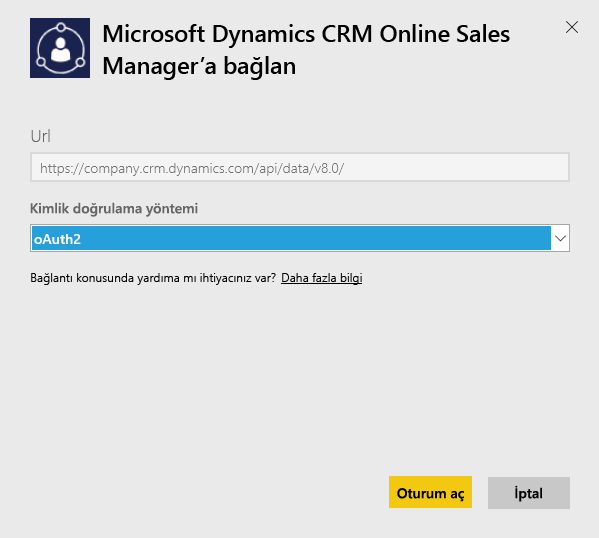
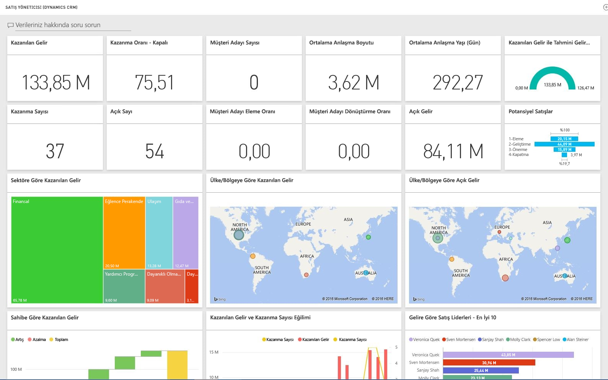

# Power BI ile Microsoft Dynamics CRM'e bağlanma
Power BI için Microsoft Dynamics CRM Online, verilerinize kolayca erişmenize ve verilerinizi çözümlemenize olanak sağlar. Power BI; Hesaplar, Etkinlikler, Fırsatlar, Ürün, Müşteri Adayları, Kullanıcılar ve daha fazlası gibi ihtiyaç duyulan tüm varlıklar ve ölçülerle açıklayıcı bir model oluşturmak için OData akışını kullanır. Uygulamayı yükledikten sonra panoyu ve raporları Power BI hizmetinde ([https://powerbi.com](https://powerbi.com)) ve Power BI mobil uygulamalarında görüntüleyebilirsiniz. 

Dynamics CRM Online [Sales Manager](https://msit.powerbi.com/groups/me/getdata/services/dynamics-crm-sales-manager) veya [Service Manager](https://msit.powerbi.com/groups/me/getdata/services/dynamics-crm-customer-service)'a bağlanın. Power BI ile [Dynamics CRM Online tümleştirmesi](https://powerbi.microsoft.com/integrations/microsoft-dynamicscrm) hakkında daha fazla bilgi edinin.

Bu bağlantı için **Microsoft Dynamics CRM Online 2016 veya sonraki bir sürümü** gerekir. Aşağıda, [gereksinimler](#Requirements) ile ilgili daha ayrıntılı bilgi verilmiştir.

## Bağlanma
[!INCLUDE [powerbi-service-apps-get-more-apps](./includes/powerbi-service-apps-get-more-apps.md)]

1. **Microsoft Dynamics CRM Sales Manager** veya **Microsoft Dynamics CRM Service Manager**'ı seçip **Bağlan**'a tıklayın.
   
   
2. Hesabınızla ilişkili Hizmet URL'sini girin.  Hizmet URL'si `https://company.crm.dynamics.com` biçimindedir, daha fazla ayrıntı için [aşağıya](#FindingParams) bakın.
   
   
3. İstendiğinde kimlik bilgilerinizi girin. (Tarayıcınızda zaten oturum açtıysanız bu adım atlanabilir.) Kimlik Doğrulama Yöntemi için **OAuth2** seçeneğini belirleyin ve **Oturum aç** düğmesine tıklayın:
   
   
4. Bağlandıktan sonra bir Satış Yöneticisi veya Servis Yöneticisi için özelleştirilmiş ve verilerinizle doldurulmuş bir pano görürsünüz:
   
   

## Microsoft Dynamics CRM panosu ve raporlarını görüntüleme
[!INCLUDE [powerbi-service-apps-open-app](./includes/powerbi-service-apps-open-app.md)]

[!INCLUDE [powerbi-service-apps-open-app](./includes/powerbi-service-apps-what-now.md)]

## Neleri kapsar?
Aşağıdaki bölümlerde, [Sales Manager](#Sales) ve [Service Manager](#Service) kişiliklerine yönelik içerikler açıklanmıştır.

Ayrıca, verilerin Dynamics CRM Online kullanıcısına atanan güvenlik rolüne bağlı olarak sınırlandırıldığını da göz önünde bulundurun.

Pano ve raporların bir ekibe veya gruba odaklanarak kısa vadeli verilere ilişkin operasyonel raporlama sağlaması amaçlanmaktadır. Her sorgu ile Dynamics CRM Online'dan maksimum 100.000 kayıt alınabilir. Bu sınır, kuruluşunuzdaki yüksek hacimli verilere bağlı olarak aşılırsa Dynamics CRM Online için veri yenilemesi sonlandırılacağı için kayıtlar sağlanamaz. Hesabınız çok büyükse özel bir çözüm oluşturmak için Power BI Desktop aracılığıyla bağlanmayı düşünebilirsiniz.

### Sales Manager
Pano ve raporlar, aşağıdaki gibi ana ölçümler içerir:  

* Won Revenue   
* Win Rate   
* Open Revenue   
* Lost revenue   
* Expected Revenue  
* Average Deal Size ve daha fazlası.  

Ayrıca, aşağıdakiler gibi temel grafikler de yer alır:  

* Won and Lost Revenue Trend, Won Revenue Vs Estimated Revenue Trend  
* Industry, Region, Territory gibi çeşitli boyutlara göre Won Revenue   
* Sales Leaders By Revenue, Activities,   
* Top Accounts, Top Won/Lost Deals,    
* New Leads Trend, Sales Pipeline ve daha fazlası.   

Bu ölçüm ve grafikler, kuruluşunuzun satış performansını anlamanıza ve satış ekibinize yönelik olarak satış kanalını çözümlemenize yardımcı olur.

Aşağıdaki tabloda, bu hizmet için kullanılabilir CRM varlıkları listelenmiş ve her bir varlık kaydına uygulanan filtrelere ilişkin ayrıntılara yer verilmiştir.

| CRM Varlığı | Uygulanan filtreler |
| --- | --- |
| Account |Son 365 günde değiştirilmiş ilgili fırsatları bulunan tüm firmalar. |
| Activity |Son 90 günde değiştirilmiş tüm etkinlikler   [modifiedon] > içinde bulunulan gün - 90 gün |
| Business Unit |Devre dışı bırakılmamış tüm departmanlar   [isdisabled] = false |
| Lead |Son 180 günde değiştirilmiş tüm müşteri adayları   [modifiedon] > içinde bulunulan gün - 180 gün |
| Opportunity |Son 365 günde değiştirilmiş tüm fırsatlar   [modifiedon] > içinde bulunulan gün - 365 gün |
| Opportunity Product |Son 365 günde değiştirilmiş tüm fırsat ürünleri   [modifiedon] > içinde bulunulan gün - 365 gün |
| Product |Tüm etkin ürünler   [statecode] <> 1 |
| Territory |Tüm bölgeler |
| User |Tüm etkin kullanıcılar ve temsilci olarak seçilmemiş yöneticiler    [isdisabled] = false ve [accessmode] <> 4 |

### Service Manager
Bu pano ve raporlar, aşağıdaki gibi ana ölçümler içerir:  

* CSAT Percentage   
* SLA Met percentage   
* Escalated Cases Percentage   
* Average Handling Time   
* Total Resolved Cases  
* Total Active Cases  
* Number of Times KB Article Used in cases ve daha fazlası.    

Ayrıca, aşağıdakiler gibi anahtar grafikleri de kapsar:   

* Incoming Cases, Resolved Cases ve Escalated Cases için Case Volume Trend   
* Origin, Location, Priority ve Type gibi çeşitli boyutlara göre Case Volume  
* CSAT percentage, SLA met percentage, Activities ve Resolved cases'a göre Leaders  
* Most Used ve Most viewed KB Articles ve daha fazlası.  
    Bu ölçüm ve grafikler, destek kuruluşu performansınızı anlamanıza ve hizmet ekibinizin etkin servis talebi iş yükünü ve servis kuyruklarını çözümlemenize yardımcı olur.

Aşağıdaki tabloda, bu hizmet için kullanılabilir CRM varlıklarının yanı sıra her bir varlık kaydına uygulanan filtrelere ilişkin ayrıntılara yer verilmiştir.

| CRM Varlığı | Uygulanan filtreler |
| --- | --- |
| Account |Son 90 günde değiştirilmiş ilgili servis taleplerini içeren tüm hesaplar. |
| Activity |Son 90 günde değiştirilmiş tüm etkinlikler   [modifiedon] > içinde bulunulan gün - 90 gün |
| Case |Son 90 günde değiştirilen tüm servis talepleri   [modifiedon] > içinde bulunulan gün - 90 gün |
| Case Resolution Activity |Son 90 günde değiştirilmiş tüm servis talebi çözümü etkinlikleri   [modifiedon] > içinde bulunulan gün - 90 gün |
| Contact |Son 90 günde değiştirilmiş ilgili servis taleplerini içeren tüm kişiler. |
| Knowledge Article |Tüm bilgi bankası makalelerinin en son sürümleri    [islatestversion] = true |
| Knowledge Article Incident |Son 90 günde değiştirilmiş tüm bilgi bankası makalesi olayları   [modifiedon] > içinde bulunulan gün - 90 gün |
| Queue |Tüm etkin kuyruklar    [statecode] = 0 |
| Queue Item |Son 365 günde oluşturulmuş, tüm servis taleplerine ilişkin kuyruk öğeleri    [createdon] > içinde bulunulan gün - 365 gün ve   [objecttypecode] = 112 |
| User |Tüm etkin kullanıcılar    [isdisabled] = false |

## Sistem gereksinimleri
* Geçerli bir Dynamics CRM Online 2016 veya sonraki bir sürüm örneği. (Power BI, şirket içi bir CRM sürümü ile çalışmaz.) 2016 veya sonraki bir sürüme sahip değilseniz:
* Bir yöneticinin, site ayarları bölümünde OData uç noktasını etkinleştirmesi gerekir.
* Tablolardan birinde 100.000'den az kayıt içeren bir hesap olmalıdır. Hesabın 100.000'den fazla kayda erişimi varsa içeri aktarma işlemi başarısız olur.

## Parametreleri bulma
Örneğin adresi, tarayıcınızın URL çubuğunda bulunabilir. Genellikle şu biçimdedir: `https://[instance_name].crm.dynamics.com`.

Power BI yalnızca Dynamics CRM 2016 uç noktalarını destekler. CRM Online'ın önceki sürümleriyle bağlantı kurulamaz. Doğrudan hesabınıza bağlanmak için Power BI Desktop'ı kullanın.

## Sorun giderme
Bağlanırken sorun yaşarsanız şunlardan emin olun:  

* doğru örnek URL'sini sağladığınızı (yöneticinize danışın)  
* örneğin CRM Online 2016 olduğunu  
* OData uç noktasının etkinleştirildiğini  

Ayrıca, `https://[instance_name].crm.dynamics.com/api/data/v8.0/` OData URL'siyle doğrudan Power BI Desktop'tan bağlanmayı deneyin.

Dynamics CRM Online 2016 kullanmanıza rağmen hâlâ bağlantı sorunu yaşıyorsanız tüm kullanılabilir güncelleştirmeleri aldığınızı onaylamak için CRM Yöneticisi'yle iletişim kurun.

CRM Online 2016 veya sonraki bir sürümüne sahip değilseniz doğrudan hesabınıza bağlanmak için Power BI Desktop'ı kullanın.

"Data refresh failed as query exceeded the maximum limit of 100000 records," (Sorgu maksimum 100.000 kayıt sınırını aştığı için veri yenileme işlemi başarısız oldu) şeklinde bir hata alırsanız doğrudan Power BI Desktop'tan bağlanmayı veya CRM çözüm şablonundan yararlanmayı deneyebilirsiniz.

## Sonraki adımlar
* [Power BI'da uygulamalar ne anlama gelir?](service-install-use-apps.md)
* [Power BI'da veri alma](service-get-data.md)
* Başka bir sorunuz mu var? [Power BI Topluluğu'na sorun](http://community.powerbi.com/)

