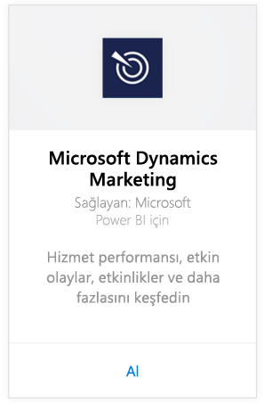
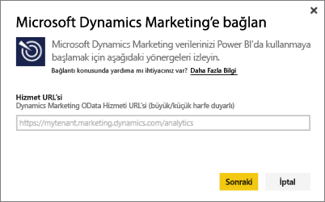
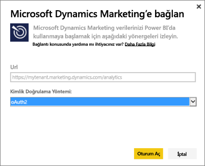
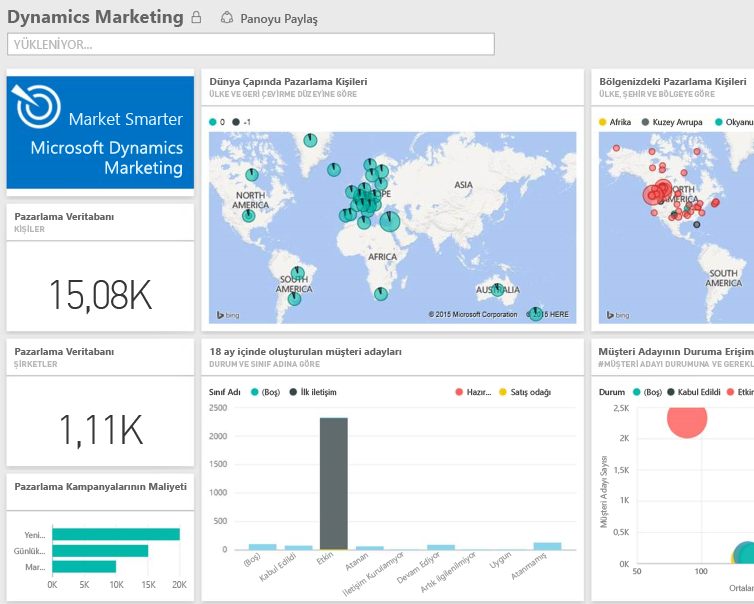

# Power BI ile Microsoft Dynamics Marketing'e bağlanma
Power BI için Microsoft Dynamics Marketing içerik paketi ile Dynamics Marketing'deki verilerinize kolayca erişir ve verilerinizi zahmetsizce çözümlersiniz. İçerik paketi; Programlar, Kampanyalar, Pazarlama Kişileri ve Şirketleri, Müşteri Adayları, Müşteri Adayı Etkileşimleri ve Puanlaması, E-posta Pazarlama İletileri ve Web Siteleri, davranış gözlemleri, bütçeler, finansal işlemler, performans KPI'leri gibi ihtiyaç duyulan tüm varlıklar ve ölçülerle OData akışına ilişkin açıklayıcı bir model kullanır. 

Power BI için [Dynamics Marketing içerik paketine](https://app.powerbi.com/getdata/services/microsoft-dynamics-marketing) bağlanın.

>[!NOTE]
>Dynamics Marketing örneği için geçerli bir OData URL'si belirtmeniz gerekir (İçerik paketi şirket içi CRM sürümü ile çalışmaz). Ek gereksinimler aşağıda verilmiştir.

## Bağlanma
1. Sol gezinti bölmesinin alt kısmındaki Veri Al seçeneğini belirleyin.
   
    
2. **Hizmetler** kutusundaki **Al** düğmesini seçin.
   
    
3. **Microsoft Dynamics Marketing** \> **Al** seçeneğini belirleyin.
   
   
4. Hesabınızla ilişkili OData URL'sini girin.  Bu URL, "https://[örnek\_adı].marketing.dynamics.com/analytics" biçiminde olacaktır.
   
   
5. İstendiğinde kimlik bilgilerinizi sağlayın (Tarayıcınızda zaten oturum açtıysanız bu adım atlanabilir). Kimlik Doğrulama Yöntemi için **OAuth2** seçeneğini belirleyin ve **Oturum aç** düğmesine tıklayın:
   
   
6. Bağlandıktan sonra, verilerinizle doldurulmuş bir Dynamics Marketing panosu görürsünüz. Sarı yıldız işaretleri, sol gezinti bölmesindeki yeni öğeleri belirtir.
   
   

**Sırada ne var?**

* Panonun üst tarafındaki [Soru-Cevap kutusunda soru sormayı](power-bi-q-and-a.md) deneyin
* Panodaki [kutucukları değiştirin](service-dashboard-edit-tile.md).
* Bağlantılı raporu açmak için [bir kutucuk seçin](service-dashboard-tiles.md).
* Veri kümeniz günlük olarak yenilenecek şekilde zamanlanır ancak yenileme zamanlamasında değişiklik yapabilir veya **Şimdi Yenile** seçeneğini kullanarak istediğinizde veri kümenizi kendiniz de yenileyebilirsiniz

## Sistem gereksinimleri
* Dynamics Marketing örneği için geçerli bir OData URL'si belirtmeniz gerekir (İçerik paketi şirket içi CRM sürümü ile çalışmaz).  
* Bir yöneticinin, site ayarları bölümünde OData uç noktasını etkinleştirmesi gerekir. OData uç noktası adresini, **Giriş Sayfası \> Ayarlar \> Site Ayarları** sayfasının **Kuruluş Veri Servisi** bölümünde bulabilirsiniz.  OData URL'si şu biçimdedir: https://[örnek\_adı].marketing.dynamics.com/analytics  
* Microsoft Dynamics Marketing'e erişmek için kullandığınız kullanıcı hesabı/kimliği, Power BI'a kaydolduğunuz kullanıcı adıyla aynı olmalıdır. Microsoft Dynamics Marketing oturumunuz, otomatik olarak, Power BI için kullandığınız kimlikle açılır. Microsoft Dynamics Marketing'de farklı bir hesapla oturum açmak istiyorsanız lütfen Power BI'a söz konusu hesapla kaydolun. Gelecek sürümde bu sorunun çözüleceğini umuyoruz.   

## Sorun giderme
Dynamics CRM hesabınıza bağlanırken "Oturum açma başarısız oldu" iletisi görürseniz Power BI oturumunuzu, CRM Online OData akışına erişmek için kullandığınız hesapla açtığınızı onaylayın. Akışı test etmek için tarayıcıda oturum açmayı deneyin.

Yöneticinizden, OData URL'nizi ve OData uç noktasının etkinleştirilip etkinleştirilmediğini onaylamasını isteyin.

Kullandığınız Dynamics Marketing sürümünü kontrol edin; 18.0 ve 18.1 sürümlerinde ek düzeltmeler yapılmıştır. Sorun devam ediyorsa ve kullandığınız sürüm bunlardan daha eski bir sürümse yükseltme seçeneğini değerlendirebilirsiniz.

Sorun devam ederse Power BI ekibine ulaşmak için bir destek bileti açın:

* Power BI uygulamasında, soru işareti > \> **Destek Ekibine Başvur** seçeneğini belirleyin.
* Bu makaleyi okuduğunuz Power BI Destek sitesinde sayfanın sağ tarafında bulunan **Destek Ekibine Başvur**'u seçin.

## Sonraki adımlar
[Power BI için veri alma](service-get-data.md)

[Power BI ile çalışmaya başlama](service-get-started.md)

