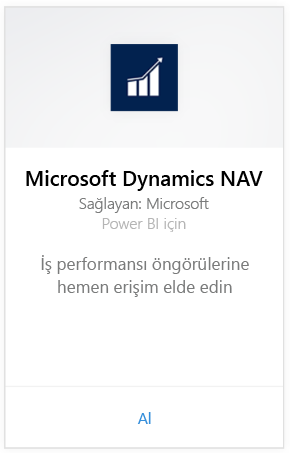
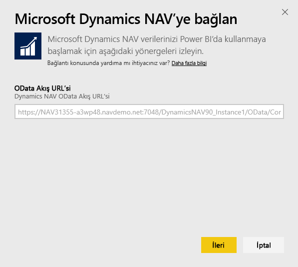
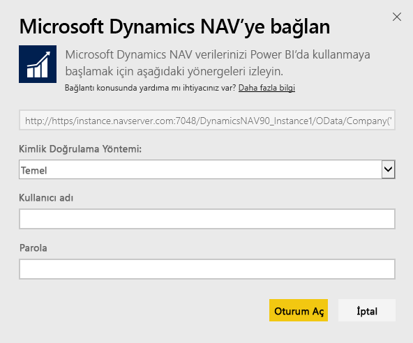
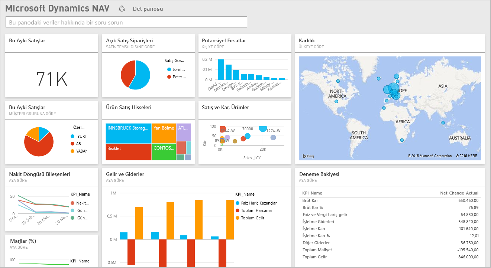

# Power BI ile Microsoft Dynamics NAV'a bağlanma
Power BI ile Microsoft Dynamics NAV verilerinize ilişkin öngörüler edinmek oldukça kolaydır. Power BI, verilerinizi (Satış ve Finansal) alır ve bu verilere dayalı bir pano ve raporlar oluşturur. Power BI, verilerin (bu örnekte satış ve finans verileri) alındığı tablolara erişmek için sizden izin ister. Aşağıda, gereksinimlerle ilgili daha ayrıntılı bilgi verilmiştir. Uygulamayı yükledikten sonra panoyu ve raporları Power BI hizmetinde ([https://powerbi.com](https://powerbi.com)) ve Power BI mobil uygulamalarında görüntüleyebilirsiniz. 

[Power BI için Microsoft Dynamics NAV'a bağlanın](https://app.powerbi.com/getdata/services/microsoft-dynamics-nav) veya Power BI ile [Dynamics NAV tümleştirmesi](https://powerbi.microsoft.com/integrations/microsoft-dynamics-nav) hakkında daha fazla bilgi edinin.

## Bağlanma
[!INCLUDE [powerbi-service-apps-get-more-apps](./includes/powerbi-service-apps-get-more-apps.md)]

1. **Microsoft Dynamics NAV**'ı ve ardından **Al**'ı seçin.  
   
2. İstendiğinde Microsoft Dynamics NAV OData URL'nizi girin. URL'nin aşağıdaki desenle eşleşmesi gerekir:
   
    `https//instance.navserver.com:7048/DynamicsNAV90_Instance1/OData/Company('CRONUS%20International%20Ltd.')`
   
   * "örnek.navsunucusu.com" (kendi NAV Sunucunuzun adı)
   * "DynamicsNAV90\_Örnek1" (kendi NAV Sunucu Örneğinizin adı)
   * "Şirket('CRONUS%20International%20Ltd.')" (kendi NAV Şirketinizin adı)
     
     Bu URL'yi edinmenin kolay bir yolu da Dynamics NAV'ın Web Hizmetleri sayfasında powerbifinance web hizmetini bulup OData URL'sini kopyalamak ve "/powerbifinance" kısmını URL dizesinden çıkarmaktır.  
     
3. **Temel**'i seçin ve Microsoft Dynamics NAV kimlik bilgilerinizi girin.
   
    Microsoft Dynamics NAV hesabınız için yönetici kimlik bilgilerine (veya satış ve finans verilerine yönelik izinlere) sahip olmanız gerekir.  Yalnızca Temel (Kullanıcı adı ve Parola) kimlik doğrulama yöntemi desteklenmektedir.
   
    
4. Power BI, Microsoft Dynamics NAV verilerinizi alır ve sizin için kullanıma hazır bir pano ve rapor oluşturur.   
   

## Panoyu ve raporları görüntüleme
[!INCLUDE [powerbi-service-apps-open-app](./includes/powerbi-service-apps-open-app.md)]

[!INCLUDE [powerbi-service-apps-open-app](./includes/powerbi-service-apps-what-now.md)]

## Neleri kapsar?
Pano ve raporlar, aşağıdaki tablolarda bulunan verileri içerir (büyük/küçük harfe duyarlı):  

* ItemSalesAndProfit  
* ItemSalesByCustomer  
* powerbifinance  
* SalesDashboard  
* SalesOpportunities  
* SalesOrdersBySalesPerson  
* TopCustomerOverview  

## Sistem gereksinimleri
Microsoft Dynamics NAV verilerinizi Power BI'a aktarmak için, verilerin alındığı satış ve finans veri tablolarına (yukarıda listelenen) yönelik izinlerinizin olması gerekir. Ayrıca tabloların da veri içermesi gerekir. Şu anda, boş tablolar içeri aktarılamamaktadır.

## Sorun giderme
Power BI, verilerinizi almak için Microsoft Dynamics NAV tarafından sunulan web hizmetlerini kullanmaktadır. Microsoft Dynamics NAV örneğinizde çok fazla veri varsa web hizmeti kullanımınız üzerindeki etkiyi en aza indirmek için, yenileme sıklığını ihtiyaçlarınıza göre değiştirmeniz önerilir. Alternatif bir öneri olarak, her yöneticinin kendi uygulamasını oluşturması yerine bir yönetici uygulamayı oluşturup paylaşabilir.

**"Parametre doğrulaması başarısız oldu. Lütfen tüm parametrelerin geçerli olduğundan emin olun"**  
Microsoft Dynamics NAV URL'nizi yazarken bu hatayla karşılaşırsanız aşağıdaki gereksinimlerin yerine getirildiğinden emin olun:

* URL tam olarak şu desene uygun olmalıdır:
  
    `https//instance.navserver.com:7048/DynamicsNAV90_Instance1/OData/Company('CRONUS%20International%20Ltd.')`
  
  * "örnek.navsunucusu.com" (kendi NAV Sunucunuzun adı)
  * "DynamicsNAV90\_Örnek1" (kendi NAV Sunucu Örneğinizin adı)
  * "Şirket('CRONUS%20International%20Ltd.')" (kendi NAV Şirketinizin adı)
* Tüm harfler küçük olmalıdır.  
* URL "https" olarak verilmiş olmalıdır.  
* URL'nin sonunda eğik çizgi olmamalıdır.

**"Oturum açma başarısız oldu"**  
Oturum açmak için Microsoft Dynamics NAV kimlik bilgilerinizi kullandıktan sonra "oturum açma başarısız oldu" hatasıyla karşılaşırsanız aşağıdaki sorunlardan biri mevcut olabilir:

* Kullanmakta olduğunuz hesap, hesabınızdan Microsoft Dynamics NAV verileri almak için gereken izinlere sahip olmayabilir. Bir yönetici hesabı olduğunu doğrulayın ve yeniden deneyin.
* Bağlanmaya çalıştığınız Dynamics NAV örneği, geçerli bir SSL sertifikasına sahip olmayabilir. Bu durumda, "unable to establish trusted SSL relationship" (güvenilir SSL ilişkisi oluşturulamıyor) gibi daha ayrıntılı bir hata iletisi ile karşılaşırsınız. Otomatik olarak imzalanan sertifikalar desteklenmemektedir.

**"Hata"**  
Kimlik doğrulaması iletişim kutusunun ardından "Hata" ifadesini içeren bir hata iletişim kutusuyla karşılaşırsanız bu, Power BI'ın verileri yüklerken bir sorunla karşılaştığı anlamına gelir.

* URL'nin yukarıda belirtilen desene uygun olduğundan emin olun. URL'yi aşağıdaki gibi belirtmek sıkça yapılan hatalardan biridir:
  
    `https//instance.navserver.com:7048/DynamicsNAV90\_Instance1/OData`
  
    'Şirket('CRONUS%20International%20Ltd.')' bölümünü de kendi NAV Şirketinizin adını yazarak eklemeniz gerekir:
  
    `https//instance.navserver.com:7048/DynamicsNAV90\_Instance1/OData/Company('CRONUS%20International%20Ltd.')`

## Sonraki adımlar
* [Power BI'da uygulamalar ne anlama gelir?](consumer/end-user-apps.md)
* [Power BI'da veri alma](service-get-data.md)
* Başka bir sorunuz mu var? [Power BI Topluluğu'na sorun](http://community.powerbi.com/)

