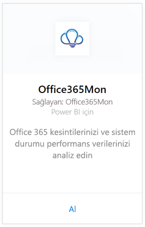
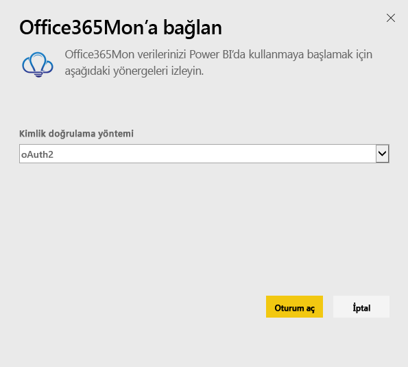
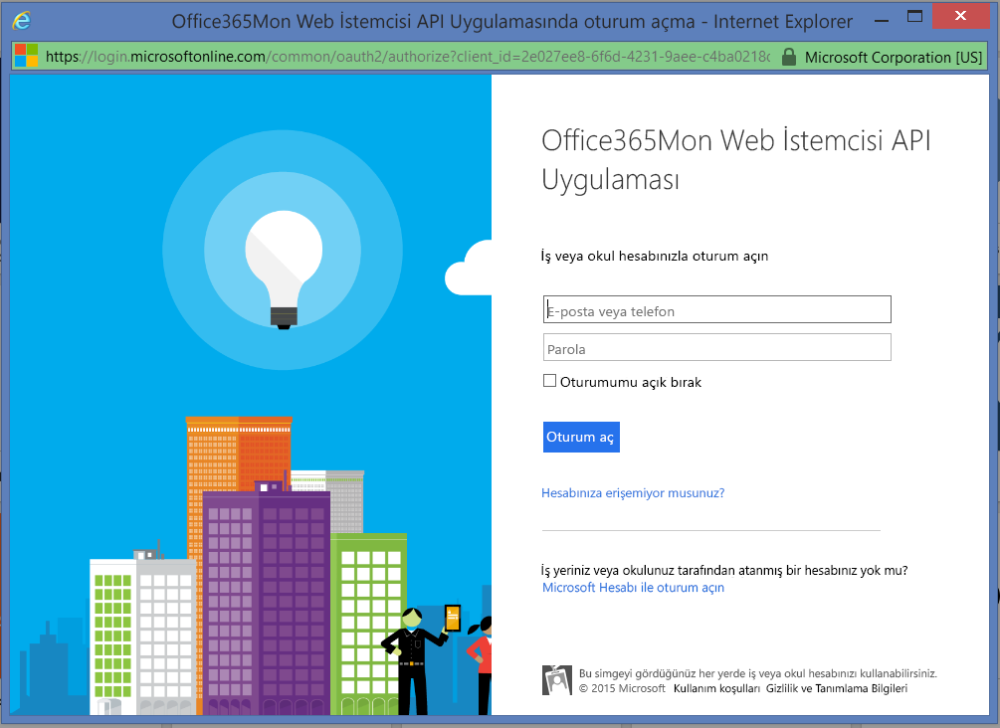
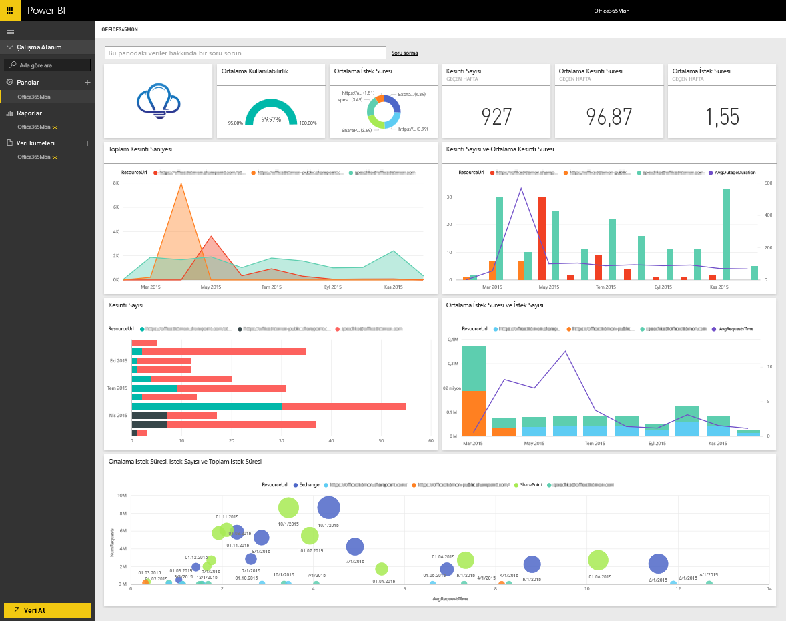

# Power BI ile Office365Mon'a bağlanma
Power BI ve Office365Mon içerik paketiyle Office 365 ile ilgili hizmet kesintilerinizi ve sistem durumuna ilişkin performans verilerinizi kolayca çözümleyebilirsiniz. Power BI, hizmet kesintileri ve sistem durumu araştırmalarının yer aldığı verilerinizi alır ve ardından kullanıma hazır bir pano ve bu verilere dayalı raporlar oluşturur.

Power BI için [Office365Mon içerik paketine](https://app.powerbi.com/groups/me/getdata/services/office365mon) bağlanın.

>[!NOTE]
>Power BI içerik paketine bağlanmak ve paketi yüklemek için bir Office365Mon yönetici hesabı gereklidir.

## Bağlanma
1. Sol gezinti bölmesinin alt kısmında bulunan **Veri Al**'ı seçin.
   
   
2. **Hizmetler** kutusundaki **Al** seçeneğini belirleyin.
   
    
3. **Office365Mon** \> **Al** seçeneğini belirleyin.
   
   
4. Kimlik Doğrulama Yöntemi için **OAuth2** \> **Oturum aç** seçeneğini belirleyin.
   
   İstendiğinde Office365Mon yönetici kimlik bilgilerinizi girin ve kimlik doğrulama işlemini gerçekleştirin.
   
   
   
   
5. Veriler Power BI tarafından içeri aktarıldıktan sonra sol gezinti bölmesinde yeni bir pano, rapor ve veri kümesi görürsünüz. Yeni öğeler sarı bir yıldız işaretiyle \* gösterilir, Office365Mon girişini seçin.
   
   

**Sırada ne var?**

* Panonun üst tarafındaki [Soru-Cevap kutusunda soru sormayı](power-bi-q-and-a.md) deneyin
* Panodaki [kutucukları değiştirin](service-dashboard-edit-tile.md).
* Bağlantılı raporu açmak için [bir kutucuk seçin](service-dashboard-tiles.md).
* Veri kümeniz günlük olarak yenilenecek şekilde zamanlanır ancak yenileme zamanlamasında değişiklik yapabilir veya **Şimdi Yenile** seçeneğini kullanarak istediğinizde veri kümenizi kendiniz de yenileyebilirsiniz

## Sorun giderme
Oturum açmak için Office365Mon abonelik kimlik bilgilerinizi kullandıktan sonra bir **"oturum açma başarısız oldu"** hatası alırsanız kullandığınız hesabın Office365Mon verilerini hesabınızdan alma izinleri yok demektir. Bir yönetici hesabı olduğunu doğrulayın ve yeniden deneyin.

## Sonraki adımlar
[Power BI ile çalışmaya başlama](service-get-started.md)

[Power BI için Veri Alma](service-get-data.md)

