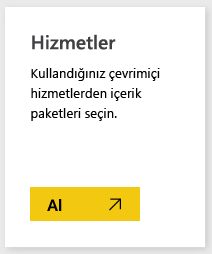
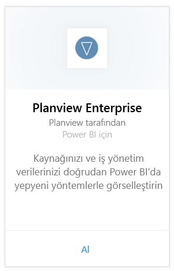
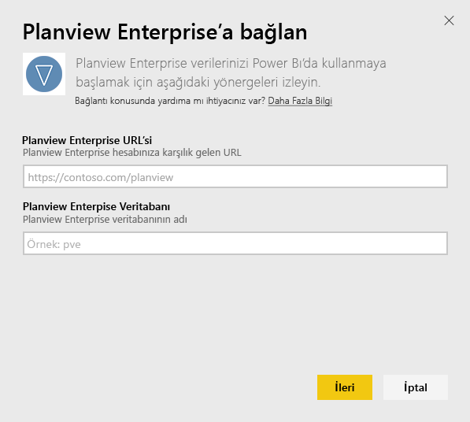
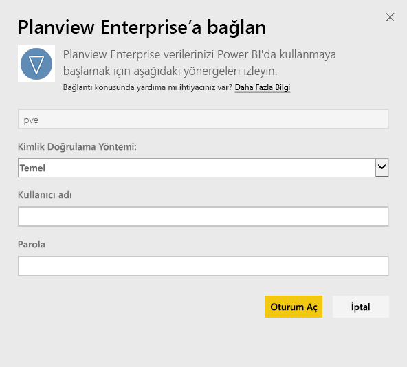
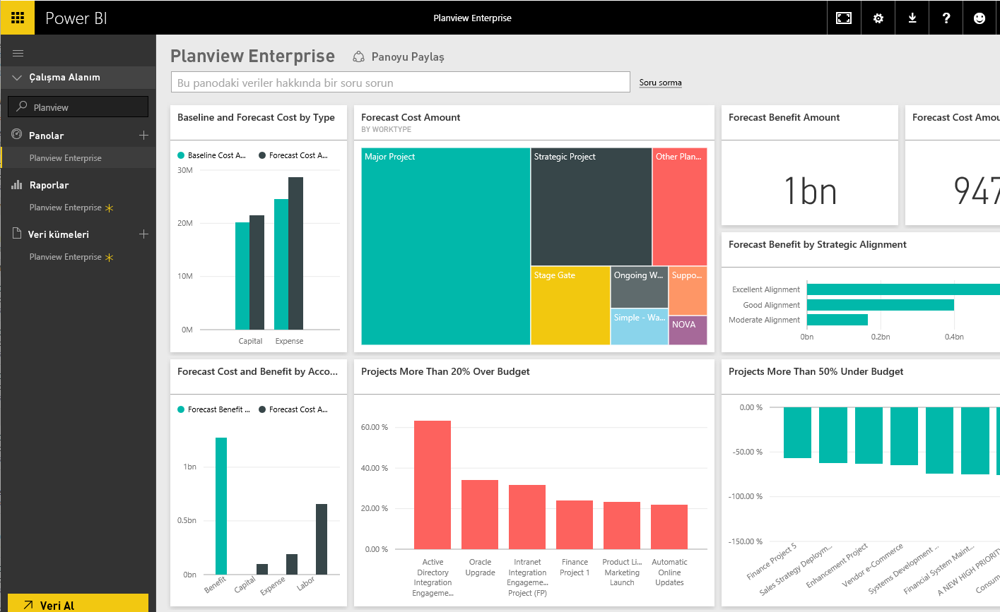

# Power BI ile Planview Enterprise'a bağlanma
Planview Enterprise içerik paketi, kaynağınızı ve iş yönetim verilerinizi doğrudan Power BI'da yepyeni yöntemlerle görselleştirmenizi sağlar. Planview Enterprise oturum açma kimlik bilgilerinizi kullanarak portföy yatırım harcamalarınızı etkileşimli olarak görün, hangi noktalarda bütçeyi aştığınızı veya bütçenin altında kaldığınızı anlayın ve projelerinizin kurumsal stratejik önceliklerinizle ne kadar uyumlu olduğunu öğrenin. Ayrıca sizin için en önemli olan öngörüleri almak için kullanıma hazır panoları ve raporları genişletebilirsiniz.

[Power BI'da Planview Enterprise içerik paketine](https://app.powerbi.com/getdata/services/planview-enterprise) bağlanma

>[!NOTE]
>Planview Enterprise verilerinizi Power BI'a aktarmak için rolünde Reporting Portal Viewer (Raporlama Portalı Görüntüleyicisi) özelliği etkin olan bir Planview Enterprise kullanıcısı olmanız gerekir. Ek gereksinimler için aşağıya bakın.

## Bağlanma
1. Sol gezinti bölmesinin alt kısmında bulunan **Veri Al**'ı seçin.
   
    
2. **Hizmetler** kutusundaki **Al** seçeneğini belirleyin.
   
    
3. Power BI sayfasında **Planview Enterprise**'ı ve ardından **Al**'ı seçin:  
    
4. Planview Enterprise URL'si metin kutusuna kullanmak istediğiniz Planview Enterprise sunucusunun URL'sini girin. Planview Enterprise Veritabanı metin kutusuna Planview Enterprise veritabanının adını girip Sonraki düğmesine tıklayın.  
    
5. Henüz seçili değilse, Kimlik Doğrulama Yöntemi listesinde **Temel** seçeneğini belirleyin. Hesabınızın **Kullanıcı adı** ve **Parola** kimlik bilgilerini girin ve **Oturum aç**'ı seçin.  
   
6. Sol bölmedeki pano listesinden Planview Enterprise'ı seçin.  
     Power BI, Planview Enterprise verilerini panoya aktarır. Veri yükleme işleminin biraz zaman alabileceğini göz önünde bulundurun.  
    

**Sırada ne var?**

* Panonun üst tarafındaki [Soru-Cevap kutusunda soru sormayı](power-bi-q-and-a.md) deneyin
* Panodaki [kutucukları değiştirin](service-dashboard-edit-tile.md).
* Bağlantılı raporu açmak için [bir kutucuk seçin](service-dashboard-tiles.md).
* Veri kümeniz günlük olarak yenilenecek şekilde zamanlanır ancak yenileme zamanlamasında değişiklik yapabilir veya **Şimdi Yenile** seçeneğini kullanarak istediğinizde veri kümenizi kendiniz de yenileyebilirsiniz

## Sistem gereksinimleri
Planview Enterprise verilerinizi Power BI'a aktarmak için rolünde Reporting Portal Viewer (Raporlama Portalı Görüntüleyicisi) özelliği etkin olan bir Planview Enterprise kullanıcısı olmanız gerekir. Ek gereksinimler için aşağıya bakın.

Bu yordamda, bir Power BI hesabıyla Microsoft Power BI giriş sayfasında oturum açtığınız varsayılmaktadır. Power BI hesabınız yoksa Power BI giriş sayfasında yeni bir ücretsiz Power BI hesabı oluşturun ve Veri Al'a tıklayın.

## Sonraki adımlar:

[Power BI ile çalışmaya başlama](service-get-started.md)

[Power BI için Veri Alma](service-get-data.md)