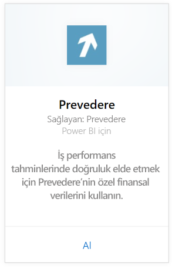
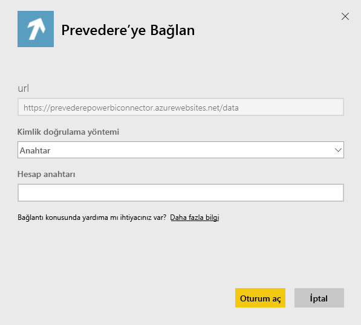
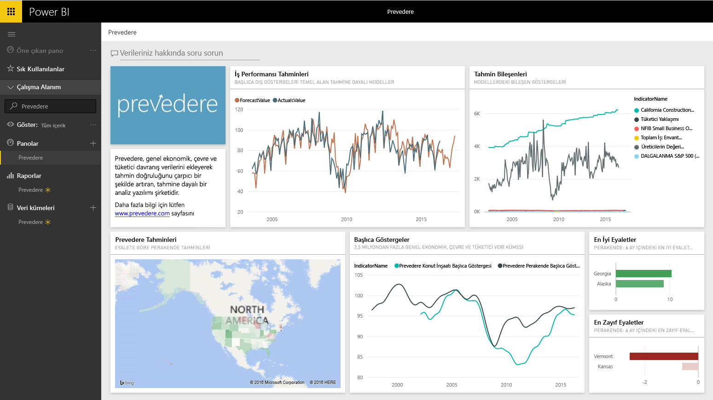

# Power BI ile Prevedere'e bağlanma
İşinizi kendinizden emin ve proaktif bir şekilde ileriye taşımak için özel ve kritik finansal bilgilere erişim elde edin.

Power BI için [Prevedere içerik paketine](https://app.powerbi.com/getdata/services/prevedere) bağlanın.

>[!NOTE]
>Mevcut bir Prevedere kullanıcısı değilseniz lütfen [örnek anahtarı](https://prevederepowerbiconnector.azurewebsites.net/static/learnmore.html) kullanarak bu çözümü deneyin.

## Bağlanma
1. Sol gezinti bölmesinin alt kısmında bulunan **Veri Al**'ı seçin.
   
   
2. **Hizmetler** kutusundaki **Al** seçeneğini belirleyin.
   
   
3. **Prevedere**'i ve ardından **Al** seçeneğini belirleyin.
   
   
4. **Kimlik Doğrulama Yöntemi** için **Anahtar** seçeneğini belirleyin ve Prevedere API anahtarınızı girin.
   
    
5. İçeri aktarma işlemini başlatmak için **Oturum aç** seçeneğini belirleyin. İşlem tamamlandığında Gezinti Bölmesinde yeni bir pano, rapor ve model görünür. İçeri aktarılan verilerinizi görüntülemek için panoyu seçin.
   
     

**Sırada ne var?**

* Panonun üst tarafındaki [Soru-Cevap kutusunda soru sormayı](power-bi-q-and-a.md) deneyin
* Panodaki [kutucukları değiştirin](service-dashboard-edit-tile.md).
* Bağlantılı raporu açmak için [bir kutucuk seçin](service-dashboard-tiles.md).
* Veri kümeniz günlük olarak yenilenecek şekilde zamanlanır ancak yenileme zamanlamasında değişiklik yapabilir veya **Şimdi Yenile** seçeneğini kullanarak istediğinizde veri kümenizi kendiniz de yenileyebilirsiniz

## Neleri kapsar?
İçerik paketi; perakende tahminlerinize, tahmin modellerinize, öncü göstergelerinize ve daha fazlasına ilişkin öngörüler edinir.

## Sistem gereksinimleri
Bu içerik paketi için Prevedere API anahtarı veya örnek anahtar (aşağıya bakın) gerekir.

## Parametreleri bulma

Mevcut müşteriler verilerine kendi API anahtarlarını kullanarak erişebilir. Henüz bir müşteri değilseniz [örnek anahtarını](https://prevederepowerbiconnector.azurewebsites.net/static/learnmore.html) kullanarak verilere ve analizlere yönelik bir örneğe göz atabilirsiniz.

## Sorun giderme
Örneğinizin boyutuna bağlı olarak verilerin yüklenmesi biraz zaman alabilir.

## Sonraki adımlar
[Power BI ile çalışmaya başlama](service-get-started.md)

[Power BI'da veri alma](service-get-data.md)

