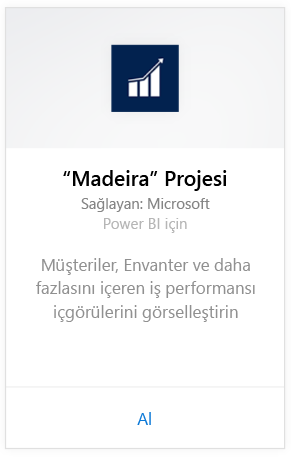
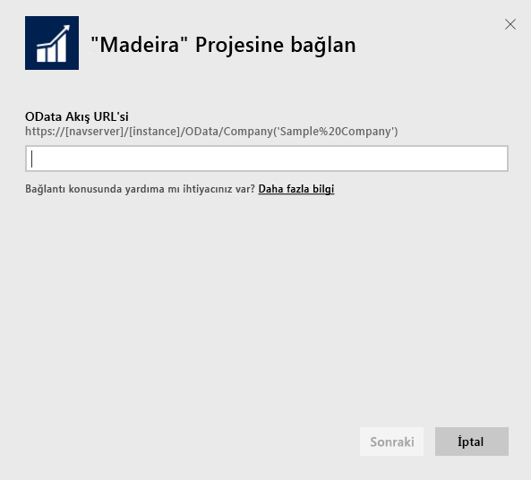
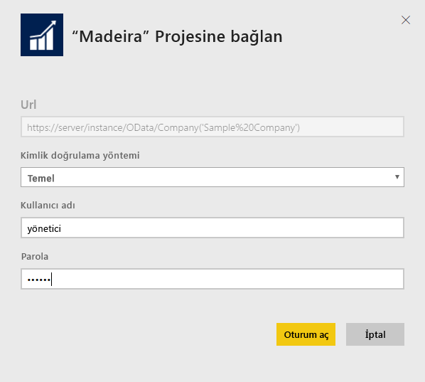
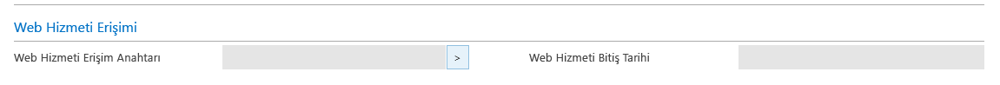
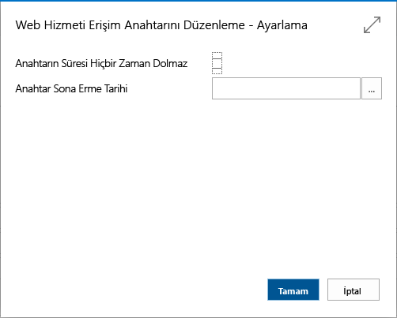
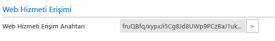

# Power BI ile Project "Madeira"ya bağlanın
Power BI ve Project "Madeira" içerik paketi sayesinde Project "Madeira" verileriniz için kolayca öngörüler elde edebilirsiniz. Power BI hem Satış hem de Finansal verilerinizi alıp bu verilere dayalı, kullanıma hazır bir pano ve raporlar oluşturur.
Power BI için Project "Madeira"ya bağlanın veya Power BI ile Project "Madeira" tümleştirmesi hakkında daha fazla bilgi edinin.

>[!NOTE]
>Bu içerik paketi, verilerin (bu örnekte satış ve finans verileri) alındığı tablolara erişmek için izin ister. [Aşağıda](#Requirements), gereksinimler ile ilgili daha ayrıntılı bilgi verilmiştir.

Power BI için [Project "Madeira" Analytics içerik paketine](https://app.powerbi.com/getdata/services/project-madeira) bağlanın.

## Bağlanma
1. Sol gezinti bölmesinin alt kısmında bulunan **Veri Al**'ı seçin.  
    
2. **Hizmetler** kutusundaki **Al** seçeneğini belirleyin.  
    
3. **Project "Madeira"** seçeneğini belirleyin ve **Al**'ı seçin.  
    
4. İstendiğinde Project "Madeira" URL'nizi girin. URL'nin tam olarak şu desende olması gerekir: https://mycronusus.projectmadeira.com:7048/NAV/OData/Şirket('CRONUS%20US'). (Kendi Project "Madeira" şirket adınızı kullanın.) Sonda eğik çizgi olmadığına ve bağlantının https biçiminde olması gerektiğine dikkat edin. [Aşağıda](#FindingParams), bu URL'yi bulma ile ilgili ayrıntılara ulaşabilirsiniz.  
   
    
5. İstendiğinde Kimlik Doğrulama Yöntemi olarak Temel seçeneğini belirleyin. Kullanıcı adı olarak Project "Madeira" e-posta adresinizi, parola olarak ise Project "Madeira" hesabınıza ilişkin web hizmeti erişim anahtarını girin. Tarayıcınızda daha önce Project "Madeira" hesabınızda oturum açtıysanız kimlik bilgileriniz istenmeyebilir. Bu erişim anahtarının nasıl oluşturulacağı hakkında ayrıntılı bilgiyi [aşağıda](#FindingParams) bulabilirsiniz.  
   
    >[!NOTE]
    >Project "Madeira"da bir süper kullanıcı olmanız gerekir.
   
   
6. Bağlandıktan sonra bir pano, rapor ve veri kümesi otomatik olarak yüklenir. Yükleme tamamlandığında, kutucuklar hesabınızdaki veriler ile güncelleştirilir.  
   
    

**Sırada ne var?**

* Panonun üst tarafındaki [Soru-Cevap kutusunda soru sormayı](power-bi-q-and-a.md) deneyin
* Panodaki [kutucukları değiştirin](service-dashboard-edit-tile.md).
* Bağlantılı raporu açmak için [bir kutucuk seçin](service-dashboard-tiles.md).
* Veri kümeniz günlük olarak yenilenecek şekilde zamanlanır ancak yenileme zamanlamasında değişiklik yapabilir veya **Şimdi Yenile** seçeneğini kullanarak istediğinizde veri kümenizi kendiniz de yenileyebilirsiniz

## Sistem gereksinimleri
Project "Madeira" verilerinizi Power BI'a aktarmak için, verilerin alındığı satış ve finans veri tablolarına yönelik izinlerinizin olması gerekir. İçerik paketi için gerekli tüm tablolar (büyük/küçük harfe duyarlı) şunları içerir:  
 
    ´´´ 
    - ItemSalesAndProfit  
    - ItemSalesByCustomer  
    - powerbifinance  
    - SalesDashboard  
    - SalesOpportunities  
    - SalesOrdersBySalesPerson  
    - TopCustomerOverview  
    ´´´ 

## Parametreleri Bulma
**Doğru URL'yi alma** Bu URL'yi edinmenin kolay bir yolu da Project "Madeira"nın Web Hizmetleri sayfasında powerbifinance web hizmetini bulup OData URL'sini kopyalamak (sağ tıklayıp Kopyalama kısayolunu kullanın) ve "/powerbifinance…" kısmını URL dizesinden çıkarmaktır.

**Web Hizmeti Erişim Anahtarları** Project "Madeira" verilerini kullanabilmeniz için kullanıcı hesabınıza ilişkin bir web hizmeti erişim anahtarı oluşturmanız gerekir. Project "Madeira"da Kullanıcılar sayfasını bulun ve kullanıcı hesabınıza ilişkin kartı açın. Burada yeni bir web hizmeti erişim anahtarı oluşturduktan sonra anahtarı kopyalayarak Power BI bağlantı sayfasındaki Parola alanına yapıştırabilirsiniz.

Web Hizmeti Erişim Anahtarlarını kullanmaya başladığınızda bunları sonraki işlemlerde de kullanmanız gerekir. Görüntülenen iletideki Tamam seçeneğini belirleyin.
Anahtarı oluştururken, süresinin belirli bir tarihte dolup dolmayacağını seçebilirsiniz.

Tamam'ı seçtiğinizde bir anahtar oluşturulur. Bu anahtarı kopyalayarak Power BI bağlantı sayfasındaki Parola alanına yapıştırabilirsiniz.

## Sorun giderme
Power BI panosunda, yukarıda listelenen yayımlanmış web hizmetlerine bağlı olarak, örnek şirkete veya mevcut finans çözümünüze ait verileri içeri aktardıysanız kendi şirketinize ilişkin veriler gösterilir. Ancak, herhangi bir sorun oluşması halinde bu bölüme göz atabilirsiniz. Burada, en sık karşılaşılan sorunlara yönelik geçici çözümler açıklanmıştır.

**"Parametre doğrulaması başarısız oldu. Lütfen tüm parametrelerin geçerli olduğundan emin olun"**

Project "Madeira" URL'nizi girdikten sonra bu hatayla karşılaştıysanız aşağıdaki gereksinimlerin karşılandığından emin olun:  

   - URL tam olarak şu desende olmalıdır: https://*mycronusus*.projectmadeira.com:7048/NAV/OData/Şirket('*CRONUS%20US*')  
   - Parantez içindeki şirket adından sonra gelen tüm metni silin  
   - URL'nin sonunda eğik çizgi olmamalıdır.  
   - URL'nin, https ile başlayan URL ile belirtilen güvenli bir bağlantıyı kullandığından emin olun.  

**"Oturum açılamadı"** Project "Madeira" kimlik bilgilerinizi kullanarak panoda oturum açmayı denediğinizde bir "oturum açılamadı" hatasıyla karşılaşırsanız bu duruma aşağıdaki sorunlardan biri neden olmuş olabilir:  

   - Kullandığınız hesap, hesabınızdaki Project "Madeira" verilerini okumak için gerekli izinlere sahip olmayabilir. Project "Madeira" kullanıcı hesabınızı doğrulayın ve parola olarak doğru web hizmeti erişim anahtarını kullandığınızdan emin olup tekrar deneyin.  
   - Bağlanmayı denediğiniz Project "Madeira" örneği, geçerli bir SSL sertifikasına sahip olmayabilir. Bu durumda, "unable to establish trusted SSL relationship" (güvenilir SSL ilişkisi oluşturulamıyor) gibi daha ayrıntılı bir hata iletisi ile karşılaşırsınız. Otomatik olarak imzalanan sertifikalar desteklenmemektedir.  

**"Hata"** Kimlik doğrulaması iletişim kutusunun ardından "Hata" ifadesini içeren bir hata iletişim kutusuyla karşılaşırsanız bu, çoğunlukla içerik paketine ilişkin verilere bağlanma ile ilgili bir sorun olduğu anlamına gelir. URL'nin, daha önce belirtilen aşağıdaki desene uygun olduğunu doğrulayın:  
    https://*mycronusus*.projectmadeira.com:7048/NAV/OData/Şirket('*CRONUS%20US*')

Belirli bir web hizmeti için tam URL'nin belirtilmesi sıklıkla yapılan bir hatadır:  
    https://*mycronusus*.projectmadeira.com:7048/NAV/OData/Şirket('*CRONUS%20US*')/powerbifinance

Şirket adını belirtmeyi de unutmuş olabilirsiniz:   
    https://*mycronusus*.projectmadeira.com:7048/NAV/OData/

## Sonraki adımlar
[Power BI ile çalışmaya başlama](service-get-started.md)

[Power BI - Temel Kavramlar](service-basic-concepts.md)

