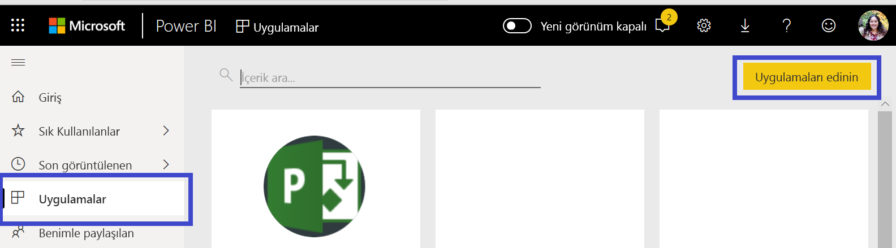
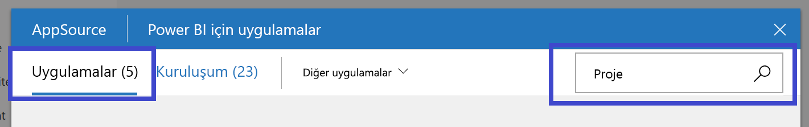
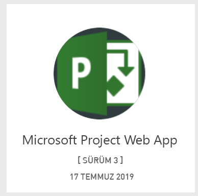
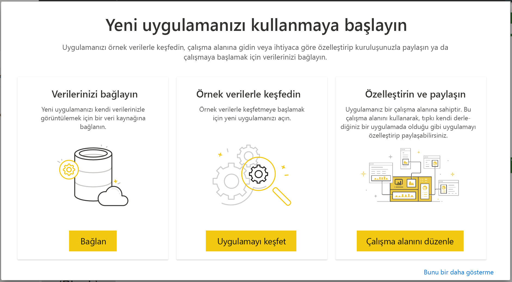
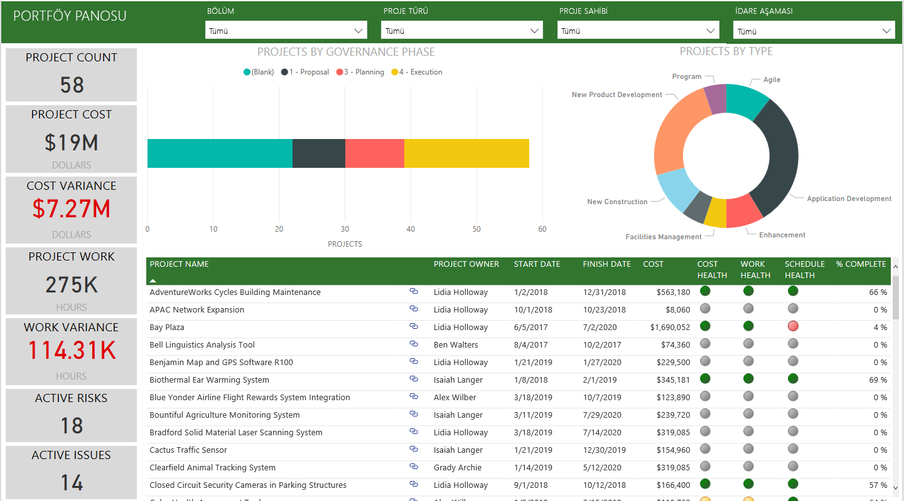
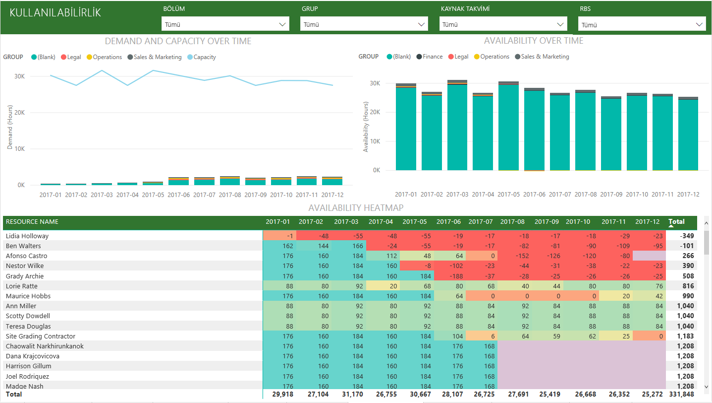
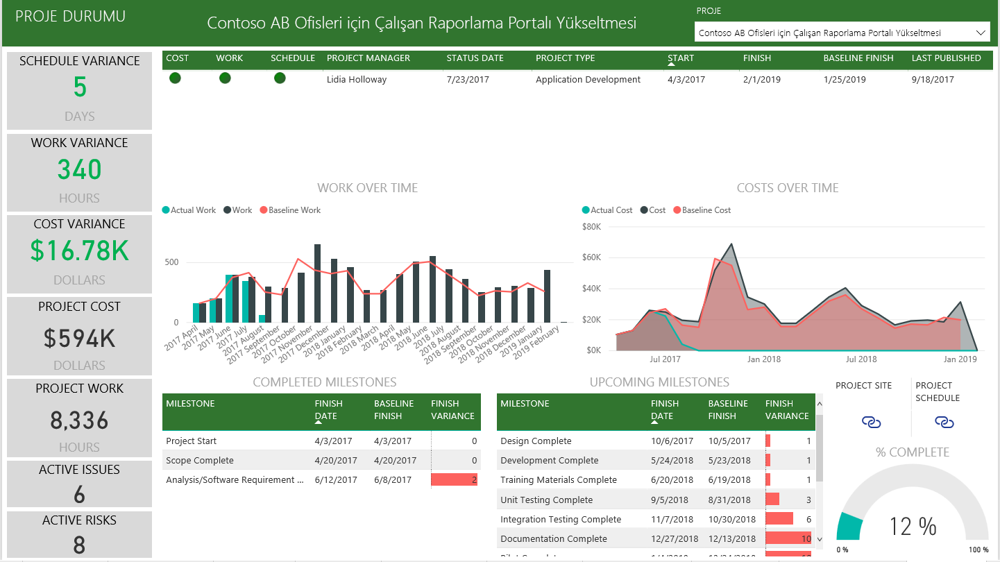

# Power BI ile Project Web App’e bağlanma
Microsoft Project Web App, proje portföy yönetimi (PPM) ve günlük çalışmalara yönelik esnek bir çevrimiçi çözümdür. Project Web App, kuruluşların çalışmaya başlayarak proje portföy yatırımlarını önceliklendirmesine ve planlanan iş değerini sunmasına olanak sağlar. Power BI için Project Web App Şablon Uygulaması, projelerin, portföylerin ve kaynakların yönetimine yardımcı olmak için Project Web App’te içgörü ortaya çıkarmanıza olanak sağlar.

Power BI için [Project Web App Şablon Uygulaması](https://appsource.microsoft.com/product/power-bi/pbi_msprojectonline.pbi-microsoftprojectwebapp)’na bağlanın.

## Bağlanma

1. Gezinti bölmesinde **Uygulamalar**'ı seçin ve ardından sağ üst köşedeki **Uygulama edinin** seçeneğini belirleyin.

    

2. **Hizmetler** kutusundaki **Al** seçeneğini belirleyin.
   
   
3. AppSource’ta **Uygulamalar** sekmesini belirleyip **Microsoft Project Web App**’i arayın/seçin.
   
4. Şöyle bir ileti alırsınız: **Bu Power BI uygulaması yüklensin mi?** Ardından, **Yükle** seçeneğini belirleyin. 

   
5. **Uygulamalar** bölmesinde **Microsoft Project Web App** kutucuğunu seçin. 
   
   
6. **Yeni uygulamanızı kullanmaya başlayın** alanında **Verileri bağla** seçeneğini belirleyin.
   
   
7. **Project Web App URL’si** metin kutusuna bağlanmak istediğiniz Project Web App’in (PWA) URL’sini girin.  Özel bir etki alanına sahipseniz bu URL'nin örnektekinden farklı olabileceğini göz önünde bulundurun. **PWA Site Dili** metin kutusuna, PWA site dilinize karşılık gelen numarayı yazın. İngilizce için tek basamaklı '1', Fransızca için '2', Almanca için '3', Portekizce (Brezilya) için '4', Portekizce (Portekiz) için '5' ve İspanyolca için '6' yazın. 
   
   
8. Kimlik Doğrulama Yöntemi için **OAuth2** \> **Oturum aç** seçeneğini belirleyin. İstendiğinde Project Web App kimlik bilgilerinizi girin ve kimlik doğrulama işlemindeki diğer adımları uygulayın.

    > [!NOTE]
    > Bağlandığınız Project Web App için Portföy Görüntüleyicisi, Portföy Yöneticisi veya Yönetici izinlerine sahip olmanız gerekir.

9. Verilerinizin yüklendiğini belirten bir bildirim görürsünüz. Bu işlem, hesabınızın boyutuna bağlı olarak biraz zaman alabilir. Power BI verileri içeri aktardıktan sonra yeni çalışma alanınızın içeriklerini görürsünüz. En son güncelleştirmeleri almak için veri kümesini yenilemeniz gerekebilir. 

    Veriler Power BI tarafından içeri aktarıldıktan sonra gezinti bölmesinde 13 sayfalık raporu ve veri kümesini görürsünüz. 

10. Raporlarınız hazır olduktan sonra, devam edin ve Project Web App verilerinizi incelemeye başlayın! Şablon Uygulaması’nda Portföye Genel Bakış (6 rapor sayfası), Kaynağa Genel Bakış (5 rapor sayfası) ve Proje Durumu (2 rapor sayfası) için 13 zengin ve ayrıntılı rapor yer alır. 

    
   
    
   
    

**Sırada ne var?**

* Veri kümeniz günlük olarak yenilenecek şekilde zamanlanır ancak yenileme zamanlamasında değişiklik yapabilir veya **Şimdi Yenile** seçeneğini kullanarak istediğinizde veri kümenizi kendiniz de yenileyebilirsiniz.

**Şablon Uygulaması’nı genişletme**

İçerik Paketi'ni daha da fazla özelleştirmek ve güncelleştirmek için [GitHub PBIT dosyasını](https://github.com/OfficeDev/Project-Power-BI-Content-Packs) indirin.

## Sonraki adımlar
[Power BI ile çalışmaya başlama](service-get-started.md)

[Power BI'da veri alma](service-get-data.md)

