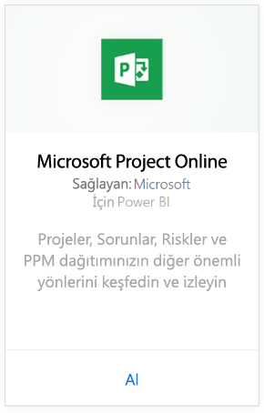
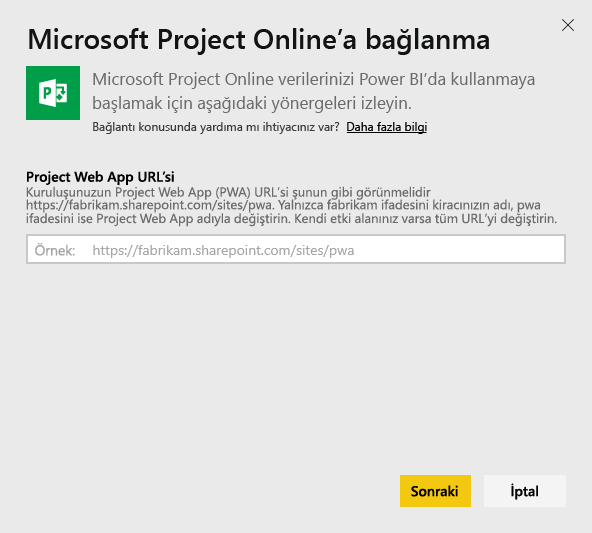
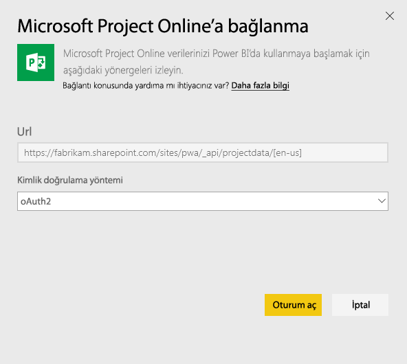

# Power BI ile Project Online'a bağlanma
Microsoft Project Online, proje portföy yönetimi (PPM) ve günlük çalışmalara yönelik esnek bir çevrimiçi çözümdür. Project Online, kuruluşların çalışmaya başlayarak proje portföy yatırımlarını önceliklendirmesine ve planlanan iş değerini sunmasına olanak sağlar. Power BI için Project Online içerik paketi sayesinde portföy durumu ve proje uyumluluğu gibi kullanıma hazır ölçümlerle proje verilerinizi araştırırsınız.

Power BI için [Project Online içerik paketine](https://app.powerbi.com/getdata/services/project-online) bağlanın.

## Bağlanma
1. Sol gezinti bölmesinin alt kısmında bulunan **Veri Al**'ı seçin.
   
    
2. **Hizmetler** kutusundaki **Al** düğmesini seçin.
   
   
3. **Microsoft Project Online** \> **Al** seçeneğini belirleyin.
   
   
4. **Project Web App URL'si** metin kutusuna, bağlanmak istediğiniz Project Web App (PWA) URL'sini girin ve **Sonraki** seçeneğini belirleyin. Özel bir etki alanına sahipseniz bu URL'nin örnektekinden farklı olabileceğini göz önünde bulundurun.
   
    
5. Kimlik Doğrulama Yöntemi için **OAuth2** \> **Oturum aç** seçeneğini belirleyin. İstendiğinde Project Online kimlik bilgilerinizi girin ve kimlik doğrulama işlemindeki diğer adımları uygulayın.
   
    
6. Verilerinizin yüklendiğini belirten bir bildirim görürsünüz. Bu işlem, hesabınızın boyutuna bağlı olarak biraz zaman alabilir. Veriler Power BI tarafından içeri aktarıldıktan sonra sol gezinti bölmesinde yeni bir pano, rapor ve veri kümesi görürsünüz. Bu, Power BI'ın verilerinizi görüntülemek için oluşturduğu varsayılan panodur. Bu panoyu, verilerinizi istediğiniz herhangi bir biçimde görüntüleyecek şekilde değiştirebilirsiniz.
   
   

**Sırada ne var?**

* Panonun üst tarafındaki [Soru-Cevap kutusunda soru sormayı](power-bi-q-and-a.md) deneyin
* Panodaki [kutucukları değiştirin](service-dashboard-edit-tile.md).
* Bağlantılı raporu açmak için [bir kutucuk seçin](service-dashboard-tiles.md).
* Veri kümeniz günlük olarak yenilenecek şekilde zamanlanır ancak yenileme zamanlamasında değişiklik yapabilir veya **Şimdi Yenile** seçeneğini kullanarak istediğinizde veri kümenizi kendiniz de yenileyebilirsiniz

## Sonraki adımlar
[Power BI ile çalışmaya başlama](service-get-started.md)

[Power BI'da veri alma](service-get-data.md)

