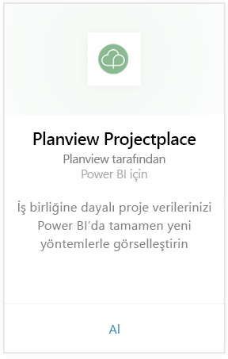
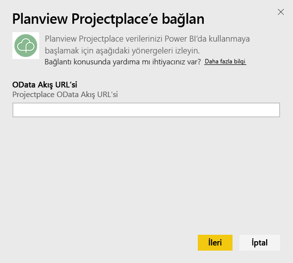
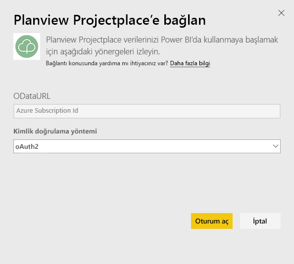
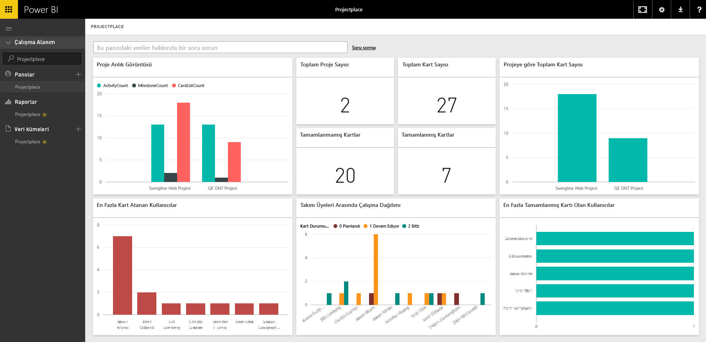

# Power BI ile Projectplace by Planview'a bağlanma
Projectplace by Planview içerik paketi ile işbirliğine dayalı proje verilerinizi, tamamen yeni yöntemlerle doğrudan Power BI'da görselleştirebilirsiniz. Önemli proje istatistiklerini etkileşimli olarak görüntülemek, en etkin ve üretken ekip üyelerinizi bulmak ve Projectplace hesabınızdaki projeler arasında risk altında bulunan kartları ve etkinlikleri belirlemek için Projectplace oturum açma kimlik bilgilerinizi kullanın. Ayrıca, sizin için en önemli öngörüleri edinmek üzere kullanıma hazır pano ve raporların kapsamını genişletebilirsiniz.

[Power BI'da Projectplace içerik paketine bağlanma](https://app.powerbi.com/getdata/services/projectplace)

>[!NOTE]
>Projectplace verilerinizi Power BI'a aktarmak için bir Projectplace kullanıcısı olmanız gerekir. Ek gereksinimler için aşağıya bakın.

## Bağlanma
1. Sol gezinti bölmesinin alt kısmında bulunan **Veri Al**'ı seçin.
   
    
2. **Hizmetler** kutusundaki **Al** seçeneğini belirleyin.
   
    
3. Power BI sayfasında **Projectplace by Planview**'u ve ardından **Al**'ı seçin:  
   
    
4. OData Feed URL (OData Akış URL'si) metin kutusuna, aşağıdaki görüntüde belirtildiği gibi, kullanmak istediğiniz Projectplace OData akışına ilişkin URL'yi girin:
   
    
5. Henüz seçili değilse, Kimlik doğrulama yöntemi listesinde **OAuth** seçeneğini belirleyin. **Oturum Aç**'a tıklayın ve oturum açma akışını takip edin.  
   
   
6. Sol bölmedeki panolar listesinde **Projectplace**'i seçin. Power BI, Projectplace verilerini panoya aktarır. Veri yükleme işleminin biraz zaman alabileceğini göz önünde bulundurun.  
   
    Panoda, Projectplace veritabanınızdaki verileri görüntüleyen kutucuklar bulunur. Aşağıda, Power BI'daki varsayılan Projectplace panosuna ilişkin bir örnek gösterilmiştir.
   
    

**Sırada ne var?**

* Panonun üst tarafındaki [Soru-Cevap kutusunda soru sormayı](power-bi-q-and-a.md) deneyin
* Panodaki [kutucukları değiştirin](service-dashboard-edit-tile.md).
* Bağlantılı raporu açmak için [bir kutucuk seçin](service-dashboard-tiles.md).
* Veri kümeniz günlük olarak yenilenecek şekilde zamanlanır ancak yenileme zamanlamasında değişiklik yapabilir veya **Şimdi Yenile** seçeneğini kullanarak istediğinizde veri kümenizi kendiniz de yenileyebilirsiniz

## Sistem gereksinimleri
Projectplace verilerinizi Power BI'a aktarmak için bir Projectplace kullanıcısı olmanız gerekir. Bu yordamda, bir Power BI hesabıyla Microsoft Power BI giriş sayfasında oturum açtığınız varsayılmaktadır. Power BI hesabınız yoksa [powerbi.com](https://powerbi.microsoft.com/get-started/) adresine gidip **Power BI - Bulut işbirliği ve paylaşımı** bölümünde **Ücretsiz olarak deneyin**’i seçin. Ardından **Veri Al**’a tıklayın.

## Sonraki adımlar
[Power BI ile çalışmaya başlama](service-get-started.md)

[Power BI - Temel Kavramlar](service-basic-concepts.md)

