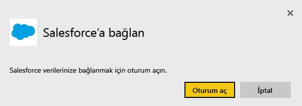
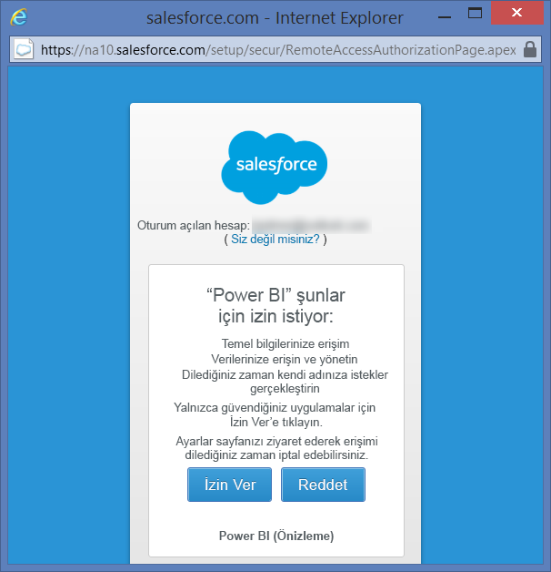
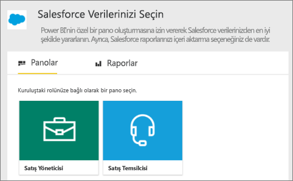
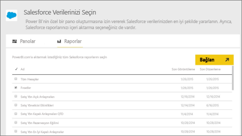
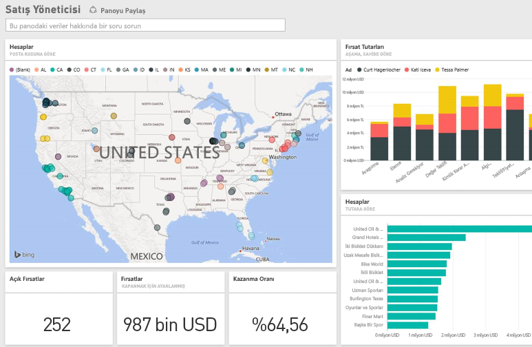

# Power BI ile Salesforce'a bağlanma
Power BI ile Salesforce.com hesabınıza kolayca bağlanabilirsiniz. Bu bağlantıyı oluşturduğunuzda verileriniz çekilerek otomatik olarak bir pano ve ilgili raporlar oluşturulur.

Power BI için [Salesforce içerik paketine](https://app.powerbi.com/getdata/services/salesforce) bağlanın veya Power BI ile [Salesforce tümleştirmesi](https://powerbi.microsoft.com/integrations/salesforce) hakkında daha fazla bilgi edinin.

## Bağlanma
1. Sol gezinti bölmesinin alt kısmında bulunan **Veri Al**'ı seçin.
   
    
2. **Hizmetler** kutusundaki **Al** seçeneğini belirleyin.
   
    
3. **Salesforce**'a tıklayıp **Al**'ı seçin.  
   
   
4. Oturum açma akışını başlatmak için **Oturum Aç**'ı seçin.
   
    
5. İstendiğinde Salesforce kimlik bilgilerinizi girin. Power BI'ın temel Salesforce bilgilerinize ve verilerinize erişebilmesi için **İzin Ver**'e tıklayın.
   
   
6. Açılan menüdeki seçenekleri kullanarak Power BI'a aktarmak istediğiniz verileri yapılandırın:
   
   * **Pano**
     
     Belirli bir kişiyi (**Satış Yöneticisi** gibi) temel alan önceden tanımlı panolardan birini seçin. Bu panolar Salesforce'tan belirli bir standart veri kümesini alır ve özel alanları dahil etmez.
     
     
   * **Raporlar**
     
     Salesforce hesabınızdan bir veya daha fazla özel rapor seçin. Bu raporlar Salesforce hizmetindeki görünümlerinizle eşleşir ve özel alan veya nesne verilerini içerebilir.
     
     
     
     Herhangi bir rapor görmüyorsanız Salesforce hesabınızda ekleyebilir veya oluşturabilir ve tekrar bağlanmayı deneyebilirsiniz.
7. İçeri aktarma sürecini başlatmak için **Bağlan**'a tıklayın. İçeri aktarma sırasında içeri aktarma işleminin devam ettiğini gösteren bir bildirim görürsünüz. İçeri aktarma işlemi tamamlandığında sol taraftaki gezinti bölmesinde Salesforce verilerinizden oluşturulan bir pano, rapor ve veri kümesi görürsünüz.
   
   

Bu panoyu, verilerinizi istediğiniz herhangi bir biçimde görüntüleyecek şekilde değiştirebilirsiniz. Soru-Cevap ile sorular sorabilir veya herhangi bir kutucuğa tıklayarak [bağlantılı raporu açabilir](service-dashboard-tiles.md) ve panodaki [kutucukları değiştirebilirsiniz](service-dashboard-edit-tile.md).

**Sırada ne var?**

* Panonun üst tarafındaki [Soru-Cevap kutusunda soru sormayı](power-bi-q-and-a.md) deneyin
* Panodaki [kutucukları değiştirin](service-dashboard-edit-tile.md)
* Bağlantılı raporu açmak için [bir kutucuk seçin](service-dashboard-tiles.md)
* Veri kümeniz günlük olarak yenilenecek şekilde zamanlanır ancak yenileme zamanlamasında değişiklik yapabilir veya **Şimdi Yenile** seçeneğini kullanarak istediğinizde veri kümenizi kendiniz de yenileyebilirsiniz

## Sistem gereksinimleri
* API erişimi etkinleştirilmiş ve etkin olarak kullanılan bir Salesforce hesabına bağlantı
* Oturum açma işlemi sırasında Power BI uygulamasına erişim izni
* Hesapta veri çekme ve yenileme için kullanılabilecek yeterli miktarda API çağrısı olması
* Yenileme için geçerli bir kimlik doğrulama belirteci. Salesforce hizmetinde uygulama başına 5 kimlik doğrulama belirteci sınırı olduğu için 5 veya daha az sayıda Salesforce veri kümesini içeri aktardığınızdan emin olun

## Sorun giderme
Herhangi bir hatayla karşılaşırsanız lütfen yukarıdaki gereksinimleri inceleyin. Ayrıca, şu an için özel veya korumalı etki alanında oturum açmanın desteklenmediğini unutmayın.

## Sonraki adımlar
[Power BI ile çalışmaya başlama](service-get-started.md)

[Veri Alma](service-get-data.md)

