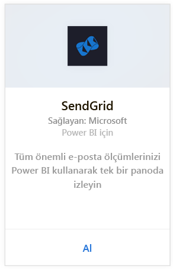
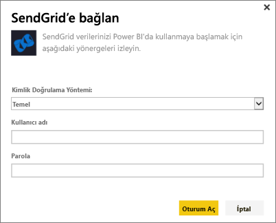
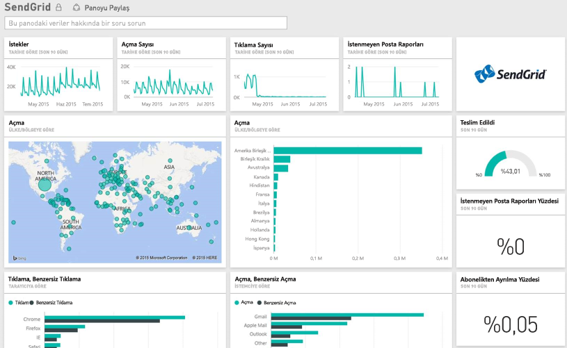

# Power BI ile SendGrid'e bağlanma
Power BI'in SendGrid içerik paketi, SendGrid hesabınızdan öngörüler ve istatistikler ayıklamanıza olanak sağlar. SendGrid içerik paketini kullanarak, SendGrid istatistiklerinizi bir panoda görselleştirebilirsiniz.

[!INCLUDE [include-short-name](./includes/service-deprecate-content-packs.md)]

Power BI için [SendGrid içerik paketine](https://app.powerbi.com/getdata/services/sendgrid) bağlanın.

## Bağlanma
1. Sol gezinti bölmesinin alt kısmında bulunan **Veri Al**'ı seçin.
   
    
2. **Hizmetler** kutusundaki **Al**'ı seçin.
   
    
3. **SendGrid** içerik paketini seçin ve **Al**'a tıklayın.
   
    
4. İstendiğinde, SendGrid kullanıcı adınızı ve parolanızı sağlayın. **Oturum Aç**'ı seçin.
   
   
5. Power BI verileri içeri aktardıktan sonra sol gezinti bölmesinde, son 90 günlük e-posta istatistiklerinizle doldurulmuş yeni bir pano, rapor ve veri kümesi görürsünüz. Yeni öğeler sarı yıldız işareti \* ile gösterilir.
   
   

**Sırada ne var?**

* Panonun üst tarafındaki [Soru-Cevap kutusunda soru sormayı](consumer/end-user-q-and-a.md) deneyin
* Panodaki [kutucukları değiştirin](service-dashboard-edit-tile.md).
* Bağlantılı raporu açmak için [bir kutucuk seçin](consumer/end-user-tiles.md).
* Veri kümeniz günlük olarak yenilenecek şekilde zamanlanır ancak yenileme zamanlamasında değişiklik yapabilir veya **Şimdi Yenile** seçeneğini kullanarak istediğinizde veri kümenizi kendiniz de yenileyebilirsiniz.

## Neleri kapsar?
SendGrid panosunda şu ölçümler bulunur:

* Genel e-posta istatistikleri - İstekler, Teslim Edilenler, Geri Dönenler, Engellenen İstenmeyen Postalar, İstenmeyen Posta Raporları vb.
* Kategoriye göre e-posta istatistikleri
* Coğrafyaya göre e-posta istatistikleri
* ISS'ye göre e-posta istatistikleri
* Cihaza, istemciye, tarayıcıya göre e-posta istatistikleri

## Sonraki adımlar
[Power BI nedir?](fundamentals/power-bi-overview.md)

[Veri Alma](service-get-data.md)

