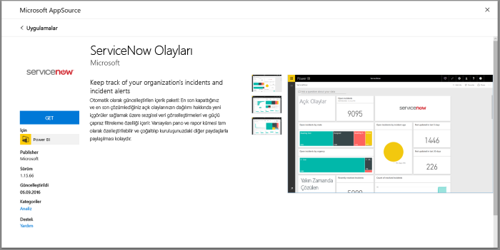
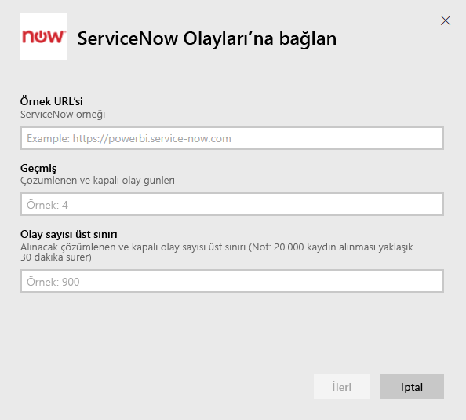
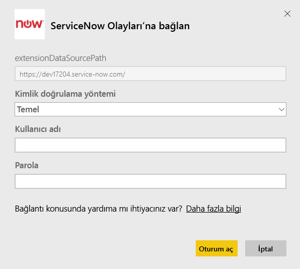
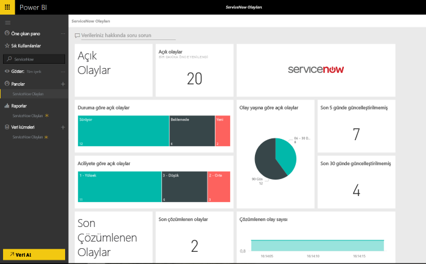

# Olay raporlama için Power BI ile ServiceNow'a bağlanma
ServiceNow işinizi geliştirmek için iş, operasyon ve BT yönetimi dahil olmak üzere birden fazla ürün ve çözüm sunar. Bu içerik paketi açık, yakın zamanda çözümlenmiş ve yakın zamanda kapatılan olaylar hakkında birden fazla rapor ve öngörü içerir.  

[ServiceNow Incidents](https://app.powerbi.com/getdata/services/servicenow) için Power BI içerik paketine bağlanın.

## Bağlanma
1. Sol gezinti bölmesinin alt kısmında bulunan **Veri Al**'ı seçin.
   
    
2. **Hizmetler** kutusundaki **Al** seçeneğini belirleyin.
   
    
3. **ServiceNow Incidents** \> **Al**'ı seçin.
   
   
4. ServiceNow örneğinizin URL'sini ve getirilecek gün/kayıt aralığını belirtin. Bir sınırı girdiğinizde içeri aktarmanın durdurulacağını unutmayın.
   
   
5. İstendiğinde, ServiceNow **Temel** kimlik bilgilerinizi girin. Çoklu oturum açma özelliği şu anda desteklenmemektedir, sistem gereksinimlerine ilişkin daha fazla bilgi için aşağıya bakın.
   
   
6. Oturum açma akışı tamamlandığında içeri aktarma işlemi başlar. İçeri aktarma işlemi sona erdiğinde, Gezinti Bölmesinde yeni bir pano, rapor ve model görünür. İçeri aktarılan verilerinizi görüntülemek için panoyu seçin.
   
    

**Sırada ne var?**

* Panonun üst tarafındaki [Soru-Cevap kutusunda soru sormayı](power-bi-q-and-a.md) deneyin
* Panodaki [kutucukları değiştirin](service-dashboard-edit-tile.md).
* Bağlantılı raporu açmak için [bir kutucuk seçin](service-dashboard-tiles.md).
* Veri kümeniz günlük olarak yenilenecek şekilde zamanlanır ancak yenileme zamanlamasında değişiklik yapabilir veya **Şimdi Yenile** seçeneğini kullanarak istediğinizde veri kümenizi kendiniz de yenileyebilirsiniz

## Sistem gereksinimleri
Bağlanmak için şunlar gereklidir:  

* Temel kimlik doğrulaması ile yourorganization.service-now.com adresine erişebilen bir hesap (Çoklu Oturum Açma özelliği bu sürümde desteklenmemektedir)  
* Hesap rest_service rolüne ve olay tablosunu okuma erişimine sahip olmalıdır  

## Sorun giderme
Yükleme sırasında bir kimlik bilgisi hatası ile karşılaşıyorsanız lütfen yukarıdaki erişim gereksinimlerini gözden geçirin. Doğru izinlere sahipseniz ve yine de sorunlarla karşılaşıyorsanız lütfen özel örneğiniz için gerekli olabilecek tüm ek izinlere sahip olduğunuzdan emin olmak üzere ServiceNow yöneticiniz ile iletişime geçin.

Yükleme çok uzun sürüyorsa bağlantı sırasında belirttiğiniz olay sayısını ve gün sayısını gözden geçirip bunları azaltmayı deneyin.

## Sonraki adımlar
[Power BI ile çalışmaya başlama](service-get-started.md)

[Power BI - Temel Kavramlar](service-basic-concepts.md)

