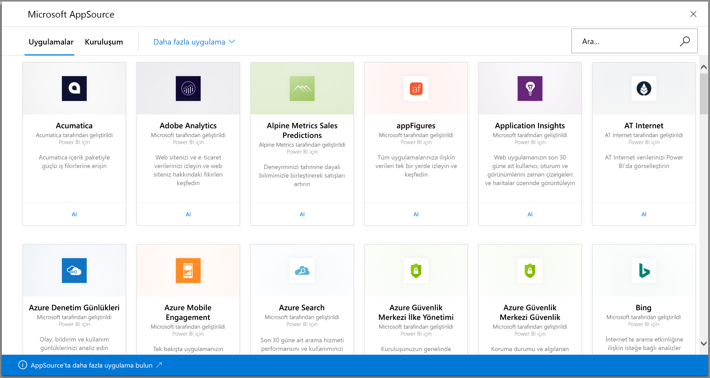
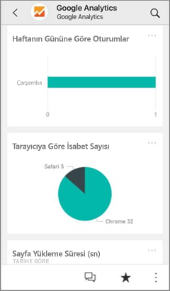
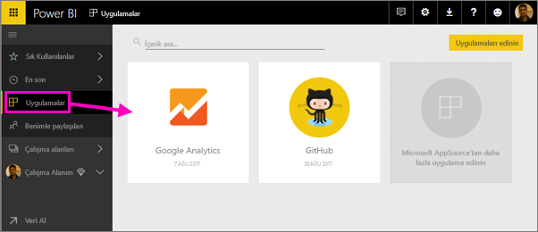
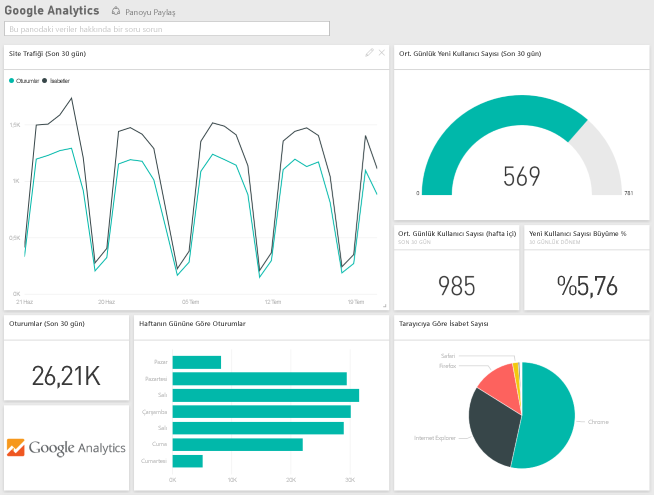
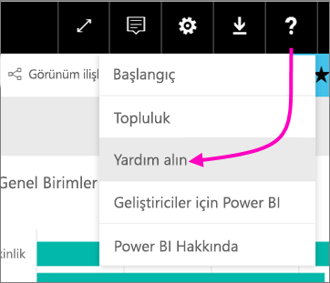

# Power BI ile kullandığınız hizmetlere bağlanma
Salesforce, Microsoft Dynamics ve Google Analytics gibi, işletmenizde kullandığınız birçok hizmetle bağlantı kurabilirsiniz. Power BI öncelikle kimlik bilgilerinizi kullanarak hizmete bağlanır, ardından, verilerinizi otomatik olarak gösteren ve işletmenizle ilgili görsel öngörüler sunan bir pano ve Power BI raporları içeren bir Power BI uygulaması oluşturur. 

[Bağlantı kurabileceğiniz tüm hizmetleri](https://app.powerbi.com/getdata/services) görüntülemek için Power BI'da oturum açın. Power BI ekibi düzenli olarak yeni hizmetler eklemektedir.

Uygulamayı yükledikten sonra panoyu ve raporları Power BI hizmetinde ([https://powerbi.com](https://powerbi.com)) ve Power BI mobil uygulamalarında görüntüleyebilirsiniz. 

## Başlangıç
[!INCLUDE [powerbi-service-apps-get-more-apps](./includes/powerbi-service-apps-get-more-apps.md)]

## Panoyu ve raporları görüntüleme
İçeri aktarma tamamlandığında, yeni uygulama Uygulamalar sayfasında görünür.

1. Sol gezinti bölmesinde **Uygulamalar** seçeneğini belirleyin ve ardından uygulamayı seçin.
   
     
2. Soru-Cevap kutusuna yazarak soru sorabilir veya bağlantılı raporu açmak için bir kutucuğa tıklayabilirsiniz. 
   
    
   
    Rapordaki verileri filtreleyebilir ve vurgulayabilirsiniz ancak değişikliklerinizi kaydedemezsiniz.

## Neleri kapsar?
Bir hizmete bağlandıktan sonra pano, raporlar ve veri kümesi içeren yeni oluşturulmuş uygulamayı görürsünüz. Hizmetten alınan veriler belirli bir senaryoya bağlıdır ve hizmetteki tüm bilgileri içermeyebilir. Veriler günde bir kez otomatik olarak yenilenecek şekilde ayarlanır. Veri kümesini seçerek, zamanlamayı denetleyebilirsiniz.

Ayrıca [Power BI Desktop](desktop-get-the-desktop.md) uygulamasını kullanarak da Google Analytics gibi hizmetlere bağlanabilir, özelleştirdiğiniz panolar ve raporlar oluşturabilirsiniz.  

Belirli hizmetlere bağlanma hakkında ayrıntılı bilgi için lütfen hizmetlerle ilgili yardım sayfalarına bakın.

## Sorun giderme
**Boş kutucuklar**  
Power BI hizmete ilk kez bağlandığında panonuzda boş kutucuklar görebilirsiniz. 2 saat sonra da panonuz boşsa bağlantı başarısız olmuş olabilir. Sorunu düzeltme önerileri içeren bir hata iletisiyle karşılaşmadıysanız lütfen destek bileti oluşturun.

* Sağ üst köşedeki soru işareti simgesini (**?**) seçin ve ardından **Yardım al** seçeneğini belirleyin.
  
    

**Eksik bilgiler**  
Panolar ve raporlar hizmetten alınan, belirli bir senaryoya odaklanmış veriler içerir; hizmetteki tüm bilgileri içermez. İçerik paketinde görmediğiniz belirli bir ölçüm varsa lütfen [Power BI Destek](https://support.powerbi.com/forums/265200-power-bi) sayfasına bir fikir ekleyin.

## Hizmet önerme
Power BI uygulaması için önermek istediğiniz bir hizmet mi kullanıyorsunuz? [Power BI Destek](https://support.powerbi.com/forums/265200-power-bi) sayfasına giderek bizimle paylaşın.

Uygulamasını oluşturmak istediğiniz bir hizmetiniz mi var? Başlamak için [başvuru yapın](https://azure.microsoft.com/marketplace/programs/certified/apply/) ve "Publish a Power BI Content Pack" (Power BI İçerik Paketi Yayımla) seçeneğini belirleyin.

## Sonraki adımlar
* [Power BI'da uygulamalar ne anlama gelir?](service-install-use-apps.md)
* [Power BI'da veri alma](service-get-data.md)
* Başka bir sorunuz mu var? [Power BI Topluluğu'na sorun](http://community.powerbi.com/)

