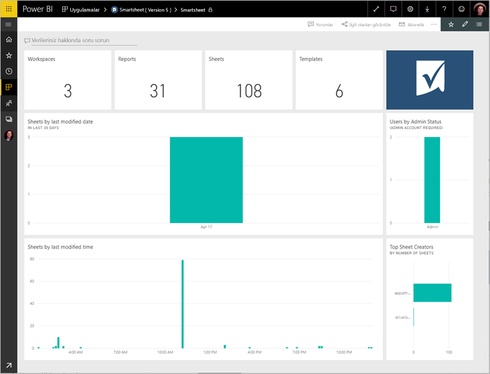
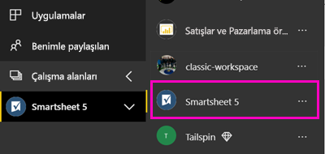
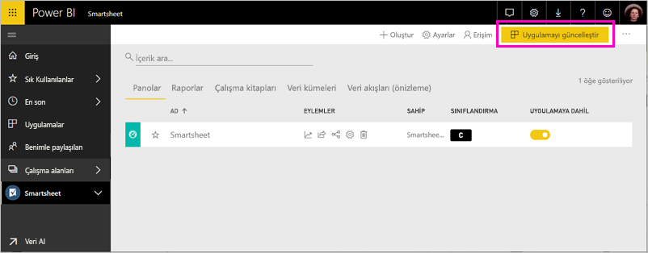

# Power BI ile Smartsheet'e bağlanma
Bu makalede, Smartsheet hesabınıza Power BI şablon uygulama ile verilerinizden çekme gösterilmektedir. Smartsheet, işbirliği ve dosya paylaşımı için basit bir platform sunar. Power BI için Smartsheet şablon uygulaması, bir pano, raporlar ve Smartsheet hesabınıza genel bakışını gösteren veri kümesi sağlar. Ayrıca [Power BI Desktop](desktop-connect-to-data.md) hesabınızdaki her bir sayfaya doğrudan bağlanmak için. 

Şablon uygulamayı yükledikten sonra panoyu ve raporu değiştirebilirsiniz. Ardından, bu iş arkadaşlarınıza bir uygulama olarak, kuruluşunuzda dağıtabilirsiniz.

Bağlanma [Smartsheet şablon uygulaması](https://app.powerbi.com/groups/me/getdata/services/smartsheet) Power BI için.

>[!NOTE]
>Bir Smartsheet yönetici hesabı bağlanmayı ve ek erişim ayrıcalığı olduğundan, Power BI şablon uygulama yükleme için tercih edilir.

## Bağlanma

[!INCLUDE [powerbi-service-apps-get-more-apps](./includes/powerbi-service-apps-get-more-apps.md)]

3. Seçin **Smartsheet** \> **şimdi edinin**.
4. İçinde **bu Power BI uygulaması yükleme?** seçin **yükleme**.
4. İçinde **uygulamaları** bölmesinde **Smartsheet** Döşe.

    

6. İçinde **yeni uygulamanızı ile çalışmaya başlama**seçin **verilere**.

    

4. Kimlik Doğrulama Yöntemi için **OAuth2\> Oturum aç** seçeneğini belirleyin.
   
   İstendiğinde Smartsheet kimlik bilgilerinizi girin ve kimlik doğrulaması işlemindeki diğer adımları uygulayın.
   
   
   
   

5. Verileri Power BI tarafından içeri aktarıldıktan sonra Smartsheet Pano açılır.
   
   

## Değiştirme ve uygulamanızı dağıtın

Smartsheet şablon uygulaması yüklediniz. Smartsheet uygulama çalışma alanı da oluşturmuş olduğunuz anlamına gelir. Çalışma alanında, rapor ve Pano değiştirebilir ve ardından olarak dağıtmak bir *uygulama* kuruluşunuzdaki iş arkadaşlarınıza. 

1. Sol gezinti çubuğunda yeni Smartsheet çalışma alanınızda, tüm içeriğini görüntülemek için seçin **çalışma alanları** > **Smartsheet**. 

    

    Bu görünüm çalışma alanı için içerik listesidir. Sağ üst köşedeki gördüğünüz **uygulamayı Güncelleştir**. İş arkadaşlarınız için uygulamanızı dağıtmaya hazır olduğunuzda nereden başlayacaksınız olmasıdır. 

    

2. Seçin **raporları** ve **veri kümeleri** çalışma alanındaki diğer öğeleri görmek için.

    Hakkında bilgi edinin [uygulama dağıtmaya](service-create-distribute-apps.md) iş arkadaşlarınıza önerilmesini sağlayın.

## Neleri kapsar?
Şablon uygulaması için Power BI çalışma alanları, sayısı gibi Smartsheet hesabınıza genel bir bakış içerir. rapor ve sayfa Smartsheet varsa, bunlar değiştirilmiş vs. Yönetici kullanıcılar, en iyi sayfa oluşturucular gibi kendi sisteminde kullanıcıların geçici bazı bilgileri de görebilirsiniz.  

Hesabınızdaki her bir sayfaya doğrudan bağlanmak için [Power BI Desktop](desktop-connect-to-data.md)'taki Smartsheet bağlayıcısını kullanabilirsiniz.  

## Sonraki adımlar

* [Power BI'da yeni çalışma alanları oluşturma](service-create-the-new-workspaces.md)
* [Power BI'da uygulamaları yükleme ve kullanma](consumer/end-user-apps.md)
* [Dış hizmetler için Power BI uygulamaları bağlanma](service-connect-to-services.md)
* Sorularınız mı var? [Power BI Topluluğu'na sorun](http://community.powerbi.com/)