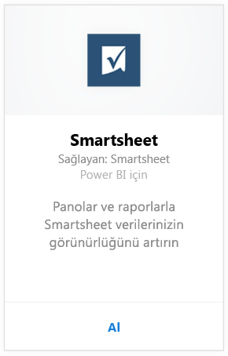
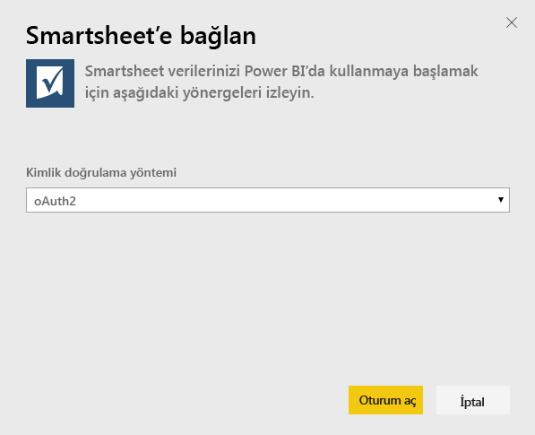
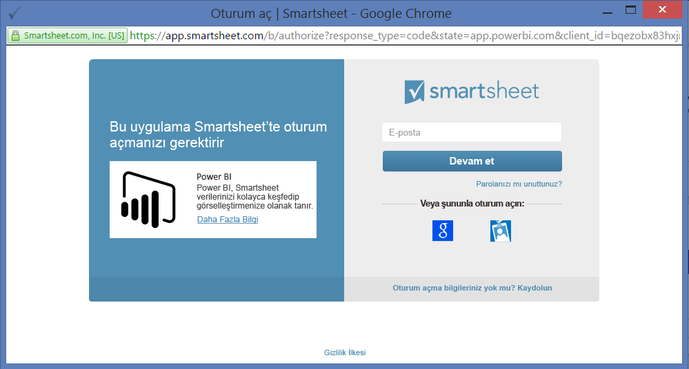
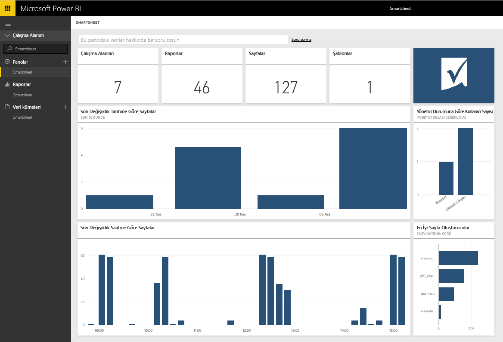

# Power BI ile Smartsheet'e bağlanma
Smartsheet, işbirliği ve dosya paylaşımı için basit bir platform sunar. Power BI için Smartsheet içerik paketi, Smartsheet hesabınıza genel bakış bilgilerini gösteren bir pano, raporlar ve veri kümesi sağlar. Ayrıca, [Power BI Desktop](desktop-connect-to-data.md)'ı kullanarak hesabınızdaki her bir sayfaya doğrudan bağlanabilirsiniz. 

Power BI için [Smartsheet içerik paketine](https://app.powerbi.com/groups/me/getdata/services/smartsheet) bağlanın.

>[!NOTE]
>Ek erişim ayrıcalığı olduğundan, Power BI içerik paketine bağlanılması ve içerik paketinin yüklenmesi için Smartsheet yönetici hesabı tercih edilir.

## Bağlanma
1. Sol gezinti bölmesinin alt kısmındaki **Veri Al**'ı seçin.
   
   
2. **Hizmetler** kutusundaki **Al** seçeneğini belirleyin.
   
    
3. **Smartsheet \> Al**'ı seçin.
   
   
4. Kimlik doğrulama yöntemi için **OAuth2\> Oturum aç** seçeneğini belirleyin.
   
   İstendiğinde Smartsheet kimlik bilgilerinizi girin ve kimlik doğrulaması işlemindeki diğer adımları uygulayın.
   
   
   
   
5. Veriler Power BI tarafından içeri aktarıldıktan sonra sol gezinti bölmesinde yeni bir pano, rapor ve veri kümesi görürsünüz. Yeni öğeler sarı bir yıldız işareti \* ile gösterilir; Smartsheet girişini seçin.
   
   

**Sırada ne var?**

* Panonun üst kısmındaki [Soru-Cevap kutusunda soru sormayı](service-q-and-a.md) deneyin
* Panodaki [kutucukları değiştirin](service-dashboard-edit-tile.md).
* Bağlantılı raporu açmak için [bir kutucuk seçin](service-dashboard-tiles.md).
* Veri kümeniz günlük olarak yenilenecek şekilde zamanlanır ancak yenileme zamanlamasında değişiklik yapabilir veya **Şimdi Yenile** seçeneğini kullanarak istediğinizde veri kümenizi kendiniz de yenileyebilirsiniz

## Neleri kapsar?
Power BI için Smartsheet içerik paketi; Smartsheet hesabınıza yönelik olarak, sahip olduğunuz çalışma alanı, rapor ve sayfa sayısı ve bunların ne zaman değiştirildiği gibi bilgileri içeren bir genel bakış sunar. Yönetici kullanıcılar, en çok sayfa oluşturanlar gibi, sistemlerindeki kullanıcılar ile ilgili bazı bilgileri de görür.  

Hesabınızdaki her bir sayfaya doğrudan bağlanmak için [Power BI Desktop](desktop-connect-to-data.md)'taki Smartsheet bağlayıcısını kullanabilirsiniz.  

## Sonraki adımlar:

[Power BI ile çalışmaya başlama](service-get-started.md)

[Power BI için veri alma](service-get-data.md)