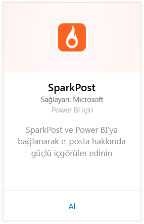
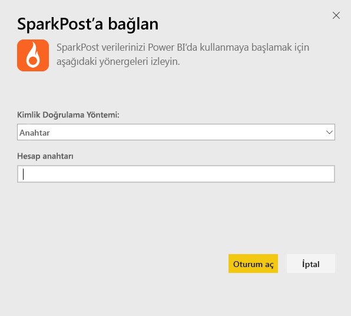
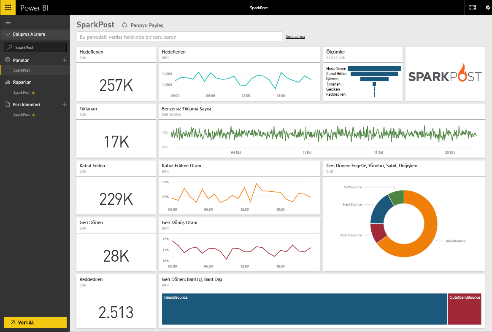
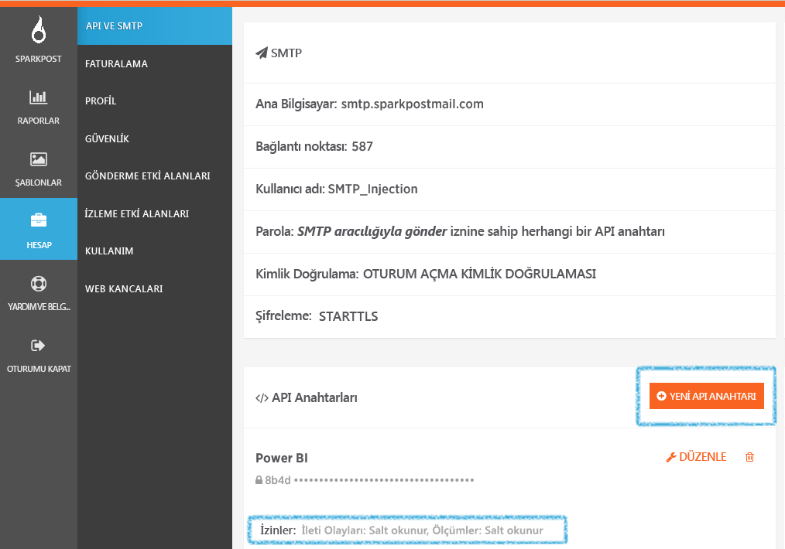

# Power BI ile SparkPost'a bağlanma
Power BI'daki SparkPost içerik paketi sayesinde SparkPost hesabınızdaki tüm değerli veri kümelerini öngörüler sunan tek bir panoya ayıklayabilirsiniz. SparkPost içerik paketini kullanarak, ISS'lere göre etki alanlarını, kampanyaları ve etkileşimi içeren genel e-posta istatistiklerinizi görselleştirebilirsiniz.

[Power BI için SparkPost içerik paketine](https://app.powerbi.com/getdata/services/spark-post) bağlanın.

## Bağlanma
1. Sol gezinti bölmesinin alt kısmında bulunan **Veri Al**'ı seçin.
   
   
2. **Hizmetler** kutusundaki **Al** seçeneğini belirleyin.
   
   
3. **SparkPost** içerik paketini seçin ve **Al**'a tıklayın. 
   
   
4. İstendiğinde SparkPost API anahtarınızı girin ve Oturum Aç'ı seçin. [Bu parametreleri bulma](#FindingParams) ile ilgili ayrıntılar için aşağıya bakın.
   
   
5. Verileriniz yüklenmeye başlar. Hesabınızın boyutuna bağlı olarak bu işlem biraz zaman alabilir. Verileriniz Power BI tarafından içeri aktarıldıktan sonra sol gezinti bölmesinde, geçtiğimiz 90 güne ait e-posta istatistikleriniz ile doldurulmuş varsayılan panoyu, raporu ve veri kümesini görürsünüz. Yeni öğeler sarı yıldız işareti \* ile gösterilir.
   
   

**Sırada ne var?**

* Panonun üst tarafındaki [Soru-Cevap kutusunda soru sormayı](power-bi-q-and-a.md) deneyin
* Panodaki [kutucukları değiştirin](service-dashboard-edit-tile.md).
* Bağlantılı raporu açmak için [bir kutucuk seçin](service-dashboard-tiles.md).
* Veri kümeniz günlük olarak yenilenecek şekilde zamanlanır ancak yenileme zamanlamasında değişiklik yapabilir veya **Şimdi Yenile** seçeneğini kullanarak istediğinizde veri kümenizi kendiniz de yenileyebilirsiniz

## Neleri kapsar?
Power BI için SparkPost içerik paketinde; benzersiz tıklamaları, iletilme oranlarını, geri dönüş oranlarını, gecikme oranlarını, ret oranlarını ve daha fazlasını içeren bilgiler bulunur.

## Parametreleri bulma
İçerik paketi, SparkPost hesabınızı Power BI'a bağlamak için API anahtarı kullanır. Hesabınızdaki API anahtarını Account (Hesap) \> API & SMTP bölümünde bulabilirsiniz ([buradan](https://support.sparkpost.com/customer/portal/articles/1933377-create-api-keys) daha fazla ayrıntıya ulaşabilirsiniz). `Message Events: Read-only `ve `Metrics: Read-only` izinlerini içeren bir API anahtarı kullanmanızı öneririz

