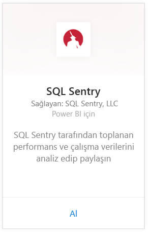
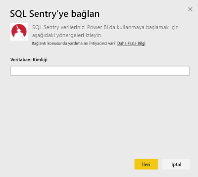
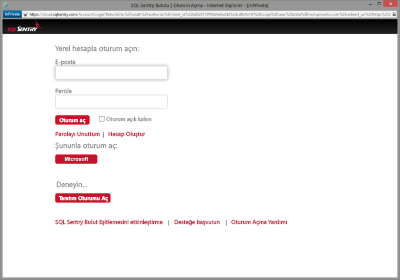
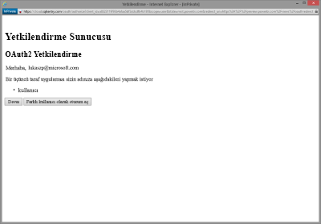
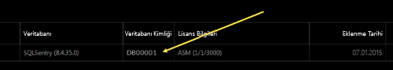
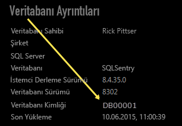

# Power BI ile SQL Sentry'ye bağlanma
SQL Sentry tarafından toplanan performans verilerinizi Power BI ile çözümlemek kolaydır. Power BI, verilerinizi alır ve ardından bu verilere dayalı varsayılan bir pano ve raporlar oluşturur.

Power BI için [SQL Sentry içerik paketine](https://app.powerbi.com/groups/me/getdata/services/sql-sentry) bağlanın.

>[!NOTE]
>Bağlanmak için, http://cloud.sqlsentry.com sayfasına bağlanırken kullandığınız SQL Sentry hesabına erişim ve izleyeceğiniz Veritabanı Kimliği gereklidir.  Veritabanı Kimliğini nerede bulacağınıza yönelik bilgiler aşağıda verilmiştir.

## Bağlanma
1. Sol gezinti bölmesinin alt kısmında bulunan **Veri Al**'ı seçin.
   
   
2. **Hizmetler** kutusundaki **Al** seçeneğini belirleyin.
   
    
3. **SQL Sentry  \> Al**'ı seçin.
   
   
4. Power BI'da izlemek istediğiniz veritabanının **Veritabanı Kimliği**'ni girin. Aşağıda [bu parametreyi bulmaya](#FindingParams) yönelik daha fazla ayrıntıya ulaşabilirsiniz.
   
   
5. Kimlik Doğrulama Yöntemi için **OAuth2\> Oturum aç** seçeneğini belirleyin.
   
   İstendiğinde, cloud.sqlsentry.com kimlik bilgilerinizi girin ve SQL Sentry kimlik doğrulaması adımlarını uygulayın.
   
   
   
   İlk kez bağlandığınızda Power BI, hesabınıza salt okunur erişime izin vermenizi ister. İçeri aktarma işlemini başlatmak için Allow (İzin ver) seçeneğini belirleyin.  Hesabınızdaki veri hacmine bağlı olarak, içeri aktarma işlemi birkaç dakika sürebilir.
   
   
6. Veriler Power BI tarafından içeri aktarıldıktan sonra sol gezinti bölmesinde yeni bir pano, rapor ve veri kümesi görürsünüz. Yeni öğeler sarı yıldız işareti \* ile gösterilir:
   
   
7. SQL Sentry panosunu seçin.
   
   Bu, Power BI'ın verilerinizi görüntülemek için oluşturduğu varsayılan panodur. Bu panoyu, verilerinizi istediğiniz herhangi bir biçimde görüntüleyecek şekilde değiştirebilirsiniz.
   
   

**Sırada ne var?**

* Panonun üst tarafındaki [Soru-Cevap kutusunda soru sormayı](service-q-and-a.md) deneyin
* Panodaki [kutucukları değiştirin](service-dashboard-edit-tile.md).
* Bağlantılı raporu açmak için [bir kutucuk seçin](service-dashboard-tiles.md).
* Veri kümeniz günlük olarak yenilenecek şekilde zamanlanır ancak yenileme zamanlamasında değişiklik yapabilir veya **Şimdi Yenile** seçeneğini kullanarak istediğinizde veri kümenizi kendiniz de yenileyebilirsiniz

## Neleri kapsar?
Aşağıdaki verilere Power BI'da SQL Sentry'den ulaşılabilir:

| Tablo adı | Açıklama |
| --- | --- |
| Connection |Bu tablo, SQL Sentry ile tanımlanan bağlantılarınız hakkındaki bilgileri içerir. |
| Date  |Bu tablo, içinde bulunulan gün ile performans verilerinin toplanmaya ve saklanmaya başlandığı tarih arasındaki tarihleri içerir. |
| Downtime  |Bu tablo, ortamınızda izlenen her bir sunucu için çalışma ve çalışmama süresi ile ilgili bilgileri içerir. |
| Memory Usage  |Bu tablo, sunucularınızdan her birindeki kullanılabilir bellek miktarı hakkında veriler içerir.  |
| Server  |Bu tablo, ortamınızdaki her bir sunucuya ilişkin kayıtlar içerir. |
| Server Health  |Bu tablo, önem derecesi ve sayı da dahil olmak üzere, ortamınızdaki özel durumlar sonucunda meydana gelen tüm olaylara ilişkin veriler içerir. |

## Parametreleri Bulma
**Veritabanı Kimliği**, yeni bir tarayıcı penceresi ile <https://cloud.sqlsentry.com> sayfasında oturum açılarak bulunabilir.  **Veritabanı Kimliği**, ana genel bakış sayfasında yer alır:

    

**Veritabanı Kimliği** Database Details (Veritabanı Ayrıntıları) ekranında da gösterilir:

    

## Sorun giderme
Uygulamalarınızın bazılarındaki veriler Power BI'da görünmüyorsa doğru Veritabanı Kimliğini kullandığınızdan ve verileri görüntüleme yetkinizin bulunduğundan emin olun. 

<https://cloud.sqlsentry.com> ile eşitlenmekte olan SQL Sentry veritabanının sahibi değilseniz, toplanan verileri görüntüleme haklarına sahip olduğunuzdan emin olmak için lütfen yöneticinizle iletişime geçin.

## Sonraki adımlar
[Power BI ile çalışmaya başlama](service-get-started.md)

[Power BI için Veri Alma](service-get-data.md)

