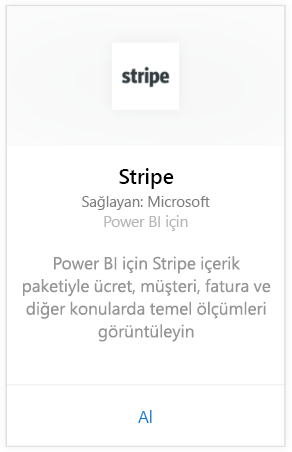
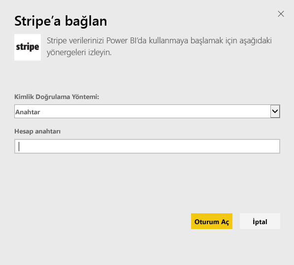
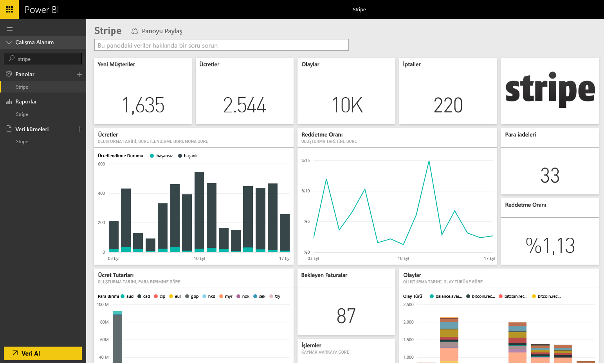

# Power BI ile Stripe'a bağlanma
Power BI içerik paketi ile Power BI'da Stripe verilerinizi görselleştirin ve araştırın. Power BI Stripe içerik paketi Müşterileriniz, Ödemeleriniz, Olaylarınız ve Faturalarınız ile ilgili verileri çeker. Veriler, son 30 günde gerçekleşen en yeni on bin olayı ve beş bin ödemeyi içerir. İçerik, sizin denetiminizde olan bir zamanlamada her gün otomatik olarak bir kez yenilenir. 

[!INCLUDE [include-short-name](./includes/service-deprecate-content-packs.md)]

[Power BI için Stripe içerik paketine](https://app.powerbi.com/getdata/services/stripe) bağlanın.

## Bağlanma
1. Sol gezinti bölmesinin alt kısmındaki Veri Al seçeneğini belirleyin.  
   
    
2. **Hizmetler** kutusundaki **Al** seçeneğini belirleyin.  
   
      
3. **Stripe** &gt; **Al** seçeneğini belirleyin.  
   
      
4. Bağlanmak için Stripe [API anahtarınızı](https://dashboard.stripe.com/account/apikeys) girin.  
   
    
5. İçeri aktarma süreci otomatik olarak başlar. İşlem tamamlandığında Gezinti Bölmesinde yıldız ile işaretlenmiş yeni bir pano, rapor ve model görüntülenir. İçeri aktarılan verilerinizi görüntülemek için panoyu seçin.
   
    

**Sırada ne var?**

* Panonun üst tarafındaki [Soru-Cevap kutusunda soru sormayı](consumer/end-user-q-and-a.md) deneyin
* Panodaki [kutucukları değiştirin](service-dashboard-edit-tile.md).
* Bağlantılı raporu açmak için [bir kutucuk seçin](consumer/end-user-tiles.md).
* Veri kümeniz günlük olarak yenilenecek şekilde zamanlanır ancak yenileme zamanlamasında değişiklik yapabilir veya **Şimdi Yenile** seçeneğini kullanarak istediğinizde veri kümenizi kendiniz de yenileyebilirsiniz.

## Sonraki adımlar
[Power BI nedir?](fundamentals/power-bi-overview.md)

[Power BI için veri alma](service-get-data.md)

