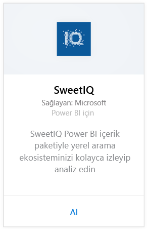
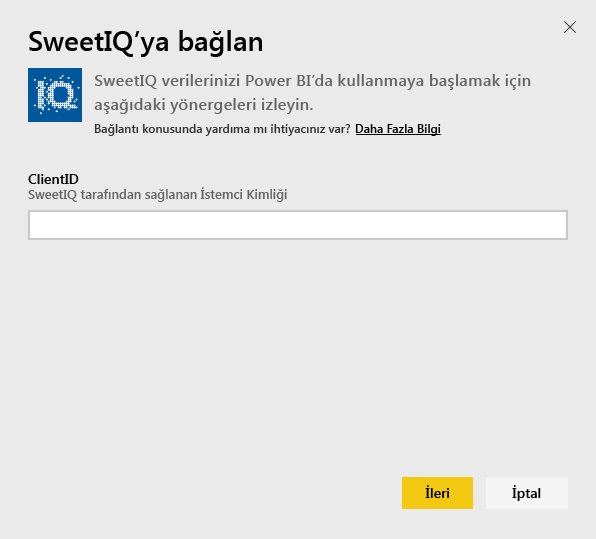
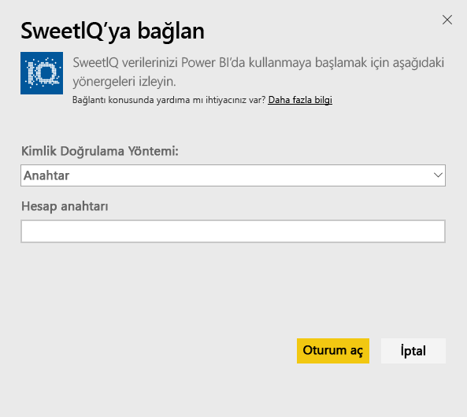
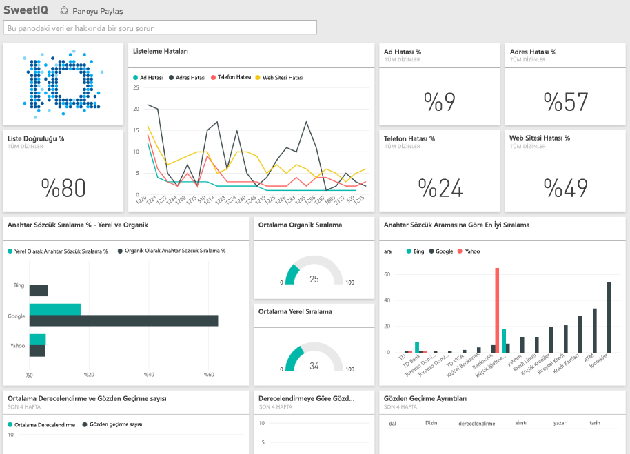

# Power BI ile SweetIQ'ya bağlanma
Power BI içerik paketi, SweetIQ hesabınızdaki verileri çekerek, verilerinizi kolayca araştırmanıza olanak sağlayan, kullanıma hazır bir içerik kümesi oluşturur. Konumlarınız, listeleriniz, derecelendirmeleriniz ve incelemeleriniz hakkındaki verileri çözümlemek için SweetIQ içerik paketini kullanın. Veriler, güncel bir izleme deneyimi elde etmenizi sağlamak üzere günlük olarak yenilenir.

Power BI için [SweetIQ içerik paketine](https://app.powerbi.com/groups/me/getdata/services/sweetiq) bağlanın.

## Bağlanma
1. Soldaki gezinti bölmesinde, **Veri Al**'a tıklayın.
   
    
2. **SweetIQ** seçeneğini belirleyin ve **Al**'a tıklayın.
   
    
3. SweetIQ Client ID'nizi (İstemci Kimliği) girin. Bu genellikle alfasayısal bir değerdir. Bu değeri bulmaya yönelik daha fazla ayrıntı için aşağıya bakın.
   
    
4. Kimlik doğrulaması türü olarak **Anahtar** seçeneğini belirleyin ve Sweet IQ API Anahtarınızı girin. Bu genellikle alfasayısal bir değerdir. Bu değeri bulmaya yönelik daha fazla ayrıntı için aşağıya bakın.
   
    
5. Power BI, verilerinizi yüklemeye başlar. Hesabınızdaki verilerin boyutuna bağlı olarak bu işlem biraz zaman alabilir. Yükleme tamamlandıktan sonra, sol gezinti bölmesinde yeni bir pano, rapor ve veri kümesi görürsünüz.
   
    

**Sırada ne var?**

* Panonun üst tarafındaki [Soru-Cevap kutusunda soru sormayı](power-bi-q-and-a.md) deneyin
* Panodaki [kutucukları değiştirin](service-dashboard-edit-tile.md).
* Bağlantılı raporu açmak için [bir kutucuk seçin](service-dashboard-tiles.md).
* Veri kümeniz günlük olarak yenilenecek şekilde zamanlanır ancak yenileme zamanlamasında değişiklik yapabilir veya **Şimdi Yenile** seçeneğini kullanarak istediğinizde veri kümenizi kendiniz de yenileyebilirsiniz

## Parametreleri bulma
Bu içerik paketine ilişkin Client ID (İstemci Kimliği) ve API anahtarı, SweetIQ kullanıcı adınız ve parolanızdan farklıdır.

Hesabınızın erişiminin bulunduğu istemcilerden birine ilişkin İstemci Kimliğini seçin. İstemci listesini SweetIQ hesabınızın "Client Management" (İstemci Yönetimi) bölümünde bulabilirsiniz.

Belirli bir istemciye ilişkin verilere erişmek üzere API anahtarını edinmek için yöneticinize başvurun.

## Sonraki adımlar
[Power BI ile çalışmaya başlama](service-get-started.md)

[Power BI için Veri Alma](service-get-data.md)

