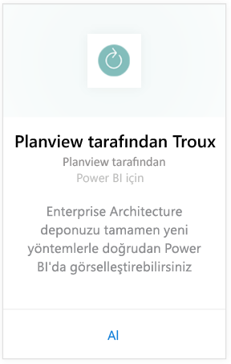
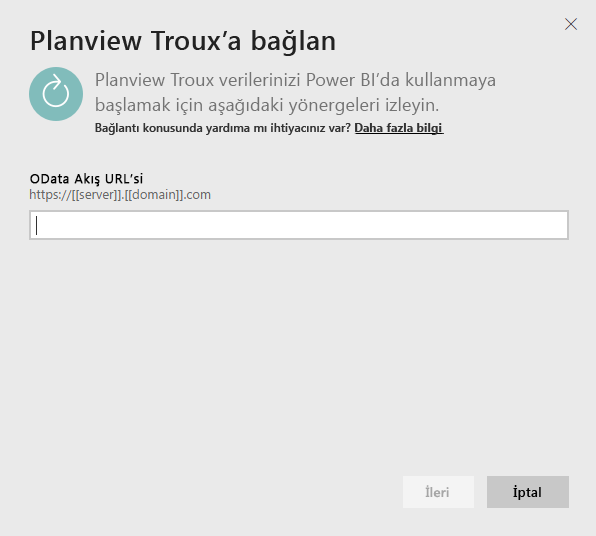
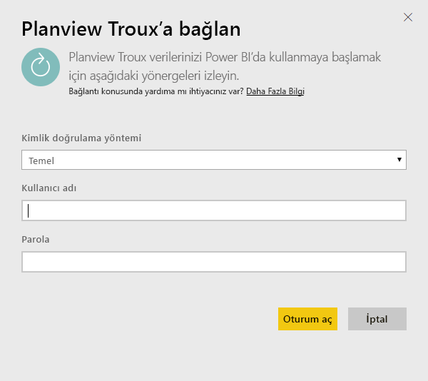
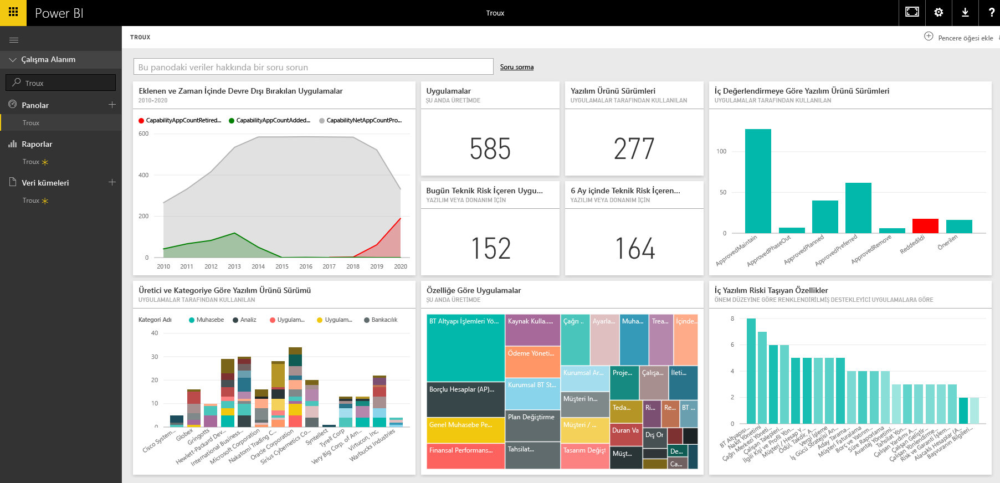

# Power BI için Troux'a bağlanma
Troux içerik paketiyle Enterprise Architecture deponuzu tamamen yeni yöntemlerle doğrudan Power BI'da görselleştirebilirsiniz. İçerik paketi; iş becerileriniz, bunları size sağlayan uygulamalar ve Power BI ile tamamen özelleştirilebilecek bu uygulamaları destekleyen teknolojilere ilişkin bir dizi öngörü sunar.

Power BI için [Troux içerik paketine](https://app.powerbi.com/getdata/services/troux) bağlanın.

## Bağlanma
1. Sol gezinti bölmesinin alt kısmında bulunan **Veri Al**'ı seçin.
   
   
2. **Hizmetler** kutusundaki **Al**'ı seçin.
   
   
3. **Troux** \>  **Al** seçeneğini belirleyin.
   
   
4. Troux OData URL'nizi belirtin. [Bu parametreleri bulma](#FindingParams) konusundaki ayrıntılı bilgileri aşağıda bulabilirsiniz.
   
   
5. **Kimlik doğrulama yöntemi** için **Temel** seçeneğini belirleyin ve kullanıcı adınızı ve parolanızı sağlayın (büyük/küçük harfe duyarlıdır), ardından **Oturum aç**'ı seçin.
   
    
6. Onaylamanızın ardından, içeri aktarma işlemi otomatik olarak başlar. İşlem tamamlandığında Gezinti Bölmesinde yeni bir pano, rapor ve model görünür. İçeri aktarılan verilerinizi görüntülemek için panoyu seçin.
   
     

**Sırada ne var?**

* Panonun üst tarafındaki [Soru-Cevap kutusunda soru sormayı](consumer/end-user-q-and-a.md) deneyin
* Panodaki [kutucukları değiştirin](service-dashboard-edit-tile.md).
* Bağlantılı raporu açmak için [bir kutucuk seçin](consumer/end-user-tiles.md).
* Veri kümeniz günlük olarak yenilenecek şekilde zamanlanır ancak yenileme zamanlamasında değişiklik yapabilir veya **Şimdi Yenile** seçeneğini kullanarak istediğinizde veri kümenizi kendiniz de yenileyebilirsiniz.

## Sistem gereksinimleri
Troux OData akışına erişim ve Troux 9.5.1 veya sonraki bir sürümü gereklidir.

## Parametreleri bulma
Benzersiz Troux OData akışı URL'nizi Müşteri Hizmetleri ekibinizden alabilirsiniz

## Sorun giderme
Kimlik bilgilerini girdikten sonra bir zaman aşımı hatası alırsanız tekrar bağlanmayı deneyin.

## Sonraki adımlar
[Power BI ile çalışmaya başlama](service-get-started.md)

[Power BI'da veri alma](service-get-data.md)

